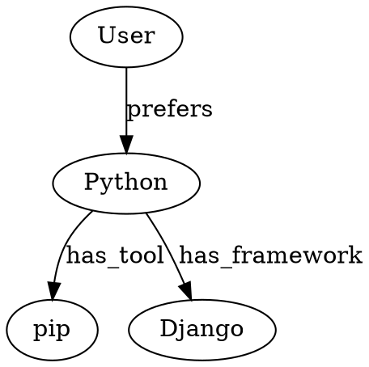
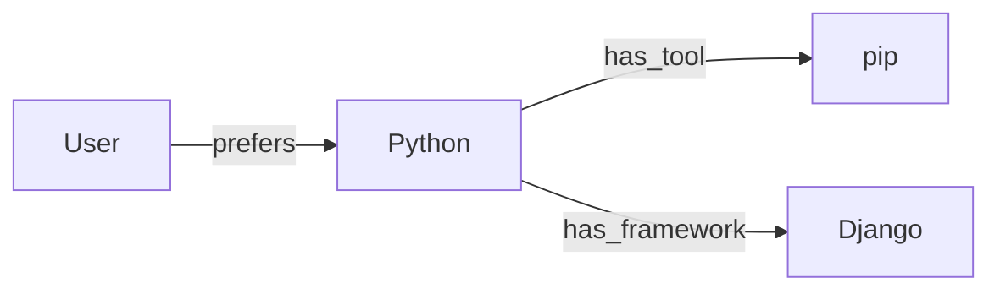

# AI Assistant Crate - Complete Feature Guide

This guide covers every feature in the `ai_assistant` crate. Each section explains **what** the concept is, **why** it matters, and **how** it works here with code examples.

---

## Table of Contents

1. [Providers](#1-providers)
2. [Streaming](#2-streaming)
3. [Synchronous Generation](#3-synchronous-generation)
4. [Sessions](#4-sessions)
5. [Context Window](#5-context-window)
6. [Preference Extraction](#6-preference-extraction)
7. [RAG (Retrieval-Augmented Generation)](#7-rag-retrieval-augmented-generation)
8. [Multi-User Support](#8-multi-user-support)
9. [Notes System](#9-notes-system)
10. [Analysis Tools](#10-analysis-tools)
11. [Security Features](#11-security-features)
12. [Performance Features](#12-performance-features)
13. [Decision Trees](#13-decision-trees)
14. [Tool Use / Tool Registry](#14-tool-use--tool-registry)
15. [Function Calling (OpenAI-compatible)](#15-function-calling-openai-compatible)
16. [Agent Framework](#16-agent-framework)
17. [Plugins](#17-plugins)
18. [Persistence & Export](#18-persistence--export)
19. [Vision & Multimodal](#19-vision--multimodal)
20. [Structured Output](#20-structured-output)
21. [Model Profiles](#21-model-profiles)
22. [Prompt Templates](#22-prompt-templates)
23. [Model Routing](#23-model-routing)
24. [Cost Estimation](#24-cost-estimation)
25. [Response Caching](#25-response-caching)
26. [Conversation Memory](#26-conversation-memory)
27. [Embedding Cache](#27-embedding-cache)
28. [Streaming Metrics](#28-streaming-metrics)
29. [Retry & Circuit Breaker](#29-retry--circuit-breaker)
30. [Diff Viewer](#30-diff-viewer)
31. [Advanced LLM Techniques](#31-advanced-llm-techniques)
32. [Security & Privacy (Advanced)](#32-security--privacy-advanced)
33. [Quality & Reliability](#33-quality--reliability)
34. [Internationalization](#34-internationalization)
35. [Benchmarking](#35-benchmarking)
36. [Provider Discovery](#36-provider-discovery)
37. [egui Widgets](#37-egui-widgets)
38. [Monitoring](#38-monitoring)
39. [Adaptive Thinking](#39-adaptive-thinking)
40. [Provider Failover](#40-provider-failover)
41. [Retry with Backoff](#41-retry-with-backoff)
42. [Conversation Compaction](#42-conversation-compaction)
43. [API Key Rotation](#43-api-key-rotation)
44. [Context Size Cache](#44-context-size-cache)
45. [Journal Sessions (JSONL)](#45-journal-sessions-jsonl)
46. [Encrypted Sessions](#46-encrypted-sessions)
47. [Binary Storage](#47-binary-storage)
48. [Log Redaction](#48-log-redaction)
49. [HTTP Client Abstraction](#49-http-client-abstraction)
50. [Vector Database Backends](#50-vector-database-backends)
51. [Distributed Computing](#51-distributed-computing)
52. [Distributed Networking](#52-distributed-networking)
53. [Autonomous Agents](#53-autonomous-agents)
54. [Knowledge Graphs](#54-knowledge-graphs)
55. [Multi-Layer Knowledge Graphs](#55-multi-layer-knowledge-graphs)
56. [Document Parsing](#56-document-parsing)
57. [Feed Monitor](#57-feed-monitor)
58. [Content Versioning](#58-content-versioning)
59. [P2P Networking](#59-p2p-networking)
60. [WebSocket Streaming](#60-websocket-streaming)
61. [MCP Protocol](#61-mcp-protocol)
62. [HTTP API Server](#62-http-api-server)
63. [Event System](#63-event-system)
64. [Content Encryption](#64-content-encryption)
65. [Access Control](#65-access-control)
66. [Request Signing](#66-request-signing)
67. [Request Queue](#67-request-queue)
68. [Webhooks](#68-webhooks)
69. [Model Ensemble](#69-model-ensemble)
70. [Prompt Optimizer](#70-prompt-optimizer)
71. [Quantization](#71-quantization)
72. [WASM Support](#72-wasm-support)
73. [OpenAPI Export](#73-openapi-export)
74. [Model Capability Registry](#74-model-capability-registry)
75. [Examples](#75-examples)
76. [REPL/CLI, Neural Reranking & A/B Testing](#76-replcli-neural-reranking--ab-testing)
77. [Cost Tracking & Multi-Modal RAG](#77-cost-tracking--multi-modal-rag)
78. [UI Framework Hooks](#78-ui-framework-hooks)
79. [Agent Graph Visualization](#79-agent-graph-visualization)
80. [Embedding Providers: Unified Embedding API](#80-embedding-providers-unified-embedding-api)
81. [Cloud Provider Presets](#81-cloud-provider-presets)
82. [AsyncProviderPlugin](#82-asyncproviderplugin)
83. [LLM-as-Judge Evaluation](#83-llm-as-judge-evaluation)
84. [Guardrail Pipeline](#84-guardrail-pipeline)
85. [Unified Tool Calling](#85-unified-tool-calling)
86. [Container Execution](#86-container-execution)
87. [Document Creation Pipeline](#87-document-creation-pipeline)
88. [Speech — STT and TTS](#88-speech--stt-and-tts)
89. [Multi-Layer Knowledge Graph](#89-multi-layer-knowledge-graph)
90. [Guardrail Pipeline v2](#90-guardrail-pipeline-v2)
91. [Event Workflows](#91-event-workflows)
92. [Context Window Improvements](#92-context-window-improvements)
93. [DSPy-Style Prompt Signatures](#93-dspy-style-prompt-signatures)
94. [A2A Protocol](#94-a2a-protocol)
95. [Advanced Memory](#95-advanced-memory)
96. [Online Evaluation](#96-online-evaluation)
97. [Context Composition](#97-context-composition)
98. [Provider Registry](#98-provider-registry)
99. [Multi-Layer Knowledge Graph Improvements](#99-multi-layer-knowledge-graph-improvements)
100. [P2P Network Hardening](#100-p2p-network-hardening)
101. [Voice Agent](#101-voice-agent)
102. [Media Generation](#102-media-generation)
103. [Distillation Pipeline](#103-distillation-pipeline)
104. [Advanced Prompt Optimization (v5)](#104-advanced-prompt-optimization-v5)
105. [MCP v2 Protocol](#105-mcp-v2-protocol)
106. [OTel GenAI Semantic Conventions](#106-otel-genai-semantic-conventions)
107. [Conversation Patterns & Agent Handoffs](#107-conversation-patterns--agent-handoffs)
108. [Durable Execution](#108-durable-execution)
109. [Declarative Agent Definitions](#109-declarative-agent-definitions)
110. [Constrained Decoding](#110-constrained-decoding)
111. [Memory Evolution (v5)](#111-memory-evolution-v5)
112. [Streaming Guardrails](#112-streaming-guardrails)
113. [MCP Spec Completeness (Elicitation, Audio, Batching, Completions)](#113-mcp-spec-completeness-elicitation-audio-batching-completions)
114. [Remote MCP Client](#114-remote-mcp-client)
115. [Human-in-the-Loop (HITL)](#115-human-in-the-loop-hitl)
116. [Advanced Prompt Optimization v2](#116-advanced-prompt-optimization-v2)
117. [Memory OS](#117-memory-os)
118. [Advanced RAG v2](#118-advanced-rag-v2)
119. [Agent Evaluation & Red Teaming](#119-agent-evaluation--red-teaming)
120. [MCTS Planning & Reasoning](#120-mcts-planning--reasoning)
121. [Voice & Multimodal v2](#121-voice--multimodal-v2)
122. [Platform & Infrastructure](#122-platform--infrastructure)
123. [SSE Streaming](#123-sse-streaming)
124. [Response Compression](#124-response-compression)
125. [Rate Limiting](#125-rate-limiting)
126. [AiAssistant Feature Integration](#126-aiassistant-feature-integration)
127. [Audit Logging](#127-audit-logging)
128. [API Versioning](#128-api-versioning)
129. [Structured Error Responses](#129-structured-error-responses)
130. [Compressed Memory Snapshots](#130-compressed-memory-snapshots)

---

## 1. Providers

**What**: A "provider" is a local LLM server that runs on your machine. It receives text prompts and returns AI-generated responses.

**Common providers**:
- **Ollama** (port 11434) - Popular, downloads models for you
- **LM Studio** (port 1234) - GUI app with built-in server
- **text-generation-webui** (port 5000) - Flexible, many model formats
- **Kobold.cpp** (port 5001) - Optimized for CPU inference
- **LocalAI** (port 8080) - Drop-in OpenAI replacement
- **Custom** - Any OpenAI-compatible endpoint

**How it works here**: The crate auto-discovers which providers are running by checking their default ports.

```rust
use ai_assistant::{AiAssistant, AiConfig, AiProvider};

let mut assistant = AiAssistant::new();
assistant.fetch_models(); // Scans all known ports for active providers

// Or configure a specific provider
let mut config = AiConfig::default();
config.provider = AiProvider::OpenAICompatible {
    base_url: "http://my-server:8000".to_string()
};
assistant.load_config(config);
```

| Provider | API Type | Default URL | Streaming |
|----------|----------|-------------|-----------|
| Ollama | Native | `localhost:11434` | Yes |
| LM Studio | OpenAI-compatible | `localhost:1234` | Yes |
| text-generation-webui | OpenAI-compatible | `localhost:5000` | Yes |
| Kobold.cpp | Native | `localhost:5001` | No* |
| LocalAI | OpenAI-compatible | `localhost:8080` | Yes |

**Key types**: `AiConfig`, `AiProvider`, `ModelInfo`

---

## 2. Streaming

**What**: Instead of waiting for the entire response, streaming delivers it word-by-word as it's generated.

**Why**: The user sees text appearing in real-time instead of a blank screen for seconds.

**How it works here**: Responses arrive as `AiResponse::Chunk(text)` events through a channel. You poll for them in your main loop.

```rust
assistant.send_message("Explain gravity".to_string(), "");

// In your update loop:
if let Some(response) = assistant.poll_response() {
    match response {
        AiResponse::Chunk(text) => print!("{}", text),     // Partial text
        AiResponse::Complete(full) => println!("{}", full), // All done
        AiResponse::Error(e) => eprintln!("{}", e),
        _ => {}
    }
}
```

**Backpressure**: If your UI can't process chunks fast enough, `StreamBuffer` accumulates them and delivers at a controlled rate.

**Cancellation**: Use `CancellationToken` to stop generation mid-response:

```rust
assistant.cancel_generation(); // Stops the current generation
```

---

## 3. Synchronous Generation

**What**: A blocking alternative to streaming when you just need the full response.

**Why**: Simpler for scripts, tests, or background processing where streaming UI isn't needed.

```rust
let response = assistant.generate_sync(
    "Explain ownership in Rust".to_string(),
    ""  // optional knowledge context
)?;
println!("Response: {}", response);
```

---

## 4. Sessions

**What**: A "session" is a saved conversation - messages, metadata, model info, timestamps.

**Why**: Users can close the app and resume conversations later.

```rust
// Save current session
assistant.save_current_session();

// Create new session (saves current first)
assistant.new_session();

// Save/load to file
assistant.save_sessions_to_file(Path::new("ai_sessions.json"))?;
assistant.load_sessions_from_file(Path::new("ai_sessions.json"))?;

// List sessions
for session in assistant.get_sessions() {
    println!("{}: {} ({} messages)", session.id, session.name, session.messages.len());
}

// Load/delete specific sessions
assistant.load_session("session_1234567890");
assistant.delete_session("session_1234567890");
```

**Key types**: `ChatSession`, `ChatMessage`

---

## 5. Context Window

**What**: Every LLM has a maximum number of "tokens" it can process at once. This is the "context window" - typically 2K to 128K tokens.

**Why**: If your conversation exceeds the window, older messages are lost. You need strategies to handle this.

**How it works here**:
- **Token estimation**: Approximates count without needing a tokenizer
- **Context tracking**: Monitors usage percentage
- **Automatic summarization**: When context gets full (~70%), older messages are summarized

```rust
let usage = assistant.calculate_context_usage(&knowledge_context);
println!("Usage: {:.1}% ({}/{} tokens)", usage.usage_percent, usage.total_tokens, usage.max_tokens);
println!("  System: {}", usage.system_tokens);
println!("  Knowledge: {}", usage.knowledge_tokens);
println!("  Conversation: {}", usage.conversation_tokens);

if usage.is_critical {
    println!("Context almost full!");
}

// Trigger summarization when needed
assistant.summarize_old_messages(&knowledge);
assistant.start_background_summarization();
assistant.poll_summarization(); // In update loop
```

**Known model context sizes**:
| Model | Context |
|-------|---------|
| Llama 3.2, 3.1 | 128K |
| Qwen 2.5 (32B+) | 128K |
| Phi-3 | 128K |
| Mistral, Mixtral | 32K |
| Qwen 2.5 (smaller) | 32K |
| DeepSeek | 32K |
| CodeLlama | 16K |
| Gemma 2 | 8K |
| Others | 8K (default) |

**Key types**: `ContextTracker`, `ContextUsage`

---

## 6. Preference Extraction

**What**: Learning what the user likes from their messages, without explicit configuration.

**Example**: "I prefer short answers" -> system remembers and adjusts responses.

```rust
// Built-in preferences:
pub struct UserPreferences {
    pub response_style: ResponseStyle, // Concise, Normal, Detailed, Technical
    pub ships_owned: Vec<String>,
    pub target_ship: Option<String>,
    pub interests: Vec<String>,
}

// Custom extraction logic
assistant.extract_preferences_with(|messages, prefs| {
    for msg in messages {
        if msg.content.contains("be brief") {
            prefs.response_style = ResponseStyle::Concise;
        }
    }
});
```

---

## 7. RAG (Retrieval-Augmented Generation)

**What**: RAG stores your documents in a searchable database and retrieves relevant chunks when the user asks a question. These chunks are injected into the LLM prompt as context.

**Why**: LLMs have fixed training data. RAG lets you give them access to YOUR documents without fine-tuning.

**Feature flag**: Requires `features = ["rag"]`

### Document Registration (Recommended)

```rust
let mut assistant = AiAssistant::new();

// Set database path (lazy initialization)
assistant.set_rag_path(Path::new("./ai_data.db"));

// Register documents - they're indexed automatically on first query
let guide = std::fs::read_to_string("docs/guide.md")?;
assistant.register_knowledge_document("User Guide", &guide);

let faq = std::fs::read_to_string("docs/faq.md")?;
assistant.register_knowledge_document("FAQ", &faq);

// Build context (auto-indexes pending documents, retrieves relevant chunks)
let (knowledge_context, conversation_context) = assistant.build_rag_context("How do I configure X?");

// Use in message
assistant.send_message("How do I configure X?".to_string(), &knowledge_context);
```

### Direct Indexing (Alternative)

```rust
assistant.init_rag(Path::new("./ai_data.db"))?;

let content = std::fs::read_to_string("docs/guide.md")?;
let chunks = assistant.index_knowledge_document("User Guide", &content)?;
println!("Indexed {} chunks", chunks);

let (chunk_count, total_tokens) = assistant.get_knowledge_stats()?;
```

### Document Management

```rust
// List, check pending, unregister, delete
let sources = assistant.get_registered_sources();
if assistant.has_pending_documents() {
    let results = assistant.process_pending_documents();
}
assistant.unregister_knowledge_document("Old Guide");
assistant.delete_knowledge_document("Outdated FAQ")?;
```

### Conversation RAG

Store and retrieve conversation history for "infinite" context:

```rust
assistant.set_conversation_rag_enabled(true);

// Store messages
assistant.store_message_in_rag(&msg, true)?; // true = in current context

// Archive old messages (keeps them searchable)
assistant.archive_messages_to_rag(4)?;

let (total, archived, archived_tokens) = assistant.get_conversation_rag_stats()?;
```

### Database Schema

| Table | Purpose |
|-------|---------|
| `knowledge_chunks` | Indexed document chunks |
| `knowledge_fts` | FTS5 full-text search index |
| `knowledge_sources` | Document metadata + content hash |
| `conversation_messages` | Per-user message history |
| `conversation_fts` | FTS5 for conversation search |
| `users` | User info + global notes |
| `knowledge_notes` | Per-user notes per document |
| `session_notes` | Per-user notes per session |

### RAG Tiers (Advanced)

The RAG system supports multiple tiers with increasing sophistication. Higher tiers use more LLM calls but improve retrieval quality.

```rust
use ai_assistant::{
    RagTier, RagTierConfig, RagFeatures, RagPipeline, RagPipelineConfig,
    RagDebugConfig, RagDebugLevel, enable_rag_debug,
};

// Option 1: Use a predefined tier
let config = RagTierConfig::with_tier(RagTier::Enhanced);
println!("{}", config.summary()); // "RAG Config: Enhanced tier, 8 features enabled, 1-2 LLM calls"

// Option 2: Custom feature selection
let mut features = RagFeatures::none();
features.fts_search = true;
features.semantic_search = true;
features.hybrid_search = true;
features.reranking = true;  // Add reranking without full Enhanced tier

let config = RagTierConfig::with_features(features);

// Check requirements
let requirements = config.check_requirements();
for req in requirements {
    println!("Need: {} - {}", req.display_name(), req.description());
}

// Estimate LLM call cost
let (min_calls, max_calls) = config.estimate_extra_calls();
println!("This config will use {}-{} extra LLM calls per query",
    min_calls, max_calls.unwrap_or(usize::MAX));
```

**Available Tiers**:

| Tier | Features | LLM Calls | Best For |
|------|----------|-----------|----------|
| `Disabled` | None | 0 | Testing, no retrieval |
| `Fast` | FTS5 only | 0 | Low latency, simple queries |
| `Semantic` | FTS5 + embeddings + hybrid | 0 | Better recall |
| `Enhanced` | + query expansion + reranking | 1-2 | Balanced quality/cost |
| `Thorough` | + multi-query + compression | 3-5 | High accuracy |
| `Agentic` | + iterative agent | Unbounded | Complex research |
| `Graph` | + knowledge graph | N+ | Relationship queries |
| `Full` | All features | N+ | Maximum capability |
| `Custom` | User-defined | Varies | Fine-tuned control |

### RAG Debug Logging

Enable detailed logging to understand what the RAG system is doing:

```rust
use ai_assistant::{RagDebugConfig, RagDebugLevel, enable_rag_debug, global_rag_debug};

// Quick enable
enable_rag_debug(RagDebugLevel::Detailed);

// Or configure in detail
let debug_config = RagDebugConfig {
    enabled: true,
    level: RagDebugLevel::Detailed,
    log_to_file: true,
    log_path: Some("./rag_debug".into()),
    log_to_stderr: true,
    log_chunks: true,
    log_llm_details: true,
    log_scores: true,
    ..Default::default()
};

// Apply config
configure_global_rag_debug(debug_config);

// After queries, export all sessions
let stats = global_rag_debug().aggregate_stats();
println!("Total sessions: {}, Avg LLM calls: {:.1}",
    stats.total_sessions, stats.avg_llm_calls_per_session);

global_rag_debug().export_all("./all_rag_sessions.json")?;
```

### RAG Pipeline (Low-Level)

For full control, use the pipeline directly:

```rust
use ai_assistant::{RagPipeline, RagPipelineConfig, RagTier};

// Create pipeline
let config = RagPipelineConfig::for_tier(RagTier::Enhanced);
let mut pipeline = RagPipeline::with_config(config);

// Process query (requires implementing callback traits)
let result = pipeline.process(
    "What is the Aurora's cargo capacity?",
    &my_llm,          // impl LlmCallback
    Some(&my_embedder), // impl EmbeddingCallback
    &my_retriever,    // impl RetrievalCallback
    None,             // impl GraphCallback (optional)
)?;

println!("Retrieved {} chunks, {} tokens",
    result.chunks.len(), result.token_count);
println!("Sources: {:?}", result.sources);
println!("Stats: {} LLM calls in {}ms",
    result.stats.llm_calls, result.stats.total_duration_ms);
```

### Individual RAG Methods

Use advanced methods standalone:

```rust
use ai_assistant::{
    AdvancedQueryExpander, MultiQueryDecomposer, HydeGenerator,
    LlmReranker, RrfFusion, ContextualCompressor,
    SelfRagEvaluator, CragEvaluator, AdaptiveStrategySelector,
};

// Query expansion
let expander = AdvancedQueryExpander::new();
let variants = expander.expand("Aurora specifications", &llm)?;

// Multi-query decomposition
let decomposer = MultiQueryDecomposer::new();
let sub_queries = decomposer.decompose("Compare Aurora and Mustang for cargo and combat", &llm)?;

// HyDE
let hyde = HydeGenerator::new();
let (hypothetical_doc, embedding) = hyde.generate_with_embedding("best starter ship", &llm, &embedder)?;

// RRF fusion of multiple result sets
let fusion = RrfFusion::new();
let fused = fusion.fuse_strings(vec![keyword_results, semantic_results]);

// Self-reflection
let evaluator = SelfRagEvaluator::new();
let result = evaluator.evaluate("What's the Aurora's price?", &context, &llm)?;
if !result.is_sufficient {
    // Trigger re-retrieval...
}

// Adaptive strategy selection
let selector = AdaptiveStrategySelector::new();
let strategy = selector.select_with_llm("Compare ship specifications", &llm)?;
```

### Encrypted Knowledge Packages (KPKG)

**What**: Distribute knowledge bases securely as encrypted packages. Each package contains documents, metadata, AI configuration, and RAG settings in a single encrypted file.

**Package structure**:
```
.kpkg file (AES-256-GCM encrypted):
├── manifest.json      # Metadata, AI config, RAG settings
├── doc1.md           # Knowledge document
├── doc2.txt          # Another document
└── subfolder/
    └── doc3.md       # Nested documents supported
```

**Manifest fields**:

| Field | Type | Description |
|-------|------|-------------|
| `name` | String | Package name |
| `description` | String | Package description |
| `version` | String | Version string |
| `default_priority` | i32 | Default document priority |
| `priorities` | Map | Per-document priorities |
| `system_prompt` | String? | System prompt for AI |
| `persona` | String? | AI persona description |
| `examples` | Array | Few-shot learning examples |
| `rag_config` | Object? | RAG configuration |
| `metadata` | Object? | Author, license, tags, etc. |

**Creating packages with KpkgBuilder**:

```rust
use ai_assistant::{KpkgBuilder, AppKeyProvider, ExamplePair};

let package = KpkgBuilder::<AppKeyProvider>::with_app_key()
    // Basic info
    .name("My Knowledge Base")
    .description("A comprehensive guide")
    .version("1.0.0")

    // AI Configuration
    .system_prompt("You are a knowledgeable assistant. Be accurate and helpful.")
    .persona("Expert with deep domain knowledge")

    // Few-shot examples (helps the AI understand expected format)
    .add_example(
        "What is X?",
        "X is [definition]. Here's how it works: [explanation]."
    )
    .add_example_with_category(
        "How do I do Y?",
        "To do Y, follow these steps: 1. First... 2. Then...",
        "how-to"  // Category helps organize examples
    )

    // Document priorities (higher = more relevant in RAG)
    .default_priority(5)
    .add_document("intro.md", content, Some(10))  // High priority
    .add_document("details.md", content, None)     // Uses default

    // RAG Configuration
    .chunk_size(512)           // Tokens per chunk
    .chunk_overlap(50)         // Overlap between chunks
    .top_k(5)                  // Results to retrieve
    .min_relevance(0.3)        // Minimum similarity score
    .priority_boost(10)        // Boost all docs in this package

    // Metadata
    .author("Author Name")
    .language("en")
    .license("MIT")
    .url("https://example.com")
    .add_tag("documentation")
    .add_tag("guide")
    .with_current_timestamps()

    .build()?;

std::fs::write("knowledge.kpkg", &package)?;
```

**Reading and indexing packages**:

```rust
use ai_assistant::{KpkgReader, AppKeyProvider, RagDbKpkgExt};

let data = std::fs::read("knowledge.kpkg")?;
let reader = KpkgReader::<AppKeyProvider>::with_app_key();

// Read just manifest (lightweight inspection)
let manifest = reader.read_manifest_only(&data)?;
println!("Package: {} v{}", manifest.name, manifest.version);
println!("System prompt: {:?}", manifest.system_prompt);
println!("Examples: {}", manifest.examples.len());

// Read documents with manifest
let (docs, manifest) = reader.read_with_manifest(&data)?;
for doc in &docs {
    println!("{}: {} bytes (priority {})", doc.path, doc.content.len(), doc.priority);
}

// Index into RAG with extended result
let rag_db = assistant.rag_db().unwrap();
let result = rag_db.index_kpkg_ext(&data)?;

// Access result helpers
println!("Indexed {} docs", result.documents_indexed());
println!("Created {} chunks", result.chunks_created());

// Build effective system prompt from manifest
if let Some(prompt) = result.build_effective_system_prompt() {
    // Combines system_prompt + persona
    assistant.config.system_prompt = prompt;
}

// Get formatted examples for prompt injection
let examples = result.format_examples_for_prompt();
// Returns "User: Q1\nAssistant: A1\n\nUser: Q2\nAssistant: A2"
```

**Best practices for system_prompt and persona**:

1. **System prompt** should define the assistant's role and constraints:
   - "You are a Star Citizen expert. Answer based only on the knowledge provided."
   - "Be concise but thorough. If unsure, say so."

2. **Persona** adds personality and expertise:
   - "Veteran pilot with 10 years of experience"
   - "Friendly teacher who explains concepts clearly"

3. **Examples** teach the AI your expected format:
   - Include 2-5 diverse examples
   - Cover different question types
   - Use categories to organize similar examples

**Custom encryption keys**:

```rust
use ai_assistant::{KpkgBuilder, KpkgReader, CustomKeyProvider};

// Create with custom passphrase
let package = KpkgBuilder::with_key_provider(CustomKeyProvider::new("secret123"))
    .name("Private Knowledge")
    .add_document("doc.md", "content", None)
    .build()?;

// Read with same passphrase
let reader = KpkgReader::with_key_provider(CustomKeyProvider::new("secret123"));
let docs = reader.read(&package)?;
```

---

## 8. Multi-User Support

**What**: The RAG system isolates data per user - each user has their own notes, preferences, and conversation history.

```rust
// Set user (default is "default" for single-user apps)
assistant.set_user_id("user_123");
let global_notes = assistant.ensure_user()?; // Creates user if needed

// All RAG operations now use this user_id
```

---

## 9. Notes System

**What**: Users can annotate their sessions, store global preferences, and add notes to specific knowledge documents.

**Three note types**:
- **Global notes**: Persistent across all sessions (e.g., "I prefer concise answers")
- **Session notes**: Specific to one chat (e.g., "Discussing ship upgrades")
- **Knowledge notes**: Annotations on documents (e.g., "Focus on Warbond CCUs")

```rust
// Global notes
assistant.set_rag_global_notes("I prefer concise answers")?;
let notes = assistant.get_rag_global_notes();

// Session notes
assistant.set_rag_session_notes("Discussing upgrades")?;

// Knowledge notes
assistant.set_knowledge_notes("CCU Guide", "Focus on Warbond")?;
let guide_notes = assistant.get_knowledge_notes("CCU Guide");

// Include notes in messages
let knowledge_notes_ctx = assistant.build_knowledge_notes_context();
assistant.send_message_with_notes(
    "What ship?".to_string(),
    &knowledge_context,
    &session_notes,
    &knowledge_notes_ctx,
);
```

---

## 10. Analysis Tools

### Sentiment Analysis

Detect emotional tone of text:

```rust
use ai_assistant::analysis::SentimentAnalyzer;

let analyzer = SentimentAnalyzer::new();
let sentiment = analyzer.analyze("I love this ship!");
// sentiment.score > 0 = positive, < 0 = negative
```

### Topic Detection

Identify what a conversation is about:

```rust
let topics = analyzer.detect_topics(&messages);
// ["combat", "ships", "upgrades"]
```

### Entity Extraction

Pull structured data from text:

```rust
use ai_assistant::{EntityExtractor, EntityExtractorConfig, EntityType};

let extractor = EntityExtractor::new(EntityExtractorConfig::default());
let entities = extractor.extract(
    "Contact user@example.com or visit https://example.com for v2.0"
);

for entity in entities {
    println!("{:?}: {} (confidence: {:.2})", entity.entity_type, entity.text, entity.confidence);
}
```

Supported types: `Email`, `Url`, `Phone`, `Version`, `ProgrammingLanguage`, `Money`, `Percentage`, `Date`, `Time`, `Organization`, `Person`, `Location`, `Custom`.

### Fact Tracking

Extract and reinforce facts from conversations:

```rust
use ai_assistant::{FactExtractor, FactExtractorConfig, FactStore};

let extractor = FactExtractor::new(FactExtractorConfig::default());
let facts = extractor.extract("I prefer Rust over Python. My goal is to learn systems programming.");

let mut store = FactStore::new();
for fact in facts {
    store.add(fact);
}

// Facts mentioned multiple times get higher confidence
store.reinforce("preference:rust");
```

### Quality Analysis

Evaluate response quality:

```rust
use ai_assistant::{QualityAnalyzer, QualityConfig};

let analyzer = QualityAnalyzer::new(QualityConfig::default());
let score = analyzer.analyze("What is Rust?", "Rust is a systems programming language...", None);

println!("Overall: {:.0}%", score.overall * 100.0);
println!("Relevance: {:.0}%", score.relevance * 100.0);
println!("Coherence: {:.0}%", score.coherence * 100.0);
println!("Issues: {:?}", score.issues);
```

---

## 11. Security Features

### Rate Limiting
Prevents too many requests in a short time. Uses token bucket algorithm - N tokens per window, each request costs one.

### Input Sanitization
Removes potential prompt injection attacks where malicious text tries to override the system prompt.

### Audit Logging
Records every request/response for accountability and debugging.

### Hook System
Pre/post processing hooks that run before/after LLM calls:

```rust
hooks.add_pre_hook("logger", |msg| {
    println!("Sending: {}", msg.content);
    Ok(msg)
});
```

---

## 12. Performance Features

### Connection Pooling
Reuses HTTP connections instead of creating new ones per request.

### Cache Compression
Compresses cached responses with gzip to save disk space.

### Latency Tracking
Measures response times with percentiles (p50, p95, p99).

### Health Checks
Periodically pings providers to check availability.

### Fallback Chain
If primary provider fails, automatically tries the next one.

### Batch Processing
Sends multiple requests in parallel for bulk operations.

---

## 13. Decision Trees

**What**: A flowchart-like structure where each node makes a decision, performs an action, or produces a result.

**Why**: Useful for structured workflows where the next step depends on previous results.

### Node Types

| Type | Purpose | Example |
|------|---------|---------|
| **Condition** | Branch on variable values | "Is age >= 18?" |
| **Action** | Record an action | "Log check-in" |
| **Terminal** | End with a result | "Access granted" |
| **Question** | Ask user for input | "What's your name?" |
| **Prompt** | Send to LLM, store response | "Summarize this" |
| **Function** | Call registered Rust function | "calculate_price()" |
| **Sequence** | Run children in order, all must succeed | A then B then C |
| **Selector** | Try children, first success wins | Try A, else B, else C |
| **Parallel** | Run all children, collect results | A and B simultaneously |
| **SubTree** | Call another tree | "Run validation tree" |
| **LlmCondition** | LLM decides branching | "Is this spam?" |

### Building a Tree

```rust
use ai_assistant::decision_tree::*;
use serde_json::json;

let tree = DecisionTreeBuilder::new("my_tree", "User Check")
    .root("check_age")
    .condition_node("check_age", vec![
        DecisionBranch {
            condition: Condition::new("age", ConditionOperator::GreaterOrEqual, json!(18)),
            target_node_id: "adult".to_string(),
            label: Some("Adult".to_string()),
        }
    ], Some("minor".to_string()))
    .terminal_node("adult", json!("allowed"), Some("Adult".to_string()))
    .terminal_node("minor", json!("denied"), Some("Minor".to_string()))
    .build();
```

### Sync Execution

```rust
let mut context = HashMap::new();
context.insert("age".to_string(), json!(25));

let path = tree.evaluate(&context);
// path.result == Some(json!("allowed"))
```

### Async Execution (TreeExecutor)

For trees with Prompt/LlmCondition nodes:

```rust
let (tx, rx) = mpsc::channel();
let mut executor = TreeExecutor::new(tree, tx);

executor.register_function("get_price", |args| {
    Ok(json!({"price": 99.99}))
});

executor.run();

match executor.state() {
    ExecutorState::WaitingForLlm { node_id } => {
        executor.resume_with_response("LLM answer");
    }
    ExecutorState::Completed => println!("Done!"),
    _ => {}
}
```

### Template Substitution

`{{variable}}` placeholders replaced with context values:
```
// Context: {"user": "Alice", "topic": "ships"}
// Template: "Tell {{user}} about {{topic}}"
// Result: "Tell Alice about ships"
```

### Serialization & Visualization

```rust
let json = tree.to_json();                    // Serialize to JSON
let tree = DecisionTree::from_json(&json)?;   // Deserialize
let mermaid = tree.to_mermaid();              // Export to Mermaid flowchart
```

---

## 14. Tool Use / Tool Registry

**What**: Define tools (functions with typed parameters) that the LLM can call during conversation.

```rust
use ai_assistant::tool_use::{Tool, ToolRegistry, ToolParameter};

let mut registry = ToolRegistry::new();

registry.register(
    Tool::new("get_weather", "Get weather for a city")
        .with_param(ToolParameter::string("city", "City name"))
        .with_handler(|args| {
            let city = args.get("city").and_then(|v| v.as_str()).unwrap_or("unknown");
            Ok(serde_json::json!({"temp": 22, "city": city}))
        })
);

let result = registry.execute("get_weather", serde_json::json!({"city": "Madrid"}));
```

**Key types**: `Tool`, `ToolRegistry`, `ToolParameter`, `ToolCall`, `ToolResult`

---

## 15. Function Calling (OpenAI-compatible)

**What**: The OpenAI function calling format - defines functions as JSON schemas that the model can choose to invoke.

**Difference from Tool Use**: This module generates the OpenAI-compatible JSON format for the API request, while Tool Use is the internal execution system.

```rust
use ai_assistant::{FunctionBuilder, FunctionRegistry, ToolChoice};

let mut registry = FunctionRegistry::new();

registry.register(
    FunctionBuilder::new("get_weather")
        .description("Get current weather")
        .add_string_param("location", "City name", true)
        .add_enum_param("unit", &["celsius", "fahrenheit"], false)
        .build()
);

let request = registry.build_request(ToolChoice::Auto);
// Produces OpenAI-compatible JSON with function definitions
```

---

## 16. Agent Framework

**What**: A multi-step execution framework where the LLM can reason, act, and observe in a loop (ReAct pattern: Reason-Act-Observe).

**Why**: Complex tasks often require multiple steps - search, calculate, lookup - before producing a final answer.

```rust
use ai_assistant::{ReactAgent, AgentConfig, create_builtin_agent_tools};

let mut agent = ReactAgent::new(AgentConfig {
    max_steps: 10,
    verbose: true,
    ..Default::default()
});

// Add built-in tools (calculator, search, etc.)
for tool in create_builtin_agent_tools() {
    agent.add_tool(tool);
}

// Execute a step
let observation = agent.execute_step(
    "I need to calculate".to_string(),
    "calculator".to_string(),
    "2 + 2 * 3".to_string(),
)?;

if agent.should_stop() {
    println!("Agent finished");
}
```

---

## 17. Plugins

**What**: Extension system for adding functionality without modifying core code.

**Lifecycle hooks**:
- `on_message_received` - Before processing user input
- `on_response_generated` - After getting LLM response
- `on_session_start` / `on_session_end`

---

## 18. Persistence & Export

### Backup Manager
Automatic backups with configurable retention (last N, or older than N days).

### Database Compaction
Removes old data, merges fragments, reduces file size.

### Multi-Format Export

```rust
use ai_assistant::{ConversationExporter, ExportFormat, ExportOptions};

let exporter = ConversationExporter::new(ExportOptions {
    format: ExportFormat::Markdown,
    include_metadata: true,
    redact_pii: true,
    ..Default::default()
});

let output = exporter.export(&messages, Some(&metadata))?;
// Also supports: JSON, CSV, HTML
```

---

## 19. Vision & Multimodal

**What**: Some LLMs process images alongside text (e.g., LLaVA). This is "multimodal" input.

```rust
use ai_assistant::{VisionMessage, ImageInput, ImageDetail};

let message = VisionMessage::new("What's in this image?")
    .add_image(ImageInput::from_file("photo.jpg")?)
    .with_detail(ImageDetail::High);

let openai_format = message.to_openai_format();
```

- `ImageInput` encodes images as base64
- `ImagePreprocessor` resizes large images to fit model limits
- `VisionCapabilities` checks if current model supports images

---

## 20. Structured Output

**What**: Force LLM responses into a specific JSON schema that can be validated.

**Why**: When you need machine-readable output (not free text), schemas ensure the response has the right fields and types.

```rust
use ai_assistant::{JsonSchema, SchemaProperty, SchemaValidator, SchemaBuilder};

// Define schema
let schema = JsonSchema::new("sentiment")
    .with_property("sentiment", SchemaProperty::string()
        .with_enum(vec!["positive", "negative", "neutral"]))
    .with_property("confidence", SchemaProperty::number()
        .with_minimum(0.0).with_maximum(1.0))
    .with_required("sentiment")
    .with_required("confidence");

// Generate instruction prompt
let prompt = format!("{}\n{}", user_question, schema.to_prompt());

// Validate response
let validation = SchemaValidator::validate(&json_response, &schema);
if !validation.valid {
    println!("Errors: {:?}", validation.errors);
}

// Pre-built schemas
let sentiment_schema = SchemaBuilder::sentiment_analysis();
let entity_schema = SchemaBuilder::entity_extraction();
```

### Structured Output Enforcer

For cases where you need guaranteed valid JSON output with retry logic:

```rust
use ai_assistant::{
    StructuredOutputEnforcer, StructuredOutputGenerator, EnforcementConfig,
    JsonSchema, SchemaProperty,
};

let mut generator = StructuredOutputGenerator::new();
generator.add_schema(
    "sentiment",
    JsonSchema::new("sentiment")
        .with_property("sentiment", SchemaProperty::string()
            .with_enum(vec!["positive", "negative", "neutral"]))
        .with_property("confidence", SchemaProperty::number()),
);

let enforcer = StructuredOutputEnforcer::new(generator, EnforcementConfig::default());

// Build a constrained prompt that instructs the LLM to output valid JSON
let prompt = enforcer.build_constrained_prompt("sentiment", "How do you feel about Rust?");

// Validate and extract JSON from a response (handles markdown fences, extra text)
let result = enforcer.validate_and_extract("sentiment", &llm_response);
match result {
    Ok(json) => println!("Valid: {}", json),
    Err(errors) => println!("Errors: {:?}", errors),
}
```

---

## 21. Model Profiles

**What**: Pre-defined generation settings (temperature, top_p, etc.) for different use cases.

**Why**: A "coding" task needs low temperature (precise), while "creative writing" needs high temperature (varied).

```rust
use ai_assistant::{ProfileManager, ProfileApplicator};

let manager = ProfileManager::with_defaults();

// Available: balanced, creative, precise, coding, conversational, concise, detailed
let profile = manager.get("coding").unwrap();
println!("Temperature: {}", profile.temperature);

let applicator = ProfileApplicator::new(&config);
let config = applicator.apply(profile);
```

---

## 22. Prompt Templates

**What**: Reusable prompt patterns with `{{variable}}` substitution.

**Why**: Common tasks (code review, translation, summarization) always need similar prompts. Templates avoid repetition.

```rust
use ai_assistant::{TemplateManager, BuiltinTemplates};

let manager = TemplateManager::with_builtins();

// Available: code_review, translation, explain, bug_fix, summarize, api_docs, refactor
let prompt = manager.render("code_review", &[
    ("code", "fn main() { ... }"),
    ("language", "Rust"),
])?;
```

---

## 23. Model Routing

**What**: Automatically selects the best available model based on the task type.

**Why**: A coding task benefits from a code-specialized model, while a creative task benefits from a general model. Don't make the user choose.

```rust
use ai_assistant::{ModelRouter, ModelRequirements, TaskType};

let router = ModelRouter::new();

// Auto-detect task type from the query
let task = ModelRouter::detect_task_type("Write code to sort an array");
assert_eq!(task, TaskType::Coding);

// Select best model for the task
let requirements = ModelRequirements::for_task(TaskType::Coding)
    .with_min_context(8000);

let best = router.select_best(&available_models, &requirements);
```

---

## 24. Cost Estimation

**What**: Track and budget API usage costs per model and provider.

**Why**: When using paid APIs, you need visibility into spending and the ability to set limits.

```rust
use ai_assistant::{CostEstimator, CostTracker, BudgetManager};

let estimator = CostEstimator::new();
let mut tracker = CostTracker::new();

// Estimate cost for a request
let estimate = estimator.estimate("gpt-4", "openai", 1000, 500);
println!("Cost: {}", estimate.format()); // $0.0450 USD

tracker.add(estimate);
println!("{}", tracker.summary());

// Budget limits
let budget = BudgetManager::new()
    .with_daily_limit(5.0)
    .with_request_limit(0.50);

if budget.check(0.10).is_exceeded() {
    println!("Budget exceeded!");
}
```

---

## 25. Response Caching

**What**: Cache LLM responses so identical (or similar) questions don't need regeneration.

**Why**: LLM calls are slow and expensive. Caching identical or near-identical queries saves both.

```rust
use ai_assistant::{ResponseCache, CacheConfig};

let mut cache = ResponseCache::new(CacheConfig {
    max_entries: 1000,
    default_ttl: Duration::from_secs(3600),
    fuzzy_matching: true,         // Similar queries match cached responses
    similarity_threshold: 0.85,   // How similar is "similar enough"
    ..Default::default()
});

// Cache a response
cache.put("What is Rust?", "llama-3", "Rust is...", 50, Some("factual"));

// Get from cache (fuzzy matching)
if let Some(response) = cache.get("What's Rust?", "llama-3") {
    println!("Cached: {}", response.content);
}

println!("Hit rate: {:.1}%", cache.stats().hit_rate() * 100.0);
```

---

## 26. Conversation Memory

**What**: Long-term memory with decay - remembers facts, preferences, and goals across sessions.

**Why**: Conversations are ephemeral. Memory lets the assistant remember important things even after sessions end.

```rust
use ai_assistant::{MemoryManager, MemoryConfig};

let mut memory = MemoryManager::new(MemoryConfig::default());

// Remember with importance weight (decays over time)
memory.remember_fact("User prefers Rust", 0.8);
memory.remember_preference("Concise explanations");
memory.remember_goal("Learn systems programming");

// Recall relevant memories for a query
let memories = memory.recall("What programming language?");

// Build context for prompts (within token budget)
let context = memory.build_context("Tell me about Rust", 500);
```

---

## 27. Embedding Cache

**What**: Cache computed embedding vectors so the same text doesn't need re-embedding.

**Why**: Embedding computation (converting text to vectors) is expensive. Caching avoids redundant work.

```rust
use ai_assistant::{SharedEmbeddingCache, EmbeddingCacheConfig, cosine_similarity};

let cache = SharedEmbeddingCache::new(EmbeddingCacheConfig {
    max_entries: 10000,
    ttl: Duration::from_secs(86400),
    ..Default::default()
});

cache.set("hello world", "text-embedding", vec![0.1, 0.2, 0.3]);

if let Some(embedding) = cache.get("hello world", "text-embedding") {
    let similarity = cosine_similarity(&embedding, &other_embedding);
}

println!("Hit rate: {:.1}%", cache.stats().unwrap().hit_rate() * 100.0);
```

---

## 28. Streaming Metrics

**What**: Real-time metrics about generation performance.

**Why**: Know how fast your LLM is generating, detect slowdowns, and track time-to-first-token.

```rust
use ai_assistant::{StreamingMetrics, MetricsConfig};

let mut metrics = StreamingMetrics::new(MetricsConfig::default());
metrics.start();

// Record tokens as they arrive
metrics.record_token();

let snapshot = metrics.snapshot();
println!("Tokens/second: {:.1}", snapshot.tokens_per_second);
println!("Time to first token: {}ms", snapshot.time_to_first_token_ms);
```

---

## 29. Retry & Circuit Breaker

**What**: Automatic retry with exponential backoff, plus circuit breaker to stop hammering a failing service.

**Why**: Network requests fail. Retries handle transient failures. Circuit breakers prevent cascading failures when a service is down.

```rust
use ai_assistant::{RetryConfig, retry, CircuitBreaker, ResilientExecutor};

// Simple retry with backoff
let result = retry(|| some_fallible_operation(), RetryConfig::default())?;

// Circuit breaker: opens after 5 failures, waits 30s before retrying
let breaker = CircuitBreaker::new(5, Duration::from_secs(30));
let executor = ResilientExecutor::new(breaker);

let result = executor.execute(|| api_call())?;
```

---

## 30. Diff Viewer

**What**: Compare text and responses, showing additions, deletions, and similarity.

**Why**: Useful for comparing different model responses or tracking how text changes.

```rust
use ai_assistant::{diff, diff_compare_responses};

let result = diff("old text\nline 2", "new text\nline 2\nline 3");
println!("Additions: {}, Deletions: {}", result.additions, result.deletions);
println!("{}", result.to_unified("old.txt", "new.txt"));

let comparison = diff_compare_responses("The quick brown fox", "The fast brown fox jumps");
println!("Similarity: {:.1}%", comparison.similarity * 100.0);
println!("Common phrases: {:?}", comparison.common_phrases);
```

---

## 31. Advanced LLM Techniques

### Prompt Chaining
Breaking a complex task into sequential LLM calls where each output feeds the next.

### Chain of Thought (CoT) Parsing
Extracting reasoning steps from a model's "thinking out loud" response.

### Self-Consistency
Asking the same question multiple times and taking the most common answer.

### Request Coalescing
If multiple users ask the same question simultaneously, share one LLM call.

### Model Warmup
Pre-load a model before it's needed to avoid cold-start latency.

---

## 32. Security & Privacy (Advanced)

### PII Detection
Finds Personally Identifiable Information (names, emails, phones) so they can be redacted before sending to the LLM.

### Content Moderation
Filters harmful or inappropriate content in both input and output.

### Injection Detection
Catches "prompt injection" attacks where input tries to override the system prompt.

---

## 33. Quality & Reliability

### Hallucination Detection
Compares responses against known facts to catch fabricated information.

### Confidence Scoring
Assigns 0-1 confidence to responses. Low-confidence responses get flagged for review.

### Model Ensemble
Asks multiple models the same question and combines answers for reliability.

---

## 34. Internationalization

### Language Detection

```rust
use ai_assistant::LanguageDetector;

let detector = LanguageDetector::new();
let result = detector.detect("Bonjour, comment allez-vous?");
println!("{} ({:.0}%)", result.name, result.confidence * 100.0);
// French (85%)
```

Supports: English, Spanish, French, German, Italian, Portuguese, Russian, Chinese, Japanese, Korean.

### Localized Strings
Built-in translations for UI text (errors, status indicators, etc.).

### Multilingual Prompts
Adapts system prompts to the user's detected language.

---

## 35. Benchmarking

**What**: Built-in performance benchmarks for all analysis components.

```rust
use ai_assistant::{run_all_benchmarks, BenchmarkConfig, compare_results};

let config = BenchmarkConfig {
    warmup_iterations: 5,
    iterations: 100,
    ..Default::default()
};

let suite = run_all_benchmarks(config);
println!("{}", suite.summary());

for result in &suite.results {
    println!("{}: mean={:.2}ms, p95={:.2}ms",
        result.name, result.stats.mean_ms, result.stats.p95_ms);
}

// Compare runs for regression detection
let comparison = compare_results(&baseline, &current);
println!("Regression: {}", comparison.has_regression);
```

Built-in benchmarks: token estimation, entity extraction, quality analysis, language detection, sentiment, topic detection.

### Criterion Benchmark Suite

The project also includes a Criterion-based benchmark suite for CI-reproducible performance measurement:

```bash
cargo bench --bench core_benchmarks --features full
```

Six benchmarks are included:

| Benchmark | Description |
|-----------|-------------|
| `intent_classification` | IntentClassifier over 8 representative sentences |
| `conversation_compaction_100_msgs` | ConversationCompactor over 100 messages |
| `prompt_shortener` | PromptShortener with a 500-word text |
| `sentiment_analysis` | SentimentAnalyzer over multiple sentences |
| `request_signing_hmac_sha256` | HMAC-SHA256 request signature generation |
| `template_rendering` | TemplateCategory rendering with variable substitution |

Results are written to `target/criterion/` as HTML reports with statistical analysis.

---

## 36. Provider Discovery

**What**: Auto-discover running LLM providers on the network.

```rust
use ai_assistant::{discover_providers, DiscoveryConfig, create_registry_with_discovery};

let config = DiscoveryConfig::default();
let providers = discover_providers(&config);

for provider in &providers {
    println!("Found: {} at {}", provider.name(), provider.base_url());
    if provider.is_available() {
        let models = provider.list_models()?;
        println!("  Models: {:?}", models.iter().map(|m| &m.name).collect::<Vec<_>>());
    }
}
```

---

## 37. egui Widgets

Enable with `features = ["egui-widgets"]`. Pre-built UI components for chat interfaces:

| Widget | Purpose |
|--------|---------|
| `chat_message()` | Render a message bubble |
| `streaming_response()` | Show current response with spinner |
| `model_selector()` | Model dropdown |
| `context_usage_bar()` | Context window usage bar |
| `session_list()` | Sidebar session list |
| `chat_input()` | Single-line input with send |
| `chat_input_multiline()` | Multi-line with Ctrl+Enter |
| `suggestions()` | Suggestion button row |
| `welcome_screen()` | Centered welcome with suggestions |
| `connection_status()` | Provider connection indicator |
| `rag_controls()` | RAG enable/disable checkboxes |
| `rag_status_compact()` | Compact RAG stats |
| `rag_status_panel()` | Detailed RAG grid |
| `NotesManager` | Complete notes management |
| `context_full_hint()` | Context full warning |

```rust
use ai_assistant::widgets::*;

fn update(&mut self, ctx: &egui::Context, ui: &mut egui::Ui) {
    let colors = ChatColors::default();

    connection_status(ui, self.assistant.is_fetching_models, self.assistant.available_models.len());

    if let Some(model) = model_selector(ui, &mut self.selected, &self.assistant.available_models) {
        self.assistant.config.selected_model = model.name;
    }

    context_usage_bar(ui, &usage, 120.0);

    egui::ScrollArea::vertical().show(ui, |ui| {
        for msg in self.assistant.get_display_messages() {
            chat_message(ui, msg, &colors, 400.0);
        }
    });

    if let Some(text) = chat_input(ui, &mut self.input, self.assistant.is_generating, "Ask...") {
        self.assistant.send_message(text, &self.knowledge);
    }
}
```

---

## 38. Monitoring

### Latency Metrics
Response times with percentiles (p50, p95, p99) per provider.

### Conversation Analytics
Messages per session, response length, topics, time distribution.

### Prometheus Metrics
Export in Prometheus format for Grafana dashboards.

---

## 39. Adaptive Thinking

**What**: Automatically adjusts the reasoning depth, temperature, max tokens, RAG tier, and chain-of-thought prompting based on heuristic analysis of the user's query — without any LLM call.

**Why**: A greeting like "hi" doesn't need low-temperature chain-of-thought reasoning, and a deep comparison query shouldn't use high temperature with minimal tokens. Adaptive thinking makes every query use the right parameters automatically, improving both quality and efficiency.

**How it works here**: The `QueryClassifier` analyzes structural signals (word count, question marks, comparison/analysis keywords, concept count, multi-part detection) combined with intent detection from `IntentClassifier` to produce a `ThinkingStrategy`. This strategy is applied before the LLM call — modifying the system prompt, temperature, and max tokens.

### Enable Adaptive Thinking

```rust
use ai_assistant::AiAssistant;

let mut assistant = AiAssistant::new();

// Enable with defaults (disabled by default for backward compatibility)
assistant.enable_adaptive_thinking();

// Now every send_message call automatically classifies the query
// and adjusts parameters before the LLM call
assistant.send_message("hello".to_string(), "");
// → Trivial: temp=0.8, max_tokens=256, no CoT

assistant.send_message(
    "Compare the advantages of CRDTs vs OT for collaborative editing".to_string(),
    ""
);
// → Complex: temp=0.4, max_tokens=4096, step-by-step CoT injected
```

### Manual Classification

```rust
use ai_assistant::adaptive_thinking::*;

let config = AdaptiveThinkingConfig { enabled: true, ..Default::default() };
let classifier = QueryClassifier::new(config);

let strategy = classifier.classify("What is Rust?");
println!("Depth: {:?}", strategy.depth);           // Simple
println!("Temperature: {}", strategy.temperature);  // 0.7
println!("CoT: {}", strategy.system_prompt_addition); // (empty)

let strategy = classifier.classify("Analyze the trade-offs between microservices and monolith");
println!("Depth: {:?}", strategy.depth);           // Expert
println!("Temperature: {}", strategy.temperature);  // 0.2
println!("RAG hint: {}", strategy.rag_complexity_hint); // reasoning
```

### Inspect Classification Signals

```rust
let strategy = classifier.classify("Compare HashMap vs BTreeMap, and when should I use each?");

let signals = &strategy.signals;
println!("Word count: {}", signals.word_count);
println!("Has comparison: {}", signals.has_comparison);
println!("Is multi-part: {}", signals.is_multi_part);
println!("Concept count: {}", signals.concept_count);
println!("Detected intent: {}", signals.detected_intent);
```

### Custom Configuration

```rust
use std::collections::HashMap;
use ai_assistant::adaptive_thinking::*;

let mut config = AdaptiveThinkingConfig {
    enabled: true,
    // Clamp depth to Simple..Complex (never Trivial, never Expert)
    min_depth: ThinkingDepth::Simple,
    max_depth: ThinkingDepth::Complex,
    // Custom temperature overrides
    temperature_map: Some(HashMap::from([
        (ThinkingDepth::Simple, 0.9),
        (ThinkingDepth::Moderate, 0.7),
        (ThinkingDepth::Complex, 0.3),
    ])),
    // CoT instructions in Spanish
    cot_instructions_override: Some(HashMap::from([
        (ThinkingDepth::Moderate, "Razona brevemente antes de responder.".to_string()),
        (ThinkingDepth::Complex, "Piensa paso a paso. Verifica cada paso.".to_string()),
    ])),
    ..Default::default()
};

assistant.set_adaptive_thinking(config);
```

### RAG Tier Priority

When adaptive thinking suggests a RAG tier but the user has also set one explicitly, the `rag_tier_priority` field controls which wins:

| Priority | Behavior |
|----------|----------|
| `Adaptive` (default) | Adaptive suggestion wins; warning logged if conflict |
| `Explicit` | User's explicit tier wins; warning logged if conflict |
| `Highest` | Whichever tier is more thorough wins |

```rust
let mut config = AdaptiveThinkingConfig {
    enabled: true,
    rag_tier_priority: RagTierPriority::Highest,
    ..Default::default()
};
```

### Thinking Tag Parsing

Models like DeepSeek-R1 and QwQ emit `<think>...</think>` blocks with their internal reasoning. The `ThinkingTagParser` strips these from the visible response:

```rust
use ai_assistant::adaptive_thinking::{ThinkingTagParser, parse_thinking_tags};

// Non-streaming: convenience function
let result = parse_thinking_tags(
    "<think>Let me reason about this...</think>The answer is 42."
);
assert_eq!(result.visible_response, "The answer is 42.");
assert_eq!(result.thinking.as_deref(), Some("Let me reason about this..."));

// Streaming: process chunk by chunk
let mut parser = ThinkingTagParser::new(true); // true = strip thinking tags
let visible1 = parser.process_chunk("<thi");
let visible2 = parser.process_chunk("nk>internal reasoning</think>Visible text");
let visible3 = parser.finalize();

let result = parser.result();
println!("Visible: {}", result.visible_response);
println!("Thinking: {:?}", result.thinking);
```

When `transparent_thinking_parse` is enabled in config (default: true), `poll_response` automatically routes chunks through the parser — the caller sees only the visible response.

### Accessing Last Strategy

After a message is sent with adaptive thinking enabled, inspect what was applied:

```rust
if let Some(strategy) = &assistant.last_thinking_strategy {
    println!("Used depth: {:?}", strategy.depth);
    println!("Temperature: {}", strategy.temperature);
}

if let Some(thinking) = &assistant.last_thinking_result {
    if let Some(ref thought) = thinking.thinking {
        println!("Model's internal reasoning: {}", thought);
    }
}
```

### Depth Levels Reference

| Depth    | Temp | max_tokens | RAG tier   | CoT prompt     | Example query |
|----------|------|------------|------------|----------------|---------------|
| Trivial  | 0.8  | 256        | simple     | (none)         | "hello", "thanks" |
| Simple   | 0.7  | 1024       | simple     | (none)         | "What is Rust?" |
| Moderate | 0.6  | 2048       | standard   | Brief reasoning | "Explain async/await" |
| Complex  | 0.4  | 4096       | complex    | Step-by-step   | "Compare X vs Y" |
| Expert   | 0.2  | (none)     | reasoning  | Rigorous verification | Deep multi-concept analysis |

---

## 40. Provider Failover

**What**: Automatic fallback to alternative providers when the primary one fails.

```rust
use ai_assistant::{AiAssistant, AiProvider};

let mut assistant = AiAssistant::new();

// Configure fallback chain: try LM Studio, then LocalAI
assistant.configure_fallback(vec![
    (AiProvider::LMStudio, "qwen2.5:7b".to_string()),
    (AiProvider::LocalAI, "llama3:8b".to_string()),
]);
assistant.enable_fallback();

// If primary fails, fallbacks are tried automatically
assistant.send_message("Hello".to_string(), "");

// Check which provider actually responded
if let Some(provider) = assistant.last_provider_used() {
    println!("Response from: {}", provider);
}
```

---

## 41. Retry with Backoff

**What**: Automatic retry with exponential backoff for transient network errors.

**How**: All provider HTTP calls are wrapped with `RetryConfig`. Fetch operations use `RetryConfig::fast()` (2 retries), generation uses `RetryConfig::default()` (3 retries). Only retryable errors (connection refused, timeout, 5xx) are retried.

```rust
use ai_assistant::{RetryConfig, retry_with_config};

// Custom retry for your own operations
let result = retry_with_config(RetryConfig::default(), || {
    some_network_operation()
})?;

// AiConfig carries a retry_config field for provider calls
let mut config = AiConfig::default();
config.retry_config = RetryConfig::fast(); // 2 retries with short delays
```

---

## 42. Conversation Compaction

**What**: Lightweight heuristic compaction of conversation history (no LLM call needed).

```rust
let mut assistant = AiAssistant::new();

// Enable auto-compaction (runs before each send_message)
assistant.enable_auto_compaction();

// Or configure thresholds
use ai_assistant::CompactionConfig;
let config = CompactionConfig {
    max_messages: 50,     // Trigger at 50 messages
    target_messages: 20,  // Compact down to 20
    preserve_recent: 10,  // Always keep last 10
    preserve_first: 2,    // Always keep first 2
    ..Default::default()
};
assistant.set_compaction_config(config);

// Manual compaction
let result = assistant.compact_conversation();
println!("Removed {} messages", result.messages_removed);
```

---

## 43. API Key Rotation

**What**: Round-robin API key management with automatic rotation on rate limits.

```rust
use ai_assistant::{ApiKeyManager, ApiKey, RotationConfig};

let mut assistant = AiAssistant::new();

// Add keys for a provider
assistant.add_api_key("openai", ApiKey::new("sk-key1"));
assistant.add_api_key("openai", ApiKey::new("sk-key2"));

// Get current key (round-robin)
let key = assistant.get_current_api_key("openai");

// Mark as rate-limited (auto-rotates to next key)
assistant.mark_key_rate_limited("openai");
```

---

## 44. Context Size Cache

**What**: Global cache for model context window sizes, avoiding repeated API calls.

```rust
use ai_assistant::{get_model_context_size_cached, clear_context_size_cache};

// Lookup with provider API as fetcher (cached after first call)
let size = get_model_context_size_cached("llama3.2:7b", |name| {
    // fetch_model_context_size(&config, name)  // Provider API call
    None  // Falls back to static table: 128_000
});

// Clear cache (e.g., when switching providers)
clear_context_size_cache();
```

---

## 45. Journal Sessions (JSONL)

**What**: Append-only JSONL session format — each message is one line, no full rewrite.

```rust
use ai_assistant::{JournalSession, JournalEntry, ChatMessage};

let journal = JournalSession::new("session.jsonl");

// Append messages (O(1) per message)
journal.append_message(&ChatMessage::user("Hello"))?;
journal.append_message(&ChatMessage::assistant("Hi!"))?;

// Count without loading all data
let count = journal.message_count()?;

// Load all messages
let messages = journal.load_messages()?;

// Compact: summary + keep last 10 messages
journal.compact("Summary of old conversation", 10)?;

// Migrate from ChatSession to journal
let session = ChatSession::new("My Session");
let journal = session.to_journal("session.jsonl")?;
```

---

## 46. Encrypted Sessions

**What**: AES-256-GCM encrypted session storage (requires `rag` feature).

```rust
use ai_assistant::ChatSessionStore;
use std::path::Path;

let key: [u8; 32] = derive_key_from_password("my_password");

// Save encrypted
store.save_encrypted(Path::new("sessions.enc"), &key)?;

// Load encrypted (returns empty store if file doesn't exist)
let store = ChatSessionStore::load_encrypted(Path::new("sessions.enc"), &key)?;
```

---

## 47. Binary Storage

**What**: Internal storage abstraction using bincode + gzip compression.

```rust
use ai_assistant::internal_storage::{save_internal, load_internal, dump_as_json, file_info};
use std::path::Path;

// Save (auto-selects binary or JSON based on features)
save_internal(&my_data, Path::new("data.bin"))?;

// Load (auto-detects format — reads both legacy JSON and binary)
let data: MyData = load_internal(Path::new("data.bin"))?;

// Debug: dump binary file as JSON
let json = dump_as_json::<MyData>(Path::new("data.bin"))?;

// Inspect file metadata
let info = file_info(Path::new("data.bin"))?;
println!("Format: {}, Size: {} bytes", info.format, info.size_bytes);
```

---

## 48. Log Redaction

**What**: Strip sensitive data from log output.

```rust
use ai_assistant::log_redaction::{redact, safe_log};

let safe = redact("Authorization: Bearer eyJhbG...");
// "Authorization: Bearer ***REDACTED***"

let safe = redact("postgres://user:s3cret@db:5432/mydb");
// "postgres://user:***@db:5432/mydb"

// Macro: redacts before printing
safe_log!("API response: {}", sensitive_data);
```

---

## 49. HTTP Client Abstraction

**What**: Testable HTTP client trait for provider communication.

```rust
use ai_assistant::http_client::{HttpClient, UreqClient};

// Production: use the real client
let client = UreqClient;
let models = fetch_ollama_models_with(&client, "http://localhost:11434")?;

// Tests: use a mock
#[cfg(test)]
let mock = MockHttpClient::with_response(json!({"models": []}));
let models = fetch_ollama_models_with(&mock, "http://localhost:11434")?;
```

---

## 50. Vector Database Backends

**What**: Pluggable vector storage backends for semantic search at different scales.

**Feature flags**:
- `embeddings` — enables the base VectorDb trait and InMemoryVectorDb
- `vector-lancedb` — adds LanceDB embedded backend

### InMemoryVectorDb (Tier 0)

```rust
use ai_assistant::vector_db::{VectorDbBuilder, VectorDbBackend, VectorDbConfig};

let config = VectorDbConfig { dimension: 384, ..Default::default() };
let mut db = VectorDbBuilder::new()
    .backend(VectorDbBackend::InMemory)
    .config(config)
    .build()?;

// Insert vectors
let metadata = std::collections::HashMap::from([
    ("source".to_string(), "doc1.md".to_string()),
]);
db.insert("vec_1", vec![0.1; 384], metadata)?;

// Search
let results = db.search(&vec![0.1; 384], 5, None)?;
for result in &results {
    println!("{}: score={:.4}", result.id, result.score);
}

// Health check
let health = db.health_check()?;
println!("Backend: {}, healthy: {}", health.backend, health.is_healthy);
```

### LanceDB Backend (Tier 2)

**Feature flag**: `vector-lancedb`

```rust
use ai_assistant::vector_db::{VectorDbBuilder, VectorDbConfig};

let config = VectorDbConfig { dimension: 384, ..Default::default() };
let mut db = VectorDbBuilder::new()
    .lance("./my_vectors")  // Path to LanceDB directory
    .config(config)
    .build()?;

// Same API as InMemory — all VectorDb trait methods work
db.insert("vec_1", vec![0.1; 384], metadata)?;
let results = db.search(&vec![0.1; 384], 5, None)?;

// Backend info
let info = db.backend_info();
println!("{}: tier {}, persistence={}", info.name, info.tier, info.supports_persistence);
// "LanceDB: tier 2, persistence=true"
```

### Qdrant Backend (Tier 3)

```rust
use ai_assistant::vector_db::{VectorDbBuilder, VectorDbConfig};

let config = VectorDbConfig { dimension: 384, ..Default::default() };
let mut db = VectorDbBuilder::new()
    .qdrant("http://localhost:6333", "my_collection")
    .config(config)
    .build()?;

// Same VectorDb trait API
db.insert("vec_1", vec![0.1; 384], metadata)?;
let results = db.search(&vec![0.1; 384], 5, None)?;
```

### Migrating Between Backends

```rust
use ai_assistant::vector_db::migrate_vectors;

// Export from InMemory, import to LanceDB
let result = migrate_vectors(&*source_db, &mut *target_db)?;
println!("Migrated: {} exported, {} imported", result.exported, result.imported);
```

### Hybrid Search (Vector + Keyword)

```rust
use ai_assistant::vector_db::{HybridVectorSearch, InMemoryVectorDb};

let vector_db = InMemoryVectorDb::new(VectorDbConfig { dimension: 384, ..Default::default() });
let mut hybrid = HybridVectorSearch::new(vector_db, 0.7); // 0.7 = vector weight

hybrid.add_document("doc1", vec![0.1; 384], "The quick brown fox", metadata)?;
let results = hybrid.hybrid_search(&vec![0.1; 384], "brown fox", 5)?;
```

### Backend Comparison

| Backend | Feature Flag | Persistence | Server | Scale | Use Case |
|---------|-------------|-------------|--------|-------|----------|
| InMemory | `embeddings` | No | No | <50K vectors | Prototypes, tests |
| LanceDB | `vector-lancedb` | Yes | No | 50K-10M | Production, single-user |
| Qdrant | `embeddings` | Yes | Yes | 10M+ | Multi-user, clusters |

---

## 51. Distributed Computing

**What**: Parallel data processing, conflict-free replicated data types (CRDTs), and distributed hash table (DHT) for multi-node coordination.

**Feature flag**: `distributed`

### Parallel MapReduce

```rust
use ai_assistant::distributed::{MapReduceJob, MapReduceConfig};

let config = MapReduceConfig::default();
let mut job = MapReduceJob::new(config);

// Word count example
job.set_input(vec![
    "hello world hello".to_string(),
    "world rust hello".to_string(),
]);

job.set_map_fn(|chunk| {
    chunk.split_whitespace()
        .map(|word| (word.to_string(), 1u64))
        .collect()
});

job.set_reduce_fn(|_key, values| {
    values.iter().sum::<u64>()
});

let results = job.execute()?;
// Results computed in parallel using rayon's work-stealing thread pool
for (word, count) in &results {
    println!("{}: {}", word, count);
}
```

### CRDTs (Conflict-Free Replicated Data Types)

```rust
use ai_assistant::distributed::{GCounter, PNCounter, LWWRegister, ORSet};

// GCounter: distributed increment-only counter
let mut counter_a = GCounter::new("node_a");
let mut counter_b = GCounter::new("node_b");
counter_a.increment(5);
counter_b.increment(3);
counter_a.merge(&counter_b);
assert_eq!(counter_a.value(), 8);

// PNCounter: increment and decrement
let mut pn = PNCounter::new("node_a");
pn.increment(10);
pn.decrement(3);
assert_eq!(pn.value(), 7);

// LWWRegister: last-writer-wins register
let mut reg = LWWRegister::new("initial_value".to_string());
reg.set("updated_value".to_string());
assert_eq!(reg.get(), "updated_value");

// ORSet: observed-remove set
let mut set = ORSet::new();
set.add("item_a", "node_1");
set.add("item_b", "node_1");
set.remove("item_a", "node_1");
assert!(set.contains("item_b"));
assert!(!set.contains("item_a"));
```

### DHT (Distributed Hash Table)

```rust
use ai_assistant::distributed::{DhtNode, NodeId};

let node_id = NodeId::random();
let mut dht = DhtNode::new(node_id);

// Store and retrieve values
dht.store("key_1", b"value_1".to_vec());
let value = dht.get("key_1");

// Find closest nodes to a key (Kademlia XOR distance)
let closest = dht.find_closest(&target_id, 3);
```

### Distributed Coordinator

```rust
use ai_assistant::distributed::DistributedCoordinator;

let mut coordinator = DistributedCoordinator::new("node_1");

// Combines DHT + MapReduce + CRDTs
coordinator.store("shared_counter", counter_data);
let result = coordinator.execute_map_reduce(job)?;
```

---

## 52. Distributed Networking

**What**: Real QUIC-based networking for multi-node clusters with mutual TLS, consistent hashing, failure detection, Merkle tree sync, replication, and LAN discovery.

**Feature flag**: `distributed-network` (separate from `distributed` — adds quinn, rustls, rcgen, sha2)

### Starting a Network Node

```rust
use ai_assistant::distributed_network::{NetworkNode, NetworkConfig, ReplicationConfig};
use std::path::PathBuf;

let config = NetworkConfig {
    listen_addr: "0.0.0.0:0".parse().unwrap(), // Auto-assigned port
    identity_dir: PathBuf::from("./node_identity"),
    ..NetworkConfig::default()
};

let node = NetworkNode::new(config).expect("Failed to create node");
println!("Node {} listening on {}", node.node_id(), node.local_addr());
```

### Connecting Nodes

```rust
// Node 2 connects to Node 1
let peer_id = node2.connect(node1.local_addr()).unwrap();
println!("Connected to peer: {}", peer_id);

// Store data with automatic replication
node1.store("key", b"value".to_vec()).unwrap();

// Retrieve from any node
let value = node2.get("key").unwrap();
```

### Consistent Hashing

```rust
use ai_assistant::ConsistentHashRing;
use ai_assistant::NodeId;

let mut ring = ConsistentHashRing::new(64, 3); // 64 vnodes, replication=3
ring.add_node(node_a);
ring.add_node(node_b);
ring.add_node(node_c);

// Get 3 distinct nodes responsible for a key
let nodes = ring.get_nodes("my_key", 3);
```

### Failure Detection

```rust
use ai_assistant::failure_detector::{PhiAccrualDetector, HeartbeatManager, HeartbeatConfig};

let config = HeartbeatConfig::default(); // phi_threshold: 8.0
let mut mgr = HeartbeatManager::new(config);

mgr.record_heartbeat(&peer_id);
match mgr.check_node(&peer_id) {
    NodeStatus::Alive => println!("Peer is healthy"),
    NodeStatus::Suspicious(phi) => println!("Peer may be failing (phi={})", phi),
    NodeStatus::Dead(phi) => println!("Peer is dead (phi={})", phi),
    NodeStatus::Unknown => println!("No heartbeats recorded"),
}
```

### Merkle Tree Sync

```rust
use ai_assistant::merkle_sync::{MerkleTree, AntiEntropySync};
use std::collections::BTreeMap;

let mut data = BTreeMap::new();
data.insert("key1".into(), b"value1".to_vec());
data.insert("key2".into(), b"value2".to_vec());

let tree = MerkleTree::from_data(&data);
let proof = tree.proof("key1").unwrap();
assert!(MerkleTree::verify_proof(tree.root_hash().as_ref().unwrap(), &proof));
```

### Node Security

```rust
use ai_assistant::node_security::{CertificateManager, JoinToken};

// Generate CA and node certificate
let (ca_cert, ca_key) = CertificateManager::generate_ca().unwrap();
let identity = CertificateManager::generate_node_cert(&ca_cert, &ca_key).unwrap();

// Create a join token (valid 24 hours, max 5 uses)
let mut token = JoinToken::generate(24, Some(5));
assert!(token.consume()); // Use one admission
```

### LAN Discovery

```rust
use ai_assistant::distributed_network::{NetworkConfig, DiscoveryConfig};

let config = NetworkConfig {
    discovery: DiscoveryConfig {
        enable_broadcast: true,       // Enable UDP broadcast
        broadcast_port: 9876,         // LAN discovery port
        broadcast_interval: Duration::from_secs(10),
        enable_peer_exchange: true,   // Ask peers for their peers
    },
    ..NetworkConfig::default()
};

// Nodes on the same LAN will auto-discover each other
let node = NetworkNode::new(config).unwrap();
// Poll for discovery events
for event in node.poll_events() {
    match event {
        NetworkEvent::PeerConnected(id, addr) => {
            println!("Auto-discovered peer {} at {}", id, addr);
        }
        _ => {}
    }
}
```

### Join Tokens (Cluster Security)

```rust
// Admin node generates a join token (valid 24h, max 10 uses)
let token = node.generate_join_token(24, Some(10));
let token_string = token.encode(); // Share this with new nodes

// New node joins with the token
let config = NetworkConfig {
    join_token: Some(token_string),
    bootstrap_peers: vec![admin_addr],
    ..NetworkConfig::default()
};
let new_node = NetworkNode::new(config).unwrap();
new_node.connect(admin_addr).unwrap();
```

### Reputation & Probation

```rust
// Check peer reputation (0.0 = untrusted, 1.0 = fully trusted)
if let Some(rep) = node.peer_reputation(&peer_id) {
    println!("Peer reputation: {:.3}", rep);
}

// Check if peer is still in probation (new nodes start in probation)
if let Some(true) = node.peer_in_probation(&peer_id) {
    println!("Peer is new, still in probation period");
}

// Check how many peers need anti-entropy sync
let pending = node.sync_status();
println!("{} peers pending sync", pending);
```

### Network Events

```rust
// Poll for cluster events
for event in node.poll_events() {
    match event {
        NetworkEvent::PeerConnected(id, addr) => println!("Connected: {} at {}", id, addr),
        NetworkEvent::PeerDisconnected(id) => println!("Disconnected: {}", id),
        NetworkEvent::PeerFailed(id, phi) => println!("Failed: {} (phi={})", id, phi),
        NetworkEvent::ReplicationComplete(key, copies) => {
            println!("Key '{}' replicated to {} nodes", key, copies);
        }
        NetworkEvent::JoinRequestReceived(id, addr) => {
            println!("Join request from {} at {}", id, addr);
        }
        NetworkEvent::MessageReceived(id, msg) => println!("Message from {}", id),
        NetworkEvent::Error(e) => eprintln!("Error: {}", e),
    }
}
```

### Distributed Vector Search

```rust
use ai_assistant::vector_db::{InMemoryVectorDb, VectorDbConfig, DistributedVectorDb};

let local_db = InMemoryVectorDb::new(VectorDbConfig::default());
let distributed_db = DistributedVectorDb::new(local_db, network_node.clone());

// Search across ALL cluster nodes
let results = distributed_db.distributed_search(&query_vector, 10).unwrap();
```

---

## Architecture Summary

```
User Code
    |
    v
AiAssistant (main entry point)
    |
    +-- Config (provider URLs, model preferences)
    +-- Session (conversation history, persistence)
    +-- Context (token tracking, summarization)
    +-- Preferences (learned user preferences)
    |
    +-- Providers (Ollama, LM Studio, etc.)
    |       |
    |       v
    |   HTTP requests to local LLM servers
    |
    +-- RAG (knowledge base, conversation storage)
    +-- Memory (long-term facts, decay)
    +-- Security (rate limit, sanitize, audit)
    +-- Analysis (sentiment, topics, quality, entities, facts)
    +-- Tools (function calling, registry)
    +-- Decision Trees (conditional workflows, async execution)
    +-- Agent (ReAct multi-step execution)
    +-- Plugins (extensibility)
    +-- Persistence (backup, export, compaction)
    +-- Cache (response cache, embedding cache)
    +-- Metrics (streaming, latency, cost)
    +-- Error Handling (zero .unwrap() — lock poison recovery, NaN-safe sorting)
    +-- Vision (multimodal, image preprocessing)
    +-- Structured Output (JSON schema, validation)
    +-- Adaptive Thinking (depth classification, CoT injection, thinking tags)
    +-- Fallback (automatic provider failover)
    +-- Retry (exponential backoff, circuit breaker)
    +-- Compaction (lightweight conversation compaction)
    +-- API Key Rotation (round-robin, rate-limit aware)
    +-- Internal Storage (bincode+gzip, auto-detect legacy JSON)
    +-- Log Redaction (safe_log!, pattern-based redaction)
    +-- HTTP Client (testable trait, mock support)
    +-- Vector DB (InMemory, LanceDB, Qdrant — pluggable backends)
    +-- Distributed (MapReduce, CRDTs, DHT, coordinator)
    +-- Distributed Network (QUIC transport, consistent hashing, failure detection,
    |       Merkle sync, replication, mutual TLS, LAN discovery)
    +-- Distributed VectorDb (fan-out search, vector replication across nodes)
    +-- Autonomous Agents (self-directed execution, 5 autonomy levels, task boards,
    |       scheduling, browser automation, environment detection, distributed tasks)
```

---

## Quick Start

```rust
use ai_assistant::{AiAssistant, AiResponse};

fn main() {
    let mut assistant = AiAssistant::new();

    // Discover providers
    assistant.fetch_models();
    while assistant.is_fetching_models {
        std::thread::sleep(std::time::Duration::from_millis(100));
        assistant.poll_models();
    }

    // Select first model
    if let Some(model) = assistant.available_models.first() {
        assistant.config.selected_model = model.name.clone();
        assistant.config.provider = model.provider.clone();
    }

    // Send message
    assistant.send_message("Hello!".to_string(), "");

    // Poll streaming response
    loop {
        if let Some(response) = assistant.poll_response() {
            match response {
                AiResponse::Chunk(text) => print!("{}", text),
                AiResponse::Complete(_) => break,
                AiResponse::Error(e) => { eprintln!("{}", e); break; }
                _ => {}
            }
        }
        std::thread::sleep(std::time::Duration::from_millis(10));
    }
}
```

---

## 53. Autonomous Agents

**What**: A complete autonomous agent system that allows AI agents to operate independently, make decisions, execute tools, manage tasks, and collaborate — with configurable safety policies and human oversight.

**Feature flags**: `autonomous`, `scheduler`, `butler`, `browser`, `distributed-agents`. None are included in `full` — opt-in only.

### Architecture Overview

The autonomous system consists of 14 modules organized in layers:

| Layer | Modules | Purpose |
|-------|---------|---------|
| Core autonomy | `autonomous_loop`, `mode_manager`, `agent_sandbox` | Agent execution loop, autonomy levels, tool validation |
| User interaction | `user_interaction`, `interactive_commands` | Human-in-the-loop, natural language command parsing |
| Task management | `task_board` | Kanban-style task tracking with priorities |
| Profiles & policies | `agent_profiles`, `agent_policy` | Pre-configured agent behaviors and safety constraints |
| Scheduling | `scheduler`, `trigger_system` | Cron-based scheduling, event-driven triggers |
| Environment | `butler`, `os_tools`, `browser_tools` | Auto-detection, OS operations, browser automation |
| Distribution | `distributed_agents` | Multi-node task distribution |

### Autonomy Levels

Five levels of agent autonomy, from most restricted to most free:

```rust
use ai_assistant::mode_manager::OperationMode;

// Chat: Respond only, no tools
// Assistant: Use pre-approved tools
// Programming: Read/write files, run code
// AssemblyLine: Execute multi-step plans
// Autonomous: Full self-direction
```

### Agent Policies

Safety constraints that limit what an agent can do:

```rust
use ai_assistant::agent_policy::{AgentPolicyBuilder, InternetMode, AutonomyLevel, RiskLevel};

let policy = AgentPolicyBuilder::new()
    .autonomy(AutonomyLevel::Standard)
    .internet(InternetMode::AllowList(vec!["api.github.com".into()]))
    .require_approval_above(RiskLevel::Medium)
    .allowed_commands(vec!["cargo".into(), "git".into()])
    .max_cost_usd(5.0)
    .max_iterations(100)
    .max_runtime_secs(3600)
    .build();
```

### Agent Profiles

Pre-configured agent personalities with default policies:

```rust
use ai_assistant::agent_profiles::ProfileRegistry;

let registry = ProfileRegistry::with_defaults();

// Built-in profiles: coding-assistant, research-agent, devops-agent, paranoid
let profile = registry.get_agent_profile("coding-assistant").unwrap();
println!("Mode: {:?}", profile.mode);       // Programming
println!("Internet: {:?}", profile.policy.internet); // AllowList
```

### Autonomous Loop

The core execution loop that drives agent behavior:

```rust
use ai_assistant::autonomous_loop::{AutonomousAgent, AutonomousAgentConfig, CostConfig};
use std::collections::HashMap;

let config = AutonomousAgentConfig::builder()
    .task("Analyze the project structure and suggest improvements")
    .max_iterations(50)
    .with_cost_config(CostConfig {
        default_cost_per_call: 0.001,
        tool_costs: HashMap::from([("browser_navigate".into(), 0.01)]),
        cost_callback: None,
    })
    .build();
```

The loop supports multi-format tool call parsing:
- **JSON array**: `[{"name":"tool","arguments":{"key":"val"}}]`
- **OpenAI-style**: `{"tool_calls":[{"function":{"name":"x","arguments":"{...}"}}]}`
- **XML tool_use**: `<tool_use><name>x</name><arguments>{"key":"val"}</arguments></tool_use>`

### Task Board

Kanban-style task management for agents:

```rust
use ai_assistant::task_board::{TaskBoard, BoardCommand, StepPriority};

let mut board = TaskBoard::new("Sprint 1");
board.execute(BoardCommand::AddTask {
    title: "Implement authentication".into(),
    description: "Add JWT-based auth to the API".into(),
    priority: StepPriority::High,
});

// Undo the last command
match board.undo_last() {
    Ok(msg) => println!("Undone: {}", msg),
    Err(e) => println!("Cannot undo: {}", e),
}

// Undo via interactive commands (English or Spanish)
// > undo
// > deshacer
// Supports reversing: AddTask, StartTask, PauseTask, ResumeTask, CancelTask, CompleteTask
```

### Scheduling & Triggers

Run agents on schedules or in response to events:

```rust
use ai_assistant::scheduler::{Scheduler, ScheduledJob, CronSchedule, ScheduledAction};

let mut scheduler = Scheduler::new();
let job = ScheduledJob::new(
    "Daily backup",
    CronSchedule::parse("0 2 * * *").unwrap(), // 2 AM daily
    ScheduledAction::RunShell { command: "backup.sh".into() },
);
scheduler.add_job(job);
```

### Butler (Environment Detection)

Auto-detects local resources with real connectivity checks:

```rust
use ai_assistant::butler::Butler;

let butler = Butler::new();
let env = butler.scan();
// Checks: Ollama (HTTP), LM Studio (HTTP), GPU (nvidia-smi),
// Chrome (path check), Docker (docker info), Network (HTTP HEAD)
for (name, result) in &env.detections {
    println!("{}: detected={}", name, result.detected);
}
```

### Browser Automation (Real CDP)

Real Chrome DevTools Protocol communication via WebSocket:

```rust
use ai_assistant::browser_tools::BrowserSession;

let mut session = BrowserSession::new();
session.launch(9222)?;  // Launches Chrome headless
let page = session.navigate("https://example.com")?;
println!("Title: {}", page.title);
let text = session.get_text("h1")?;
session.click("#submit")?;
session.type_text("#search", "query")?;
let screenshot_b64 = session.screenshot()?;
session.close()?;
```

### Multi-Agent Sessions

Multiple agents collaborating on a shared task:

```rust
use ai_assistant::AiAssistant;

let mut assistant = AiAssistant::default();
let session = assistant.create_multi_agent_session("Build a web app");
session.add_agent("architect", "design-agent");
session.add_agent("developer", "coding-assistant");
session.add_agent("reviewer", "paranoid");
```

### Distributed Agents

Task distribution across multiple nodes (requires `distributed-agents` feature):

```rust
use ai_assistant::distributed_agents::{DistributedAgentManager, NodeId};

let node_id = NodeId::from_string("worker-1");
let mut manager = DistributedAgentManager::new(node_id);
let task_id = manager.submit_task("Process dataset", "data-worker", 5);
```

### Browser & Distributed Agents on AiAssistant

Both browser tools and distributed agents are wired directly into `AiAssistant` for convenient access:

```rust
use ai_assistant::AiAssistant;

let mut assistant = AiAssistant::default();

// Browser tools (requires `browser` feature)
assistant.init_browser();
if let Some(session) = assistant.browser_session_mut() {
    session.launch(9222).ok();
}

// Distributed agents (requires `distributed-agents` feature)
use ai_assistant::distributed::NodeId;
assistant.init_distributed_agents(NodeId::random());
if let Some(manager) = assistant.distributed_agents_mut() {
    let task_id = manager.submit_task("Analyze logs", "data-worker", 3);
}
```

---

## 54. Knowledge Graphs

**What**: Extracts entities and relations from documents using LLM-based analysis and stores them in a SQLite-backed graph, enabling graph-traversal-enhanced retrieval (Graph RAG). Entities span organizations, products, persons, locations, concepts, and events, connected by typed relations such as `manufactures` or `located_in`.

### Building and Indexing

Open or create a database, then index documents with an `LlmEntityExtractor`. The extractor wraps any function that accepts `(system_prompt, user_prompt)` and returns a string response from your LLM.

```rust
use ai_assistant::knowledge_graph::{
    KnowledgeGraph, KnowledgeGraphConfig, LlmEntityExtractor, EntityType,
};

let config = KnowledgeGraphConfig {
    max_traversal_depth: 2,
    min_relation_confidence: 0.6,
    ..KnowledgeGraphConfig::default()
};

let mut graph = KnowledgeGraph::open("knowledge.db", config)?;

let extractor = LlmEntityExtractor::new(|system, user| {
    my_llm_call(system, user) // returns Result<String>
})
.with_entity_types(vec![EntityType::Organization, EntityType::Product]);

graph.index_document("doc_ships_01", "Aegis Dynamics manufactures the Sabre fighter.", &extractor)?;

let stats = graph.stats()?;
println!("Entities: {}, Relations: {}", stats.total_entities, stats.total_relations);
```

### Querying and Graph RAG Integration

```rust
let result = graph.query("What ships does Aegis make?", &extractor)?;
for chunk in &result.chunks {
    println!("[{}] {}", chunk.source_doc, chunk.content);
}

// Integrate with RagPipeline
let callback = graph.as_graph_callback(&extractor);
// pass callback to RagPipeline::with_graph_callback(...)
```

**Feature flag**: `rag`

---

## 55. Multi-Layer Knowledge Graphs

**What**: Organises graph data into four priority-ranked layers -- `Knowledge` (verified packs), `User` (stated beliefs), `Internet` (web-sourced, with TTL), and `Session` (per-conversation context). The coordinator automatically extracts user beliefs from messages and detects contradictions between layers.

### Session and User Graphs

```rust
use ai_assistant::multi_layer_graph::{MultiLayerGraph, BeliefExtractor};

let mut mlg = MultiLayerGraph::new();

let entities = vec!["Sabre".to_string(), "Aegis".to_string()];
mlg.process_user_message("session-42", "I own a Sabre and I think it's the best fighter.", &entities);

for belief in &mlg.user_graph.beliefs {
    println!("[{:?}] {}", belief.belief_type, belief.statement);
}

let session = mlg.get_or_create_session("session-42");
println!("Session entities: {:?}", session.entity_names());
```

### Contradiction Detection and Persistence

```rust
use ai_assistant::multi_layer_graph::MultiLayerGraph;
use std::path::PathBuf;

let mut mlg = MultiLayerGraph::with_persistence(
    PathBuf::from("user_graph.json"),
    PathBuf::from("internet_graph.json"),
    PathBuf::from("contradictions.json"),
);

if let Some(conflict) = mlg.add_internet_data(
    "Sabre", "manufacturer", "Aegis",
    "https://example.com/sabre",
    Some("Aegis Dynamics"),
) {
    println!("Conflict on '{}': {} vs {}", conflict.attribute,
             conflict.primary_value, conflict.conflicting_value);
}
```

---

## 56. Document Parsing

**What**: Extracts plain text, metadata, and structured sections from EPUB, DOCX, ODT, PDF, HTML, and plain-text files. HTML and plain text are always available; the richer binary formats require the `documents` feature flag.

### Parsing Files

```rust
use ai_assistant::document_parsing::{DocumentParser, DocumentParserConfig};
use std::path::Path;

let config = DocumentParserConfig {
    extract_sections: true,
    extract_metadata: true,
    extract_tables: false,
    ..DocumentParserConfig::default()
};

let parser = DocumentParser::new(config);
let doc = parser.parse_file(Path::new("report.pdf"))?;

println!("Title: {:?}", doc.metadata.title);
println!("Words: {}", doc.word_count);
for title in doc.section_titles() {
    println!("  Section: {}", title);
}
```

### Parsing Raw Strings and Bytes

```rust
use ai_assistant::document_parsing::{DocumentParser, DocumentParserConfig, DocumentFormat};

let parser = DocumentParser::new(DocumentParserConfig::default());

let doc = parser.parse_string(
    "<h1>Introduction</h1><p>Hello world.</p>",
    DocumentFormat::Html,
)?;
println!("{}", doc.text);

let epub_bytes = std::fs::read("book.epub")?;
let doc = parser.parse_bytes(&epub_bytes, DocumentFormat::Epub)?;
println!("Sections: {}", doc.sections.len());
```

**Feature flag**: `documents` (required for EPUB, DOCX, ODT, PDF)

---

## 57. Feed Monitor

**What**: Parses RSS 2.0 and Atom feeds using regex-based XML extraction and tracks new entries across repeated checks. `FeedMonitor` maintains stateful tracking so only genuinely new entries are reported on subsequent polls.

### Parsing a Feed Directly

```rust
use ai_assistant::feed_monitor::{FeedParser, FeedFormat};

let xml = reqwest::blocking::get("https://example.com/rss.xml")?.text()?;
let feed = FeedParser::parse(&xml)?;

println!("Feed: {} ({} entries)", feed.metadata.title, feed.entry_count);
for entry in &feed.entries {
    println!("  [{}] {}", entry.published.map(|d| d.to_string()).unwrap_or_default(), entry.title);
}
```

### Monitoring Multiple Feeds

```rust
use ai_assistant::feed_monitor::{FeedMonitor, FeedMonitorConfig};
use std::collections::HashMap;

let mut feeds = HashMap::new();
feeds.insert("rust-blog".to_string(), "https://blog.rust-lang.org/feed.xml".to_string());

let config = FeedMonitorConfig {
    feeds,
    check_interval_secs: 1800,
    max_entries_per_feed: 50,
    ..FeedMonitorConfig::default()
};

let mut monitor = FeedMonitor::new(config);

for result in monitor.check_all() {
    if result.success {
        println!("{}: {} new entries", result.feed_name, result.new_entries.len());
    }
}
```

---

## 58. Content Versioning

**What**: Tracks arbitrary string content over time by storing `ContentSnapshot` instances and computing line-based diffs. An optional similarity threshold prevents storing versions that differ too little.

### Storing Versions

```rust
use ai_assistant::content_versioning::{ContentVersionStore, VersioningConfig};

let config = VersioningConfig {
    max_versions: 20,
    auto_diff: true,
    change_threshold: 0.05,
    store_content: true,
};

let mut store = ContentVersionStore::new(config);

let v1 = store.add_version("page/home", "Hello world.");
let v2 = store.add_version("page/home", "Hello world. New paragraph added.");
println!("v2: {:?}", v2); // Some(...) because content changed
```

### Diffing Versions

```rust
let diff = store.diff_latest("page/home")?;
println!("{}", diff.summary());
print!("{}", diff.to_unified_diff());

if let Some(history) = store.history("page/home") {
    println!("Versions stored: {}", history.version_count());
}
```

**Feature flag**: `rag` (for the SQLite-backed store variant)

---

## 59. P2P Networking

**What**: Peer-to-peer networking layer for distributed AI assistant instances. Provides NAT traversal via STUN/UPnP/NAT-PMP, peer discovery via bootstrap nodes, a trust-based reputation system, and knowledge sharing between peers.

**Feature flag**: `p2p` (requires `distributed`)

### Configuration and Startup

```rust
use ai_assistant::p2p::{P2PConfig, P2PManager, PeerDataTrust};

let config = P2PConfig {
    enabled: true,
    peer_data_trust: PeerDataTrust::ConsensusRequired(3),
    bootstrap_nodes: vec!["203.0.113.1:12345".to_string()],
    enable_mdns: true,
    max_peers: 50,
    min_reputation: 0.4,
    ..P2PConfig::default()
};

let mut manager = P2PManager::new(config);
manager.start()?;

println!("Local peer ID: {}", manager.local_peer_id());
println!("Connected peers: {}", manager.peer_count());

manager.stop();
```

### NAT Traversal

```rust
use ai_assistant::p2p::{NatTraversal, P2PConfig};

let mut nat = NatTraversal::new(P2PConfig::default());

let result = nat.discover_nat()?;
println!("NAT type: {:?}", result.nat_type);

if let Ok(port) = nat.try_upnp_mapping(12345, 12345) {
    println!("UPnP mapped external port {}", port);
}

if let Some(addr) = nat.get_connectable_address() {
    println!("Share this address with peers: {}", addr);
}
```

### ICE Connectivity and Reputation

```rust
use ai_assistant::p2p::{IceAgent, IceCandidate, ReputationSystem};
use std::net::SocketAddr;

let mut ice = IceAgent::new();
let local_addr: SocketAddr = "0.0.0.0:12345".parse().unwrap();
ice.add_local_candidate(IceCandidate::host(local_addr));
ice.start_checks();

let mut rep = ReputationSystem::new(0.3);
let peer = rep.get_or_create("peer_abc");
peer.record_success();
peer.record_correct_contribution();
println!("Score: {:.2}, trusted: {}", peer.score, peer.is_trusted(0.3));

for top_peer in rep.get_top_peers(5) {
    println!("{}: {:.2}", top_peer.peer_id, top_peer.score);
}
```

---

## 60. WebSocket Streaming

**What**: RFC 6455 WebSocket implementation for real-time bidirectional AI communication. Provides low-level frame encoding/decoding, a handshake builder, and a high-level stream handler that reassembles streaming chunks.

### Frame Construction and Handshake

```rust
use ai_assistant::websocket_streaming::{WsFrame, WsHandshake, WsOpcode};

let handshake = WsHandshake::new("localhost:8090", "/ws")
    .with_protocol("ai-assistant")
    .with_header("Authorization", "Bearer mytoken");

let http_request = handshake.build_request();
let expected_accept = handshake.expected_accept();

let text_frame = WsFrame::text("hello");
let ping_frame = WsFrame::ping(b"keepalive");
let close_frame = WsFrame::close(1000, "normal closure");

let encoded = text_frame.encode(); // ready to write to TcpStream
```

### Stream Handler with Callbacks

```rust
use ai_assistant::websocket_streaming::WsStreamHandler;

let mut handler = WsStreamHandler::new();
handler.set_open();

handler.set_on_chunk(|id, content| {
    print!("{}", content);
});
handler.set_on_complete(|id, full_text| {
    println!("\n[{}] complete ({} chars)", id, full_text.len());
});

handler.handle_message(r#"{"type":"stream_start","id":"msg_1","model":"llama3"}"#)?;
handler.handle_message(r#"{"type":"stream_chunk","id":"msg_1","content":"Hello"}"#)?;
handler.handle_message(r#"{"type":"stream_end","id":"msg_1"}"#)?;
```

---

## 61. MCP Protocol

**What**: Implementation of Anthropic's Model Context Protocol (MCP, version 2024-11-05) over JSON-RPC 2.0. Provides both a server side (register tools, resources, and prompts) and a client side (call tools, read resources, retrieve prompts from remote MCP servers).

### MCP Server

```rust
use ai_assistant::mcp_protocol::{McpServer, McpTool, McpResource, McpResourceContent};

let mut server = McpServer::new("my-assistant", "1.0.0");

let tool = McpTool::new("search", "Search the knowledge base")
    .with_property("query", "string", "The search query", true)
    .with_property("limit", "integer", "Max results", false);

server.register_tool(tool, |args| {
    let query = args["query"].as_str().unwrap_or("");
    Ok(serde_json::json!({ "results": [format!("Result for: {}", query)] }))
});

let request_json = r#"{"jsonrpc":"2.0","id":1,"method":"tools/list"}"#;
let response_json = server.handle_message(request_json);
```

### MCP Client

```rust
use ai_assistant::mcp_protocol::McpClient;

let mut client = McpClient::new("http://localhost:9000/mcp");
let capabilities = client.initialize()?;

let tools = client.list_tools()?;
for tool in &tools {
    println!("Tool: {} - {}", tool.name, tool.description);
}

let result = client.call_tool("search", serde_json::json!({
    "query": "Rust ownership"
}))?;
```

---

## 62. HTTP API Server

**What**: Lightweight embedded HTTP server that exposes an `AiAssistant` instance as a REST API using only `std::net::TcpListener`. Endpoints: `GET /health`, `GET /models`, `POST /chat`, `GET /config`, `POST /config`.

### Blocking Server

```rust
use ai_assistant::server::{AiServer, ServerConfig};

let config = ServerConfig {
    host: "127.0.0.1".to_string(),
    port: 8090,
    max_body_size: 1_048_576,
    read_timeout_secs: 30,
};

let server = AiServer::new(config);
server.run_blocking()?;
```

### Background Server

```rust
use ai_assistant::server::{AiServer, ServerConfig};
use ai_assistant::{AiAssistant, AiConfig};

let assistant = AiAssistant::with_config(AiConfig::default());
let server = AiServer::with_assistant(ServerConfig::default(), assistant);
let handle = server.start_background()?;

println!("Server running at {}", handle.url());
// POST http://<addr>/chat  {"message": "Hello"}
```

---

## 63. Event System

**What**: A synchronous, multi-handler event bus covering the full `AiAssistant` lifecycle. Events span seven categories: `response`, `provider`, `session`, `context`, `model`, `rag`, and `tool`.

### Registering Handlers

```rust
use ai_assistant::events::{EventBus, AiEvent, EventHandler};
use std::sync::Arc;

let mut bus = EventBus::with_history(200);

bus.on(|event| {
    println!("[{}] {}", event.category(), event.name());
});

bus.emit(AiEvent::ProviderAttempt {
    provider: "ollama".to_string(),
    model: "llama3".to_string(),
});
bus.emit(AiEvent::ResponseComplete { response_length: 512 });

println!("Total provider events: {}", bus.count_events("provider"));
```

### Built-in Handlers

```rust
use ai_assistant::events::{EventBus, LoggingHandler, LogLevel, CollectingHandler};
use std::sync::Arc;

let mut bus = EventBus::new();
bus.add_handler(Arc::new(LoggingHandler::new(LogLevel::Info)));

let collector = CollectingHandler::new();
bus.add_handler(Arc::new(collector));
```

### History and Replay

```rust
use ai_assistant::events::{EventBus, AiEvent};

let bus = EventBus::with_history(500);
// ... emit events ...

let history = bus.history();
for entry in &history {
    println!("[{}ms] {}", entry.timestamp_ms, entry.event.name());
}
bus.clear_history();
```

---

## 64. Content Encryption

**What**: Encrypt and decrypt conversation content using symmetric key encryption. Supports `Aes256Gcm`, `ChaCha20Poly1305`, and a simple `Xor` fallback. With the `rag` feature, AES-256-GCM uses real authenticated encryption.

### Creating Keys and Encrypting Content

```rust
use ai_assistant::content_encryption::{
    ContentEncryptor, EncryptionKey, EncryptionAlgorithm,
};

let mut encryptor = ContentEncryptor::new();

let key = EncryptionKey::new("key-1", vec![0u8; 32], EncryptionAlgorithm::Aes256Gcm);
encryptor.add_key(key);

let encrypted = encryptor.encrypt_string("Hello, secret world!").unwrap();
let plaintext = encryptor.decrypt_string(&encrypted).unwrap();
assert_eq!(plaintext, "Hello, secret world!");
```

### Key Rotation

```rust
use ai_assistant::content_encryption::{ContentEncryptor, EncryptionKey, EncryptionAlgorithm};

let mut encryptor = ContentEncryptor::new();

let key_a = EncryptionKey::new("key-a", vec![1u8; 32], EncryptionAlgorithm::Aes256Gcm);
let key_b = EncryptionKey::new("key-b", vec![2u8; 32], EncryptionAlgorithm::Aes256Gcm);

encryptor.add_key(key_a);
encryptor.add_key(key_b);
encryptor.set_active_key("key-b").unwrap();
// Old ciphertexts encrypted with key-a still decrypt correctly
```

**Feature flag**: `rag` (enables real AES-256-GCM authenticated encryption)

---

## 65. Access Control

**What**: Role-based access control (RBAC) for resources. Supports role inheritance, explicit deny rules, conditional access (MFA, IP ranges, usage caps), and fine-grained per-resource-instance entries.

### Defining Roles and Checking Permissions

```rust
use ai_assistant::access_control::{AccessControlManager, Permission, ResourceType};

let mut acl = AccessControlManager::new();

acl.assign_role("alice", "editor");
acl.assign_role("bob", "viewer");

let result = acl.check_permission(
    "alice",
    ResourceType::Conversation,
    Permission::Write,
    None,
);
```

### Custom Roles with Inheritance

```rust
use ai_assistant::access_control::{AccessControlManager, Role, Permission, ResourceType};

let mut acl = AccessControlManager::new();

let analyst = Role::new("analyst")
    .inherits_from("viewer")
    .with_permission(ResourceType::Memory, Permission::Read)
    .with_permission(ResourceType::Model, Permission::Execute);

acl.add_role(analyst);
acl.assign_role("carol", "analyst");
```

### Per-Resource Entries and Deny Rules

```rust
use ai_assistant::access_control::{
    AccessControlManager, AccessControlEntry, AccessCondition,
    Permission, ResourceType,
};

let mut acl = AccessControlManager::new();

let entry = AccessControlEntry::new("dave", ResourceType::Conversation)
    .with_permissions(&[Permission::Read, Permission::Write])
    .for_resource("conv-42")
    .with_condition(AccessCondition::RequiresMfa);

acl.add_entry(entry);
acl.deny("dave", ResourceType::Conversation, Permission::Delete);
```

---

## 66. Request Signing

**What**: Sign outgoing requests with a shared secret and verify incoming requests to confirm authenticity. Uses a timestamp-and-nonce scheme with constant-time comparison.

### Signing and Verifying

```rust
use ai_assistant::request_signing::{RequestSigner, SignatureAlgorithm, SignatureError};

let signer = RequestSigner::new(b"my-shared-secret", SignatureAlgorithm::HmacSha256);

let signed = signer.sign(r#"{"model":"llama3","prompt":"Hello"}"#);
println!("Signature: {}", signed.signature);

match signer.verify(&signed, 60) {
    Ok(()) => println!("Request is authentic"),
    Err(SignatureError::Expired) => eprintln!("Replay attempt"),
    Err(SignatureError::Invalid) => eprintln!("Signature mismatch"),
    Err(SignatureError::MissingFields) => eprintln!("Incomplete request"),
}
```

---

## 67. Request Queue

**What**: A thread-safe priority queue for managing concurrent AI generation requests. Requests are dequeued in `High > Normal > Low` order with FIFO within the same level.

### Basic Enqueue and Dequeue

```rust
use ai_assistant::request_queue::{RequestQueue, QueuedRequest, RequestPriority};

let queue = RequestQueue::new(100);

queue.enqueue(QueuedRequest::new("Summarize this").with_priority(RequestPriority::Low));
queue.enqueue(QueuedRequest::new("Cancel operation").with_priority(RequestPriority::High));

let first = queue.try_dequeue().unwrap();
assert_eq!(first.priority, RequestPriority::High);
```

### Monitoring Queue Health

```rust
let stats = queue.stats();
println!("Pending: {}, Processed: {}, Dropped: {}",
    stats.pending, stats.total_processed, stats.total_dropped);
```

---

## 68. Webhooks

**What**: Send HTTP event notifications to external endpoints. Supports per-webhook event filtering, shared-secret signing, custom headers, configurable timeouts, and automatic retry.

### Registering and Sending

```rust
use ai_assistant::webhooks::{WebhookManager, WebhookConfig, WebhookEvent, WebhookPayload};

let mut manager = WebhookManager::new();

let config = WebhookConfig::new("https://example.com/hooks/ai")
    .with_events(vec![WebhookEvent::MessageReceived, WebhookEvent::ErrorOccurred])
    .with_secret("my-webhook-secret")
    .with_header("Authorization", "Bearer token123");

manager.register(config);

let payload = WebhookPayload::new(
    WebhookEvent::MessageReceived,
    serde_json::json!({"session_id": "sess-1", "message": "Hello"}),
);

let results = manager.send(payload);
for result in &results {
    println!("Success: {}, attempts: {}", result.success, result.attempts);
}

let stats = manager.stats();
println!("Success rate: {:.1}%", stats.success_rate * 100.0);
```

---

## 69. Model Ensemble

**What**: Combines outputs from multiple AI models using configurable strategies (voting, weighted averaging, best-of-N, cascade) to improve accuracy and reliability.

### Building an Ensemble

```rust
use ai_assistant::model_ensemble::{Ensemble, EnsembleConfig, EnsembleModel, EnsembleStrategy};

let config = EnsembleConfig {
    strategy: EnsembleStrategy::BestOfN,
    model_timeout: std::time::Duration::from_secs(20),
    min_models: 2,
    parallel: true,
    models: vec![
        EnsembleModel::new("llama3:8b", "ollama").with_weight(1.0),
        EnsembleModel::new("mistral:7b", "ollama").with_weight(0.9),
    ],
};

let ensemble = Ensemble::new(config);

let result = ensemble.execute("Explain backpropagation", |prompt, model_id, provider| {
    Ok(format!("[{provider}/{model_id}] response to: {prompt}"))
});

println!("Winner: {:?}", result.winning_model);
println!("Agreement: {:.0}%", result.agreement * 100.0);
```

### Available Strategies

| Strategy | Description |
|---|---|
| `Voting` | Majority vote across model responses |
| `WeightedVoting` | Vote weighted by `EnsembleModel::weight` |
| `BestOfN` | Pick highest-scoring response |
| `Cascade` | Try models in order, stop on first success |
| `Routing` | Route query to the most specialised model |

---

## 70. Prompt Optimizer

**What**: A/B tests prompt templates and learns from feedback to automatically select the most effective variant, with configurable exploration vs. exploitation balance.

### Registering Variants and Selecting

```rust
use ai_assistant::prompt_optimizer::{PromptOptimizer, OptimizerConfig, Feedback};

let mut optimizer = PromptOptimizer::new(OptimizerConfig::default());

optimizer.add_variant("concise",  "Answer briefly: {query}");
optimizer.add_variant("detailed", "Provide a thorough answer to: {query}. Include examples.");
optimizer.add_variant("cot",      "Think step by step, then answer: {query}");

if let Some(variant) = optimizer.select_best("What is attention in transformers?") {
    let prompt = variant.apply_query("What is attention in transformers?");
    println!("Using '{}': {}", variant.name, prompt);
}

// Record feedback to close the loop
let id = "concise".to_string();
optimizer.record_feedback(&id, Feedback {
    success: true,
    quality_score: Some(0.85),
    response_time_ms: Some(1200),
    token_count: Some(148),
});
```

---

## 71. Quantization

**What**: Detects quantization formats (GGUF, GPTQ, AWQ, EXL2), calculates VRAM/RAM requirements, and recommends the optimal format for a given hardware profile.

### Detecting a Format

```rust
use ai_assistant::quantization::{QuantizationDetector, QuantFormat};

let detector = QuantizationDetector::new();

let format = detector.detect_format("llama-3-13b-q4_k_m.gguf");
if let Some(fmt) = format {
    println!("Format: {}, Bits: {}", fmt.name(), fmt.bits_per_weight());
    println!("Quality: {:.1}%", fmt.quality_retention() * 100.0);

    let mem = detector.estimate_memory("13B", &fmt);
    println!("Total: {:.1} GB, CPU ok: {}", mem.total_gb, mem.cpu_compatible);
}
```

### Hardware-Aware Recommendations

```rust
use ai_assistant::quantization::{QuantizationDetector, HardwareProfile};

let detector = QuantizationDetector::new();

let hw = HardwareProfile::nvidia(8.0, 32.0); // 8 GB VRAM, 32 GB RAM
let rec = detector.recommend_quantization("13B", &hw);
println!("Recommended: {} (confidence: {:.0}%)", rec.format.name(), rec.confidence * 100.0);
println!("Reason: {}", rec.reason);
```

---

## 72. WASM Support

**What**: Platform detection, capability queries, and cross-platform utilities (time, HTTP) that compile for both native and `wasm32` targets.

**Feature flag**: `wasm` (enables `js_sys` integration on `wasm32`)

### Platform Detection

```rust
use ai_assistant::wasm::{is_wasm, PlatformCapabilities, Capability};

if is_wasm() {
    println!("Running in WebAssembly");
}

let caps = PlatformCapabilities::current();
if !caps.has(Capability::Filesystem) {
    println!("No filesystem - use in-memory storage");
}
if caps.has_all(&[Capability::Network, Capability::SystemTime]) {
    println!("Can make timed network requests");
}

println!("filesystem: {}, threads: {}, sqlite: {}", caps.filesystem, caps.threads, caps.sqlite);
```

---

## 73. OpenAPI Export

**What**: Builds OpenAPI 3.0 specifications programmatically using a fluent builder API and exports them as JSON or YAML.

### Building a Spec

```rust
use ai_assistant::openapi_export::{
    OpenApiBuilder, OperationBuilder, OpenApiPathItem, JsonSchema,
};

let spec = OpenApiBuilder::new()
    .title("My AI API")
    .description("Local LLM gateway")
    .version("1.0.0")
    .server("http://localhost:8080", Some("Local development"))
    .tag("chat", Some("Chat completion endpoints"))
    .schema("ChatRequest",
        JsonSchema::object()
            .with_property("model",  JsonSchema::string())
            .with_property("prompt", JsonSchema::string())
            .with_required(vec!["model", "prompt"]),
    )
    .path("/v1/chat", OpenApiPathItem {
        post: Some(
            OperationBuilder::new()
                .summary("Chat completion")
                .tag("chat")
                .operation_id("chatComplete")
                .build()
        ),
        ..Default::default()
    })
    .build();
```

### Exporting

```rust
use ai_assistant::openapi_export::{export_to_json, export_to_yaml, generate_ai_assistant_spec};

let spec = generate_ai_assistant_spec();
let json = export_to_json(&spec).expect("serialization failed");
let yaml = export_to_yaml(&spec).expect("serialization failed");
println!("Exported {} paths", spec.paths.len());
```

---

## 74. Model Capability Registry

**What**: A registry of known models with their capabilities (context size, vision, tool use, streaming, etc.), enabling informed model selection at runtime.

```rust
use ai_assistant::{ModelRegistry, ModelCapabilityInfo, AiProvider};

let registry = ModelRegistry::with_known_models();

// Look up a model's capabilities
if let Some(model) = registry.get("gpt-4o") {
    let caps = model.capabilities.as_ref().unwrap();
    println!("Context: {} tokens", caps.context_window);
    println!("Vision: {}", caps.supports_vision);
    println!("Tools: {}", caps.supports_tools);
    println!("Streaming: {}", caps.supports_streaming);
}

// Register a custom model
let mut registry = ModelRegistry::new();
registry.register(
    ai_assistant::ModelInfo::new("my-model", AiProvider::Ollama)
        .with_capabilities(ModelCapabilityInfo {
            context_window: 8192,
            supports_vision: false,
            supports_tools: true,
            supports_streaming: true,
            ..Default::default()
        }),
);
```

Pre-registered models include GPT-4o, GPT-4o-mini, Claude 3.5 Sonnet, Claude 3 Haiku, Gemini 1.5 Pro, Llama 3, and Mistral with accurate capability metadata.

---

## 75. Examples

The crate ships 15 runnable examples in the `examples/` directory. Each declares `required-features` in `Cargo.toml` so they are automatically skipped when features are missing.

| Example | Features Required | Description |
|---------|-------------------|-------------|
| `basic_chat` | (none) | Basic chat interaction with a provider |
| `streaming` | (none) | Streaming response demonstration |
| `quality_tests` | (none) | Quality analysis and scoring |
| `multi_agent` | `multi-agent` | Multi-agent session orchestration |
| `vector_search` | `embeddings` | Local embeddings and vector search |
| `mcp_server` | `tools` | MCP protocol server example |
| `rag_pipeline` | `rag` | Complete RAG pipeline with chunking, embedding, retrieval |
| `knowledge_graph` | `rag` | Knowledge graph construction and graph-enhanced RAG |
| `encrypted_knowledge` | `rag` | KPKG encrypted knowledge package creation and reading |
| `dag_workflow` | (none) | DAG-based workflow orchestration |
| `autonomous_agent` | `autonomous` | Autonomous agent with policies and tool execution |
| `scheduler_agent` | `scheduler` | Cron-scheduled agent with triggers |
| `p2p_network` | `p2p` | P2P networking with NAT traversal and knowledge sharing |
| `repl_demo` | (none) | Interactive REPL engine demonstration |
| `ab_testing_demo` | `eval` | A/B testing framework demonstration |

Run an example:

```bash
# Basic example (no extra features needed)
cargo run --example basic_chat

# Example requiring feature flags
cargo run --example rag_pipeline --features rag
cargo run --example autonomous_agent --features autonomous
cargo run --example p2p_network --features p2p
cargo run --example ab_testing_demo --features eval
```

---

## 76. REPL/CLI, Neural Reranking & A/B Testing

**Phase 9** adds three modules: an interactive REPL engine, a neural reranking pipeline for RAG results, and a complete A/B testing framework.

### REPL/CLI (`repl.rs` + `bin/ai_assistant_cli.rs`)

**What**: An interactive Read-Eval-Print Loop (REPL) engine that provides a terminal-based interface for conversing with the AI assistant without requiring a graphical UI.

**Why**: Enables headless usage, scripting integration, and rapid testing without external dependencies.

**How**:

```rust
use ai_assistant::repl::ReplEngine;

// Create and configure the REPL
let mut repl = ReplEngine::new();

// Built-in commands:
//   /help    - Show available commands
//   /clear   - Clear conversation history
//   /session - Session management (create, list, switch)
//   /model   - Change or view the current model
//   /config  - View or modify configuration
//   /export  - Export conversation
//   /quit    - Exit the REPL
```

The `ai_assistant_cli` binary provides a ready-to-run CLI:

```bash
cargo run --bin ai_assistant_cli --features full
```

Features: tab completion for commands and arguments, persistent command history, configurable color themes, multi-session management.

### Neural Reranking (`reranker.rs`)

**What**: A pipeline of reranking strategies that improve the precision of RAG retrieval and vector search results by re-scoring and reordering candidates after initial retrieval.

**Why**: Initial vector similarity search returns approximate results. Reranking applies more sophisticated scoring to the top candidates, significantly improving the quality of the final results presented to the user or fed into the LLM context.

**How**:

```rust
use ai_assistant::reranker::{
    CrossEncoderReranker, ReciprocalRankFusion,
    DiversityReranker, CascadeReranker, RerankerPipeline,
};

// Cross-encoder: score each (query, document) pair
let cross_encoder = CrossEncoderReranker::new();
let reranked = cross_encoder.rerank("my query", &candidates, 10);

// Reciprocal Rank Fusion: merge multiple ranked lists
let rrf = ReciprocalRankFusion::new(60); // k=60
let fused = rrf.fuse(&[ranking_a, ranking_b]);

// Diversity reranker: Maximum Marginal Relevance (MMR)
let diversity = DiversityReranker::new(0.7); // lambda=0.7
let diverse = diversity.rerank("query", &candidates, 10);

// Cascade: chain rerankers with progressively smaller top-k
let cascade = CascadeReranker::new(vec![
    (Box::new(cross_encoder), 50),
    (Box::new(diversity), 10),
]);

// Full pipeline combining multiple strategies
let pipeline = RerankerPipeline::new()
    .add_stage(Box::new(cross_encoder))
    .add_stage(Box::new(diversity));
let final_results = pipeline.rerank("query", &candidates, 10);
```

| Reranker | Strategy | Use Case |
|----------|----------|----------|
| `CrossEncoderReranker` | Query-document relevance scoring | Precision-focused retrieval |
| `ReciprocalRankFusion` | Merge multiple rankings (RRF) | Combining diverse search methods |
| `DiversityReranker` | Maximum Marginal Relevance (MMR) | Reducing redundancy in results |
| `CascadeReranker` | Progressive top-k filtering | Efficient multi-stage reranking |
| `RerankerPipeline` | Configurable stage composition | Production reranking workflows |

### A/B Testing (`ab_testing.rs`)

**What**: A framework for running controlled experiments on prompts, model configurations, and other parameters, with statistical significance testing to determine which variant performs better.

**Why**: Making data-driven decisions about prompt engineering and model selection requires systematic experimentation, not guesswork. This module provides deterministic variant assignment, metric tracking, and significance testing.

**How**:

```rust
use ai_assistant::ab_testing::{
    ExperimentManager, Experiment, Variant,
};

// Create an experiment manager
let mut manager = ExperimentManager::new();

// Define an experiment with variants
let experiment = Experiment::new("prompt_style")
    .add_variant(Variant::new("formal", "You are a formal assistant."))
    .add_variant(Variant::new("casual", "Hey! I'm your casual helper."));

manager.add_experiment(experiment);
manager.start_experiment("prompt_style");

// Assign a user to a variant (deterministic by user ID via FNV-1a)
let variant = manager.assign_variant("prompt_style", "user_123");

// Record metrics
manager.record_metric("prompt_style", "user_123", 4.5); // e.g., satisfaction score

// Check statistical significance (Welch's t-test for continuous, chi-square for proportions)
let result = manager.check_significance("prompt_style");
// result.is_significant, result.p_value, result.winning_variant

// Early stopping: automatically conclude when significance is reached
manager.enable_early_stopping("prompt_style", 0.05); // alpha=0.05
```

**AiAssistant integration**:

```rust
let mut assistant = AiAssistant::default();
assistant.init_experiment_manager();

// Access the manager
let manager = assistant.experiment_manager_mut().unwrap();
manager.add_experiment(experiment);
```

**Statistical methods**:
- **Welch's t-test**: For continuous metrics (e.g., response quality scores). Handles unequal variances and sample sizes.
- **Chi-square test**: For binary/categorical outcomes (e.g., conversion rates).
- **Early stopping**: Monitors running experiments and auto-completes when statistical significance is reached at the configured alpha level.

---

## 77. Cost Tracking & Multi-Modal RAG

**Phase 10** adds three modules: a pure-Rust BPE token counter, a real-time cost tracking dashboard with middleware, and a multi-modal RAG pipeline for handling text, images, and other modalities.

### BPE Token Counter (`token_counter.rs`)

**What**: Accurate token counting using Byte Pair Encoding (BPE), the same algorithm used by GPT tokenizers, implemented entirely in pure Rust with no external dependencies.

**Why**: Accurate token counting is essential for cost estimation, context window management, and budget allocation. Approximate word-based counting can be off by 20-40%; BPE counting matches the actual tokenizer used by LLM providers.

**How**:

```rust
use ai_assistant::token_counter::{
    TokenCounter, BpeTokenCounter, ApproximateCounter,
    ProviderTokenCounter, TokenBudget, TokenAllocation,
};

// Pure Rust BPE tokenizer (most accurate)
let bpe = BpeTokenCounter::default();
let count = bpe.count_tokens("Hello, world!");

// Fast approximate counter (word-based heuristic)
let approx = ApproximateCounter::new();
let count = approx.count_tokens("Hello, world!");

// Provider-specific counter (uses provider's token ratio)
let provider = ProviderTokenCounter::for_openai();
let count = provider.count_tokens("Hello, world!");

// Token budget management
let budget = TokenBudget::new(4096);
let allocation = budget.allocate("system prompt", "user message", 512);
// allocation.system_tokens, allocation.user_tokens, allocation.response_tokens
```

| Counter | Speed | Accuracy | Use Case |
|---------|-------|----------|----------|
| `BpeTokenCounter` | Medium | High (matches GPT tokenizers) | Cost estimation, billing |
| `ApproximateCounter` | Fast | Approximate (~75% accuracy) | Quick checks, UI display |
| `ProviderTokenCounter` | Fast | Provider-specific ratio | Provider-aware estimation |

### Cost Integration (`cost_integration.rs`)

**What**: A real-time cost tracking dashboard with request-level cost recording, provider-level aggregation, budget alerts, and middleware for intercepting requests before they are sent.

**Why**: Without visibility into costs, LLM usage can spiral unexpectedly. This module provides per-request tracking, daily/monthly budget limits, and a middleware layer that can warn or block requests that would exceed the budget.

**How**:

```rust
use ai_assistant::cost_integration::{
    CostDashboard, CostMiddleware, DefaultCostMiddleware,
    CostAwareConfig, RequestCostEntry, RequestType, CostDecision,
};

// Create a cost dashboard
let mut dashboard = CostDashboard::new();

// Record a request cost
dashboard.record(RequestCostEntry {
    provider: "openai".to_string(),
    model: "gpt-4".to_string(),
    request_type: RequestType::Chat,
    input_tokens: 500,
    output_tokens: 200,
    cost_usd: 0.025,
    timestamp: chrono::Utc::now(),
});

// Get cost report
let report = dashboard.report();
// report.total_cost, report.by_provider, report.by_model, report.request_count

// Middleware: intercept requests and decide allow/warn/block
let config = CostAwareConfig::new()
    .daily_limit_usd(10.0)
    .monthly_limit_usd(100.0);
let middleware = DefaultCostMiddleware::new(config);

let decision = middleware.check_request(&dashboard, 0.05);
match decision {
    CostDecision::Allow => { /* proceed */ },
    CostDecision::Warn(msg) => { /* proceed with warning */ },
    CostDecision::Block(msg) => { /* reject request */ },
}
```

**REPL integration**: The `/cost` command displays the current cost dashboard in the REPL.

**AiAssistant integration**:

```rust
let mut assistant = AiAssistant::default();
assistant.init_cost_tracking();

// Access the dashboard
let dashboard = assistant.cost_dashboard().unwrap();
let report = assistant.cost_report();

// Mutable access for recording
let dashboard_mut = assistant.cost_dashboard_mut().unwrap();
```

### Multi-Modal RAG (`multimodal_rag.rs`)

**What**: A retrieval-augmented generation pipeline that handles multiple content modalities (text, images, audio, tables) rather than only plain text. Documents can contain mixed modalities, and retrieval considers all of them.

**Why**: Real-world documents contain images, tables, code blocks, and other non-text content. A text-only RAG pipeline misses important information. Multi-modal RAG indexes and retrieves across all modalities for more complete answers.

**How**:

```rust
use ai_assistant::multimodal_rag::{
    ModalityType, MultiModalChunk, MultiModalDocument,
    MultiModalRetriever, MultiModalPipeline, MultiModalResult,
    ImageCaptionExtractor,
};

// Create a multi-modal document with mixed content
let doc = MultiModalDocument::new("architecture_guide")
    .add_text_chunk("The system uses a microservices architecture...")
    .add_image_chunk("diagram.png", "Architecture diagram showing 3 services")
    .add_table_chunk("| Service | Port |\n|---------|------|\n| API | 8080 |");

// Index into the retriever
let mut retriever = MultiModalRetriever::new();
retriever.index_document(doc);

// Search across all modalities
let results = retriever.search("microservices architecture", 5);
for result in &results {
    match result.modality {
        ModalityType::Text => println!("Text: {}", result.content),
        ModalityType::Image => println!("Image: {}", result.caption.as_deref().unwrap_or("")),
        ModalityType::Table => println!("Table: {}", result.content),
        _ => {}
    }
}

// Full pipeline: retrieve + synthesize
let pipeline = MultiModalPipeline::new(retriever);
let result: MultiModalResult = pipeline.query("How is the system architected?", 5);
// result.chunks, result.modalities_used, result.query
```

| Type | `ModalityType` | What it stores |
|------|----------------|----------------|
| Text | `Text` | Plain text content |
| Image | `Image` | Image path + optional caption |
| Audio | `Audio` | Audio transcript or description |
| Table | `Table` | Structured tabular data |
| Code | `Code` | Code snippets with language info |

### New Examples

| Example | Description |
|---------|-------------|
| `cost_tracking` | Demonstrates cost dashboard, middleware, and budget alerts |
| `multimodal` | Demonstrates multi-modal document indexing and retrieval |

---

## 78. UI Framework Hooks

Frontend frameworks (React, Vue, Svelte) need typed event streams. The `ui_hooks` module provides Rust-side callback infrastructure for this.

### ChatStreamEvent

Eight event variants for real-time UI updates:

```rust
use ai_assistant::{ChatHooks, ChatStreamEvent, ChatStatus, StreamAdapter, UsageInfo};

// Subscribe to events
let mut hooks = ChatHooks::new();
hooks.on_event(Box::new(|event| {
    println!("{}: {}", event.event_type(), event.to_json());
}));

// Emit events
hooks.emit(ChatStreamEvent::StatusChange { status: ChatStatus::Thinking });
hooks.emit(ChatStreamEvent::MessageStart { id: "msg-1".into(), role: "assistant".into() });
hooks.emit(ChatStreamEvent::MessageDelta { id: "msg-1".into(), content_chunk: "Hello!".into() });
hooks.emit(ChatStreamEvent::MessageEnd { id: "msg-1".into(), finish_reason: "stop".into(), usage: Some(UsageInfo::new(100, 50)) });
```

### StreamAdapter

Convert raw chunks to typed events:

```rust
let events = StreamAdapter::from_chunks(&["Hello", " world"]);
// Produces: MessageStart + 2x MessageDelta + MessageEnd

let tool_events = StreamAdapter::from_tool_call("search", "{\"q\":\"rust\"}", "{\"results\":[]}");
// Produces: ToolCallStart + ToolCallDelta + ToolCallEnd
```

### ChatSession

Lightweight session state for UI binding:

```rust
use ai_assistant::ui_hooks::ChatSession;

let mut session = ChatSession::new();
session.add_message("user", "What is Rust?");
session.add_message("assistant", "A systems language.");
session.set_status(ChatStatus::Idle);
let json = session.to_json(); // Serialize for frontend consumption
```

| Type | Purpose |
|------|---------|
| `ChatStreamEvent` | 8-variant typed event enum |
| `ChatHooks` | Subscriber-based event broadcasting |
| `StreamAdapter` | Raw chunks to typed events |
| `ChatSession` | Session state with JSON export |
| `ChatStatus` | Idle/Thinking/Streaming/ToolCalling/Error |
| `UsageInfo` | Token usage + cost tracking |

**Example:** `cargo run --example ui_hooks_demo`

---

## 79. Agent Graph Visualization

Export agent workflows as graphs and record execution traces for analysis.

### Building Graphs

```rust
use ai_assistant::agent_graph::{AgentGraph, AgentNode, AgentEdge, EdgeType};

let mut graph = AgentGraph::new();
graph.add_node(AgentNode::new("a1", "Researcher", "research").with_capability("web_search"));
graph.add_node(AgentNode::new("a2", "Writer", "writing"));
graph.add_edge(AgentEdge::new("a1", "a2", EdgeType::DataFlow).with_label("results"));
```

### Export Formats

```rust
println!("{}", graph.export_dot());     // Graphviz DOT
println!("{}", graph.export_mermaid()); // Mermaid flowchart
println!("{}", graph.export_json());    // JSON for D3.js
```

### From DAG

```rust
use ai_assistant::{DagDefinition, DagNode, DagEdge};

let mut dag = DagDefinition::new();
dag.add_node(DagNode::new("fetch", "Fetch", "http"));
dag.add_node(DagNode::new("process", "Process", "transform"));
dag.add_edge(DagEdge::new("fetch", "process"));

let graph = AgentGraph::from_dag(&dag);
```

### Execution Traces

```rust
use ai_assistant::agent_graph::{ExecutionTrace, TraceStep, StepStatus, GraphAnalytics};

let mut trace = ExecutionTrace::new();
trace.record(TraceStep::new("a1", "search").with_duration(1200).with_status(StepStatus::Completed));
trace.record(TraceStep::new("a2", "draft").with_duration(3500).with_status(StepStatus::Completed));

// Analytics
let bottlenecks = GraphAnalytics::bottlenecks(&trace, 2000);
let utilization = GraphAnalytics::agent_utilization(&trace);
let critical = GraphAnalytics::critical_path(&graph, &trace);
```

| Type | Purpose |
|------|---------|
| `AgentGraph` | Node/edge graph with export |
| `AgentNode` | Agent with capabilities + metadata |
| `AgentEdge` | Typed edge (DataFlow/Control/Delegation/Communication/Dependency) |
| `ExecutionTrace` | Step-by-step execution recording |
| `TraceStep` | Individual execution step with timing |
| `GraphAnalytics` | Critical path, bottlenecks, utilization |

**Example:** `cargo run --example agent_graph_demo`

---

## 80. Embedding Providers: Unified Embedding API

**What**: A unified `EmbeddingProvider` trait that abstracts over multiple embedding backends, letting you swap between local (TF-IDF) and remote (OpenAI, Ollama, HuggingFace) embeddings without changing application code.

**Why**: Embeddings are separate from text generation. The `ProviderPlugin` trait handles chat/completion, but embedding endpoints have different APIs, dimensions, and batching semantics. A dedicated trait keeps the abstraction clean.

**The trait**:

```rust
use ai_assistant::embedding_providers::{EmbeddingProvider, create_embedding_provider};

// The trait every provider implements:
// - embed(&self, text: &str) -> Result<Vec<f32>>
// - embed_batch(&self, texts: &[&str]) -> Result<Vec<Vec<f32>>>
// - dimensions(&self) -> usize
// - provider_name(&self) -> &str
```

**Four implementations**:

| Provider | Backend | Dimensions | Network |
|----------|---------|------------|---------|
| `LocalTfIdf` | In-process TF-IDF | 100 | No |
| `OllamaEmbedding` | Ollama `/api/embeddings` | 768+ | Localhost |
| `OpenAIEmbedding` | OpenAI `/v1/embeddings` | 1536 | Cloud |
| `HuggingFaceEmbedding` | HuggingFace Inference API | model-dependent | Cloud |

**Factory function**:

```rust
// Quick construction by name
let provider = create_embedding_provider("openai", Some("text-embedding-3-small"));
let provider = create_embedding_provider("local", None); // TF-IDF fallback
```

**Usage**:

```rust
let embedder = create_embedding_provider("local", None);
let vector = embedder.embed("Hello world").unwrap();
let batch = embedder.embed_batch(&["Hello", "World"]).unwrap();
assert_eq!(vector.len(), embedder.dimensions());
```

---

## 81. Cloud Provider Presets

**What**: Seven new `AiProvider` variants (Groq, Together, Fireworks, DeepSeek, Mistral, Perplexity, OpenRouter) with preconfigured base URLs, environment variable names, default models, and context sizes. Plus a dedicated `GeminiProvider` for the Google Gemini native API.

**Why**: Most cloud providers expose OpenAI-compatible endpoints, but each has a different base URL, API key env var, and model naming. Hardcoding these as `AiProvider` variants means zero-config setup -- just set the env var and go.

**New AiProvider variants**:

| Variant | Base URL | Env Var | Default Model | Context |
|---------|----------|---------|---------------|---------|
| `Groq` | `api.groq.com/openai/v1` | `GROQ_API_KEY` | `llama-3.3-70b-versatile` | 128K |
| `Together` | `api.together.xyz/v1` | `TOGETHER_API_KEY` | `meta-llama/Llama-3.3-70B-Instruct-Turbo` | 128K |
| `Fireworks` | `api.fireworks.ai/inference/v1` | `FIREWORKS_API_KEY` | `accounts/fireworks/models/llama-v3p3-70b-instruct` | 128K |
| `DeepSeek` | `api.deepseek.com/v1` | `DEEPSEEK_API_KEY` | `deepseek-chat` | 64K |
| `Mistral` | `api.mistral.ai/v1` | `MISTRAL_API_KEY` | `mistral-large-latest` | 128K |
| `Perplexity` | `api.perplexity.ai` | `PERPLEXITY_API_KEY` | `sonar-pro` | 200K |
| `OpenRouter` | `openrouter.ai/api/v1` | `OPENROUTER_API_KEY` | `openai/gpt-4o` | 128K |

**GeminiProvider** (native API):

The `GeminiProvider` implements `ProviderPlugin` for Google's native Gemini API (`generativelanguage.googleapis.com`), supporting:
- `generateContent` for chat/completion
- `streamGenerateContent` with SSE streaming
- `embedContent` for embeddings
- Function calling (tool_use)
- Model listing

```rust
use ai_assistant::gemini_provider::GeminiProvider;

let provider = GeminiProvider::new("your-api-key".to_string());
let models = provider.list_models(); // Fetches from Gemini API
```

**Routing**: When `AiProvider::Gemini` is selected, the provider system routes requests through the native `GeminiProvider` instead of the OpenAI-compatible path, ensuring correct request/response format translation.

---

## 82. AsyncProviderPlugin

**What**: An async version of the `ProviderPlugin` trait that uses `Pin<Box<dyn Future>>` return types instead of synchronous returns. This enables non-blocking LLM calls without pulling in the `async-trait` crate.

**Why**: The original `ProviderPlugin` trait is synchronous -- every call blocks the thread until the LLM responds. For applications that need to call multiple providers concurrently, stream responses while doing other work, or run inside an async runtime (Tokio, etc.), blocking is unacceptable. `AsyncProviderPlugin` provides first-class async support without macro magic.

**Feature gate**: `async-runtime`

**Core trait methods**:

```rust
use ai_assistant::async_provider::{AsyncProviderPlugin, AsyncProviderRegistry};

// The trait every async provider implements:
// - is_available_async(&self) -> Pin<Box<dyn Future<Output = bool>>>
// - list_models_async(&self) -> Pin<Box<dyn Future<Output = Result<Vec<ModelInfo>>>>>
// - generate_async(&self, messages, config) -> Pin<Box<dyn Future<Output = Result<AiResponse>>>>
// - generate_streaming_async(&self, messages, config) -> Pin<Box<dyn Future<Output = Result<StreamingResponse>>>>
```

All four core methods return `Pin<Box<dyn Future<Output = T> + Send>>`, making them object-safe and compatible with `dyn AsyncProviderPlugin`.

**Default methods** (optional to override):
- `generate_with_tools_async()` -- returns "tool use not supported" by default
- `generate_embeddings_async()` -- returns "embeddings not supported" by default

Providers that support tools or embeddings can override these; everyone else gets a sensible error without boilerplate.

**SyncToAsyncAdapter**: Wraps any existing sync `ProviderPlugin` to make it usable in async contexts. Internally uses `tokio::task::spawn_blocking` to move the blocking call onto Tokio's blocking thread pool so it does not stall the async executor.

```rust
use ai_assistant::async_provider::SyncToAsyncAdapter;

// Wrap any sync provider as async
let sync_provider: Box<dyn ProviderPlugin> = /* ... */;
let async_provider = SyncToAsyncAdapter::new(sync_provider);

// Now usable in async code:
let response = async_provider.generate_async(messages, config).await?;
```

**AsyncToSyncAdapter**: The reverse direction -- wraps an `AsyncProviderPlugin` for use in synchronous code. Creates a dedicated `tokio::runtime::Runtime` internally and uses `runtime.block_on()` to drive the futures. Useful when async-only providers need to integrate with synchronous pipelines.

```rust
use ai_assistant::async_provider::AsyncToSyncAdapter;

let async_provider: Box<dyn AsyncProviderPlugin> = /* ... */;
let sync_provider = AsyncToSyncAdapter::new(async_provider);

// Callable from sync code:
let response = sync_provider.generate(messages, &config)?;
```

**AsyncProviderRegistry**: Manages a collection of async providers, analogous to the sync provider registry. Supports:
- `register(name, provider)` -- register an async provider under a name
- `get(name)` -- look up a provider by name
- `set_default(name)` -- designate a default provider
- `default_provider()` -- retrieve the current default
- `list_providers()` -- list all registered provider names

```rust
let mut registry = AsyncProviderRegistry::new();
registry.register("ollama", Box::new(my_async_ollama));
registry.set_default("ollama");

let provider = registry.default_provider().unwrap();
let models = provider.list_models_async().await?;
```

**Bridge pattern summary**:

| Adapter | Input | Output | Mechanism |
|---------|-------|--------|-----------|
| `SyncToAsyncAdapter` | `dyn ProviderPlugin` | `dyn AsyncProviderPlugin` | `spawn_blocking` |
| `AsyncToSyncAdapter` | `dyn AsyncProviderPlugin` | `dyn ProviderPlugin` | `Runtime::block_on` |

This two-way bridge means you never need to rewrite a provider -- any sync provider works in async contexts and vice versa.

---

## 83. LLM-as-Judge Evaluation

**What**: A framework for using one LLM to evaluate the quality of another LLM's responses. `LlmJudge` builds structured evaluation prompts and parses the LLM's JSON-formatted verdicts, but does not call any LLM itself -- the caller sends prompts to their chosen provider.

**Why**: Human evaluation of LLM outputs is expensive and slow. Automated metrics (BLEU, ROUGE) miss nuance. LLM-as-Judge is the middle ground: an LLM can assess coherence, relevance, faithfulness, and toxicity with near-human accuracy, and it scales to thousands of evaluations per hour. By decoupling prompt building from LLM invocation, this module works with any provider (local, cloud, sync, async).

**Feature gate**: `evaluation` (included in `full`)

**EvalCriterion**: Six built-in criteria, plus custom:

| Criterion | What it measures |
|-----------|-----------------|
| `Relevance` | Does the response address the question? |
| `Coherence` | Is the response logically structured and clear? |
| `Faithfulness` | Does it stick to provided context without fabrication? |
| `Toxicity` | Does it contain harmful or offensive content? |
| `Helpfulness` | Is the response practically useful to the user? |
| `Custom(name, description)` | Any user-defined criterion |

**Single criterion evaluation**:

```rust
use ai_assistant::evaluation::{LlmJudge, EvalCriterion};

let judge = LlmJudge::new();

// Step 1: Build a prompt for the judge LLM
let prompt = judge.build_judge_prompt(
    EvalCriterion::Relevance,
    "What is the capital of France?",       // original query
    "Paris is the capital of France.",       // response to evaluate
);

// Step 2: Send `prompt` to your LLM of choice and get back text
let llm_output = my_provider.generate(&prompt)?;

// Step 3: Parse the judge's verdict
let result = judge.parse_judge_response(&llm_output)?;
// result.score: f64 (1-5 scale)
// result.reasoning: String
// result.pass: bool (score >= threshold)
```

**Multi-criterion evaluation**: `evaluate_all()` returns a list of (criterion_name, prompt) pairs so you can batch-evaluate a response against multiple criteria in a single pass:

```rust
let criteria = vec![
    EvalCriterion::Relevance,
    EvalCriterion::Coherence,
    EvalCriterion::Helpfulness,
];

let prompts = judge.evaluate_all(&criteria, query, response);
// prompts: Vec<(String, String)> — e.g., [("relevance", "...prompt..."), ...]

// Send each prompt to the LLM, then parse each response
for (name, prompt) in &prompts {
    let output = my_provider.generate(prompt)?;
    let result = judge.parse_judge_response(&output)?;
    println!("{}: score={}, pass={}", name, result.score, result.pass);
}
```

**Pairwise comparison**: Compare two responses head-to-head to determine which is better:

```rust
let prompt = judge.build_pairwise_prompt(
    "Explain quantum computing",   // query
    "Response A text...",           // candidate A
    "Response B text...",           // candidate B
);

let output = my_provider.generate(&prompt)?;
let winner = judge.parse_pairwise_response(&output)?;
// winner: PairwiseResult { winner: "A" | "B" | "tie", reasoning: String }
```

**RAG faithfulness checking**: Specifically evaluates whether a response is grounded in the provided context documents, catching hallucinated claims:

```rust
let prompt = judge.build_rag_faithfulness_prompt(
    "What did the report say about Q3?",
    "Revenue grew 15% in Q3...",                // response
    "Q3 report: Revenue increased by 15%...",   // source context
);

let output = my_provider.generate(&prompt)?;
let result = judge.parse_rag_faithfulness(&output)?;
// result.faithful: bool
// result.unsupported_claims: Vec<String>
// result.score: f64
```

**Batch aggregation**: After collecting results from multiple evaluations, compute aggregate statistics:

```rust
let results: Vec<JudgeResult> = /* collect results from above */;
let summary = judge.aggregate_results(&results);
// summary.avg_score: f64
// summary.pass_rate: f64 (fraction with pass=true)
// summary.score_distribution: HashMap<u8, usize> (histogram of scores 1-5)
```

**Design philosophy**: `LlmJudge` never calls an LLM directly. It is a prompt-building and response-parsing library. This means:
- No provider dependency -- works with Ollama, OpenAI, Gemini, or any custom provider
- No async/sync coupling -- the caller decides how to invoke the LLM
- Fully testable -- unit tests verify prompt structure and parsing without needing a live LLM
- Composable -- combine with `AsyncProviderPlugin` for concurrent evaluations, or with the A/B testing module for automated quality monitoring

---

## 84. Guardrail Pipeline

**What**: A unified pipeline that orchestrates multiple safety/validation guards on LLM input and output. The `Guard` trait is the extension point; `GuardrailPipeline` is the orchestrator. Six built-in guards ship with the crate, and custom guards can be added by implementing `Guard`.

**Why**: Production LLM applications need multiple safety layers: content length limits, rate limiting, PII detection, toxicity screening, and attack detection. Without a unified pipeline, each check is ad-hoc and easy to forget. The pipeline ensures every message passes through all configured guards before reaching the model (pre-send) and before reaching the user (post-receive).

**Feature gate**: included in `full`

**Core types**:

| Type | Role |
|------|------|
| `Guard` trait | Extension point: `name()`, `stage()`, `check(text) -> GuardCheckResult` |
| `GuardrailPipeline` | Orchestrator: holds guards, runs stage filtering, collects results |
| `GuardStage` | When the guard runs: `PreSend`, `PostReceive`, or `Both` |
| `GuardAction` | What happened: `Pass`, `Warn(reason)`, `Block(reason)` |
| `GuardCheckResult` | Guard name + action + severity score (0.0-1.0) + details |
| `PipelineResult` | Aggregated: `passed` bool + all results + optional `blocked_by` |

**Built-in guards**:

| Guard | Stage | What it checks |
|-------|-------|----------------|
| `ContentLengthGuard` | Both | Maximum character count |
| `RateLimitGuard` | PreSend | Sliding-window request rate |
| `PatternGuard` | Both | Substring blocklist matching |
| `ToxicityGuard` | Both | Toxicity via `ToxicityDetector` |
| `PiiGuard` | Both | PII via `PiiDetector` |
| `AttackGuard` | PreSend | Prompt injection via `AttackDetector` |

**Creating a pipeline with guards**:

```rust
use ai_assistant::guardrail_pipeline::{
    GuardrailPipeline, ContentLengthGuard, RateLimitGuard,
    PatternGuard, PiiGuard, ToxicityGuard, AttackGuard,
};

let mut pipeline = GuardrailPipeline::new()
    .with_threshold(0.8)     // block if any guard score >= 0.8
    .with_logging(true);     // record violations for audit

pipeline.add_guard(Box::new(ContentLengthGuard::new(4000)));
pipeline.add_guard(Box::new(RateLimitGuard::new(10, 60)));  // 10 requests per 60 seconds
pipeline.add_guard(Box::new(PatternGuard::new(vec![
    "DROP TABLE".to_string(),
    "rm -rf".to_string(),
])));
pipeline.add_guard(Box::new(PiiGuard::new()));
pipeline.add_guard(Box::new(ToxicityGuard::new()));
pipeline.add_guard(Box::new(AttackGuard::new()));
```

**Checking input before sending to LLM**:

```rust
let input_result = pipeline.check_input("Tell me about Rust programming");
if input_result.passed {
    // Safe to send to LLM
    let response = provider.generate(&config, &messages, &system_prompt)?;

    // Check LLM output before showing to user
    let output_result = pipeline.check_output(&response);
    if output_result.passed {
        println!("{}", response);
    } else {
        println!("Response blocked by: {:?}", output_result.blocked_by);
    }
} else {
    println!("Input blocked by: {:?}", input_result.blocked_by);
}
```

**Implementing a custom guard**:

```rust
use ai_assistant::guardrail_pipeline::{Guard, GuardStage, GuardCheckResult, GuardAction};

struct MyCustomGuard;

impl Guard for MyCustomGuard {
    fn name(&self) -> &str { "custom_guard" }
    fn stage(&self) -> GuardStage { GuardStage::PostReceive }
    fn check(&self, text: &str) -> GuardCheckResult {
        if text.contains("CONFIDENTIAL") {
            GuardCheckResult {
                guard_name: self.name().to_string(),
                action: GuardAction::Block("Confidential data detected".to_string()),
                score: 1.0,
                details: "Output contains confidential markers".to_string(),
            }
        } else {
            GuardCheckResult {
                guard_name: self.name().to_string(),
                action: GuardAction::Pass,
                score: 0.0,
                details: "Clean".to_string(),
            }
        }
    }
}
```

**Audit trail**: When logging is enabled, `pipeline.violations()` returns all recorded violations for compliance and debugging.

---

## 85. Unified Tool Calling

**What**: A two-tier tool calling system that works with any LLM provider. Tier 1 is native tool calling via the provider's API (Ollama, Gemini, OpenAI-compatible). Tier 2 is `PromptToolFallback`, which injects tool definitions into the system prompt and parses JSON tool calls from the LLM's text output.

**Why**: Not all LLM providers support native function/tool calling. Local inference servers like KoboldCpp, or older model versions, only produce text. `PromptToolFallback` bridges this gap: any model that can output JSON can participate in tool-calling workflows. Meanwhile, providers that do support native tool calling (Ollama, Gemini, OpenAI) use the more reliable native path.

**Feature gate**: included in `full`

**Provider support matrix**:

| Provider | Tool calling | Mechanism |
|----------|-------------|-----------|
| Ollama | native | `/api/chat` with `tools` array, response `message.tool_calls` |
| Gemini | native | `functionDeclarations` in request, `functionCall` in response |
| OpenAI-compatible | native | `tools` array in request, `tool_calls` in choices |
| KoboldCpp | prompt fallback | `PromptToolFallback` injects tools in prompt, parses JSON from output |
| Any text provider | prompt fallback | Same `PromptToolFallback` mechanism |

**Native tool calling (Ollama example)**:

```rust
use ai_assistant::provider_plugins::{OllamaProvider, ProviderPlugin};
use ai_assistant::config::AiConfig;
use ai_assistant::tools::ToolDefinition;

let provider = OllamaProvider::new("http://localhost:11434");
let config = AiConfig::default();
let messages = vec![];
let tools = vec![
    ToolDefinition::new("get_weather", "Get current weather for a city")
        .with_parameter("city", "string", "City name", true),
];

let (response, tool_calls) = provider.generate_with_tools(
    &config, &messages, "You are a helpful assistant.", &tools,
)?;

for call in &tool_calls {
    println!("Tool: {}, Args: {:?}", call.name, call.arguments);
}
```

**Prompt-based fallback (any provider)**:

```rust
use ai_assistant::provider_plugins::PromptToolFallback;
use ai_assistant::tools::ToolDefinition;

let tools = vec![
    ToolDefinition::new("search", "Search the web"),
    ToolDefinition::new("calculator", "Evaluate a math expression"),
];

// Step 1: Augment the system prompt with tool definitions
let augmented = PromptToolFallback::build_tool_prompt(
    "You are a helpful assistant.",
    &tools,
);

// Step 2: Send augmented prompt to any text-completion provider
let response = my_provider.generate(&config, &messages, &augmented)?;

// Step 3: Parse tool calls from the LLM's text output
let tool_calls = PromptToolFallback::parse_tool_calls_from_text(&response);
// Parses: {"tool_call": {"name": "search", "arguments": {"query": "..."}}}
// Works with inline JSON and ```json code blocks
```

**How `PromptToolFallback` works internally**:
1. `build_tool_prompt()` appends a structured "Available tools:" section to the system prompt, listing each tool's name, description, and parameters, plus instructions for the LLM to emit `{"tool_call": {"name": "...", "arguments": {...}}}` when it wants to invoke a tool
2. `parse_tool_calls_from_text()` scans the LLM's text output for JSON objects matching the `tool_call` schema (both inline and inside code blocks), deserializes them, and returns `Vec<ToolCall>` with sequential IDs (`fallback_call_0`, `fallback_call_1`, etc.)
3. If no tool calls are found, an empty vector is returned -- the response is treated as normal text

---

## 86. Container Execution

**What**: A Docker-based execution engine that provides real process, filesystem, and network isolation for running untrusted code. `ContainerExecutor` is the low-level Docker API client (built on the `bollard` crate). `ContainerSandbox` wraps it to provide the same interface as `CodeSandbox` but with container isolation. `ExecutionBackend` auto-selects between container and process-based execution depending on whether Docker is available. `SharedFolder` provides bind-mounted directories for host/container file exchange.

**Why**: Process-based sandboxing (`CodeSandbox`) relies on OS-level restrictions that are limited on some platforms — code can still read files, use the network, or interfere with other processes. Docker containers provide true isolation: separate filesystem, no network (by default), memory and CPU limits, and automatic cleanup. `ExecutionBackend::auto()` makes the choice transparent: if Docker is running, you get container isolation; if not, you fall back to process isolation without changing your code.

**Feature gate**: `containers` — **not** included in `full` (requires Docker daemon and the `bollard` crate)

**Core types**:

| Type | Role |
|------|------|
| `ContainerExecutor` | Low-level Docker API: create, start, stop, exec, logs, upload/download files |
| `ContainerConfig` | Executor settings: Docker socket URL, default timeouts, resource limits |
| `ContainerSandbox` | High-level sandbox: wraps `ContainerExecutor`, same API as `CodeSandbox` |
| `ContainerSandboxConfig` | Sandbox settings: Docker image per language, reuse policy, shared folder path |
| `ExecutionBackend` | Auto-selecting backend: `Container(ContainerSandbox)` or `Process(CodeSandbox)` |
| `SharedFolder` | Bind-mounted directory for host/container file exchange, optional cloud sync |
| `NetworkMode` | Container network policy: `None` (isolated), `Bridge`, `Host`, `Custom(name)` |
| `CreateOptions` | Per-container overrides: env vars, port mappings, bind mounts, resource limits |

**Container tools**: 8 tools registered in the `ToolRegistry` via `register_container_tools()`:

| Tool | Description |
|------|-------------|
| `container_create` | Create a new container from an image |
| `container_start` | Start a stopped container |
| `container_stop` | Stop a running container |
| `container_remove` | Remove a container |
| `container_exec` | Execute a command inside a running container |
| `container_logs` | Retrieve container logs |
| `container_list` | List all managed containers |
| `container_run_code` | Write code to a file and execute it in a container |

**Creating and using a container executor**:

```rust
use ai_assistant::{ContainerExecutor, ContainerConfig};
use ai_assistant::container_executor::CreateOptions;
use std::time::Duration;

let config = ContainerConfig::default();
let mut executor = ContainerExecutor::new(config)?;

// Create and start a container
let id = executor.create("python:3.12-slim", "my_sandbox", CreateOptions::default())?;
executor.start(&id)?;

// Execute code inside the container
let result = executor.exec(&id, &["python", "-c", "print('hello')"], Duration::from_secs(30))?;
assert_eq!(result.exit_code, 0);
assert!(result.stdout.contains("hello"));

// Cleanup
executor.stop(&id, 10)?;
executor.remove(&id, false)?;
```

**Using the auto-selecting backend**:

```rust
use ai_assistant::container_sandbox::{ExecutionBackend, ContainerSandboxConfig};
use ai_assistant::code_sandbox::Language;

// Auto-detect: uses Docker if available, falls back to process
let mut backend = ExecutionBackend::auto();
println!("Using backend: {}", backend.backend_name()); // "container" or "process"

let result = backend.execute(&Language::Python, "print(2 + 2)");
assert!(result.stdout.contains("4"));
```

**Shared folder for file exchange**:

```rust
use ai_assistant::SharedFolder;

let folder = SharedFolder::temp()?;
folder.put_file("input.txt", b"some data")?;

// Mount into a container via bind_mount_spec()
let mount_spec = folder.bind_mount_spec();
// e.g. "/tmp/ai_shared_abc123:/workspace"

// After container runs, read output files
let output = folder.get_file("result.csv")?;
```

---

## 87. Document Creation Pipeline

**What**: A container-based document generation and conversion pipeline. `DocumentPipeline` uses Docker containers equipped with Pandoc, LibreOffice, and wkhtmltopdf to convert Markdown or HTML content into professional document formats: PDF, DOCX, PPTX, XLSX, ODT, HTML, LaTeX, EPUB, PNG, and SVG.

**Why**: Generating documents beyond plain text is a common need for AI assistants — creating reports, slide decks, spreadsheets, and PDFs from LLM output. Rather than depending on platform-specific tools installed on the host, the pipeline runs everything inside Docker containers that have the necessary tools pre-installed. This works identically on any OS that runs Docker.

**Feature gate**: `containers` (same as container execution — uses Docker under the hood)

**Core types**:

| Type | Role |
|------|------|
| `DocumentPipeline` | Main entry point: manages containers and conversion workflow |
| `DocumentPipelineConfig` | Settings: container image, timeouts, default stylesheet, resource limits |
| `DocumentRequest` | What to create: content + output format + optional name/metadata/stylesheet |
| `DocumentResult` | Result: output bytes + file path in shared folder + metadata |
| `OutputFormat` | Target format: `Pdf`, `Docx`, `Pptx`, `Xlsx`, `Odt`, `Html`, `Latex`, `Epub`, `Png`, `Svg` |
| `SourceFormat` | Input format: `Markdown`, `Html`, `Latex`, `ReStructuredText` |
| `DocumentError` | Error type: container, conversion, format, and I/O errors |

**Creating a document from Markdown**:

```rust
use ai_assistant::{DocumentPipeline, DocumentPipelineConfig, DocumentRequest, SourceFormat};
use ai_assistant::document_pipeline::OutputFormat;

let config = DocumentPipelineConfig::default();
let mut pipeline = DocumentPipeline::new(config)?;

let request = DocumentRequest::new("# Quarterly Report\n\nRevenue increased by 15%.", OutputFormat::Pdf)
    .with_name("Q4_report")
    .with_source_format(SourceFormat::Markdown);

let result = pipeline.create(&request)?;
println!("PDF created: {} bytes", result.output.len());
```

**Batch document creation**:

```rust
let requests = vec![
    DocumentRequest::new("# Report", OutputFormat::Pdf),
    DocumentRequest::new("# Report", OutputFormat::Docx),
    DocumentRequest::new("<h1>Slides</h1>", OutputFormat::Pptx)
        .with_source_format(SourceFormat::Html),
];

let results = pipeline.create_batch(&requests)?;
for r in &results {
    println!("{}: {} bytes", r.file_path.display(), r.output.len());
}
```

**Converting between formats**:

```rust
let pdf_bytes = std::fs::read("input.docx")?;
let result = pipeline.convert(&pdf_bytes, "input.docx", OutputFormat::Pdf)?;
```

**Workflow**: The pipeline writes the source content into a `SharedFolder`, runs the appropriate conversion tool (Pandoc for Markdown/LaTeX to PDF/DOCX/EPUB, LibreOffice for PPTX/XLSX/ODT, wkhtmltopdf for HTML to PDF/PNG) inside a Docker container, and reads the output file back from the shared folder.

---

## 88. Speech — STT and TTS

**What**: A unified speech-to-text (STT) and text-to-speech (TTS) system. The `SpeechProvider` trait defines `transcribe()` (audio bytes to text) and `synthesize()` (text to audio bytes). Six provider implementations cover cloud APIs, local HTTP servers, and native offline inference.

**Why**: Voice interfaces, audio transcription, and accessibility features are increasingly common in AI applications. Rather than coupling to a single speech API, this module provides a trait-based abstraction so you can swap providers based on requirements: cloud for quality, local for privacy, offline for air-gapped environments.

**Feature gate**: `audio` for cloud providers (OpenAI, Google) and local HTTP providers (Piper, Coqui). `whisper-local` for offline STT via `whisper-rs` native bindings (heavy dependency, requires GGML model files).

**Provider matrix**:

| Provider | STT | TTS | Requires |
|----------|-----|-----|----------|
| `OpenAISpeechProvider` | Whisper API | TTS API | `audio` + `OPENAI_API_KEY` |
| `GoogleSpeechProvider` | Cloud Speech-to-Text v1 | Cloud Text-to-Speech v1 | `audio` + `GOOGLE_API_KEY` |
| `PiperTtsProvider` | -- | Piper HTTP server | `audio` + local Piper (port 5000) |
| `CoquiTtsProvider` | -- | Coqui HTTP server | `audio` + local Coqui (port 5002) |
| `WhisperLocalProvider` | whisper-rs (offline) | -- | `whisper-local` + GGML model file |
| `LocalSpeechProvider` | composite | composite | `audio` — wraps one STT + one TTS provider |

**Core types**:

| Type | Role |
|------|------|
| `SpeechProvider` trait | Unified interface: `transcribe()` + `synthesize()` + `name()` |
| `AudioFormat` | Audio encoding: `Wav`, `Mp3`, `Ogg`, `Flac`, `Pcm`, `Opus`, `Aac` |
| `SpeechConfig` | Provider configuration: API key, base URL, model names, timeouts |
| `TranscriptionResult` | STT output: text + language + duration + optional segments |
| `TranscriptionSegment` | Timestamped segment: start/end time + text |
| `SynthesisOptions` | TTS options: voice, speed, language |
| `SynthesisResult` | TTS output: audio bytes + format + duration |

**Transcribing audio (OpenAI Whisper)**:

```rust
use ai_assistant::{OpenAISpeechProvider, SpeechProvider, AudioFormat};

let provider = OpenAISpeechProvider::from_env()?;
let audio_bytes = std::fs::read("meeting.wav")?;
let result = provider.transcribe(&audio_bytes, AudioFormat::Wav, Some("es"))?;
println!("Transcription: {}", result.text);
```

**Synthesizing speech (OpenAI TTS)**:

```rust
use ai_assistant::speech::SynthesisOptions;

let audio = provider.synthesize("Hello, welcome to the meeting.", &SynthesisOptions::default())?;
std::fs::write("greeting.mp3", &audio.audio_data)?;
```

**Using a local whisper.cpp server**:

```rust
use ai_assistant::OpenAISpeechProvider;

// whisper.cpp exposes an OpenAI-compatible /v1/audio/transcriptions endpoint
let local = OpenAISpeechProvider::new("no-key")
    .with_base_url("http://localhost:8080");
let result = local.transcribe(&audio_bytes, AudioFormat::Wav, None)?;
```

**Offline STT with whisper-rs (requires `whisper-local` feature)**:

```rust
use ai_assistant::speech::WhisperLocalProvider;

let provider = WhisperLocalProvider::new("/models/ggml-base.bin")
    .with_language("en")
    .with_threads(4);
let result = provider.transcribe(&audio_bytes, AudioFormat::Wav, None)?;
```

**Factory function**:

```rust
use ai_assistant::speech::create_speech_provider;

let provider = create_speech_provider("openai")?;  // or "google", "piper", "coqui", "whisper", "local"
```

The `"local"` variant automatically composes the best available local providers: Piper or Coqui for TTS (whichever server is running), and whisper-rs for STT (if the `whisper-local` feature is enabled and `WHISPER_MODEL_PATH` is set).

**Butler integration**: When the `butler` feature is enabled, `Butler::suggest_speech_config()` scans the local environment for available speech engines (Piper on port 5000, Coqui on port 5002, whisper.cpp server, GGML model files) and returns `(Option<stt_name>, Option<tts_name>)` suggestions. This powers auto-configuration in the autonomous agent setup.

---

## 89. Multi-Layer Knowledge Graph

**What**: The multi-layer graph system (`multi_layer_graph.rs`) organizes knowledge into four priority-ranked layers that merge automatically when building context for the LLM. Each layer has a fixed priority that determines which information takes precedence when layers contain overlapping or contradictory data. Section 55 covers the basic API; this section explains the layer architecture, priority semantics, and practical design patterns.

**Why**: Real-world assistants draw from multiple knowledge sources simultaneously -- curated databases, user preferences, web search results, and ephemeral conversation context. A flat graph treats all data equally, which leads to problems: a user's casual opinion could override verified medical literature, or stale web data could contradict authoritative sources. The priority-layer system solves this by giving each source a weight that reflects its trustworthiness.

**The four layers**:

| Layer | Priority | Source | Lifecycle |
|-------|----------|--------|-----------|
| **Knowledge** | 100 | `.kpkg` files, RAG-indexed documents, curated databases | Permanent (developer-managed) |
| **User** | 80 | `BeliefExtractor` analysis of user messages | Persistent (saved to `user_graph.json`) |
| **Internet** | 50 | Web search results cached with TTL | Expires after configured duration |
| **Session** | 30 | Entities and relations from the current conversation | Cleared when session ends |

- **Knowledge Layer** (priority: 100) -- Verified data from knowledge packs, indexed documents, and curated databases. Fed manually by the developer via `.kpkg` files or RAG indexing. This is the most authoritative layer and always takes precedence over other sources.

- **User Layer** (priority: 80) -- User preferences, beliefs, and opinions. Fed automatically by `BeliefExtractor`, which analyzes user messages and extracts statements like "I prefer Python" into `UserBelief(Preference, "Python")`. Persists across sessions.

- **Internet Layer** (priority: 50) -- Web search results cached with a configurable TTL (time-to-live). Fed automatically when the agent performs web searches. Data expires after the configured duration, ensuring stale information is eventually discarded.

- **Session Layer** (priority: 30) -- Temporary entities and relations from the current conversation. Auto-cleared when the session ends. Useful for tracking ephemeral context like "the file we discussed" or "the error you mentioned".

**Creating and populating the graph**:

```rust
use ai_assistant::{MultiLayerGraph, GraphLayer, BeliefExtractor};

// Create graph with persistence
let mut graph = MultiLayerGraph::with_persistence(
    Some("user_graph.json".into()),
    Some("internet_cache.json".into()),
);

// Process user message — auto-extracts beliefs via BeliefExtractor
graph.process_user_message("session1", "I love Rust and prefer async code", &["Rust"]);

// Add internet data with TTL (seconds)
graph.add_internet_data("Rust", "systems_language", "Rust is a systems programming language", 3600);

// Build context for LLM — merges all layers by priority
let context = graph.build_context("session1", &["Rust"]);

// Detect contradictions between layers
let contradictions = graph.get_unresolved_contradictions();
```

**Use cases and priority tuning**:

- **Medical assistant**: Knowledge layer has medical literature (priority 100), User layer has patient preferences (priority 80). Knowledge always takes precedence for safety -- if a user says "I don't need antibiotics" but the knowledge base says otherwise, the system flags the contradiction rather than silently deferring to the user.

- **Personal assistant**: User layer could be configured with higher priority than Knowledge for subjective preferences. When the user says "I prefer dark mode", that should override any default recommendation from the knowledge base.

- **Research tool**: Internet layer importance increases; data recency matters more than static knowledge. You might adjust priorities so that recent web results (with valid TTL) rank closer to the Knowledge layer.

- **Regulatory compliance**: A custom "Regulatory" layer could hold current regulations, fed by an automated regulatory feed. By assigning it priority 100 alongside Knowledge, you ensure compliance data is never overridden by user preferences or cached web results.

**Feature flag**: `rag`

---

## 90. Graph Visualization (DOT/Mermaid)

**What**: The agent graph system (see Section 79) can export graphs in three standard visualization formats: DOT (Graphviz), Mermaid, and JSON. This section shows the output formats and how to use them in documentation workflows.

**Why**: Debugging and documenting multi-agent workflows is difficult without visual tools. DOT and Mermaid are industry-standard graph description languages supported by a wide range of renderers, from desktop tools to inline rendering in documentation platforms.

**DOT (Graphviz)** -- rendered with Graphviz command-line tools (`dot`, `neato`), VS Code extensions (Graphviz Preview), or online viewers (viz-js.com):



**Mermaid** -- renders directly in GitHub, GitLab, Notion, Obsidian, and most modern documentation platforms without any external tools:



**Generating exports from code**:

```rust
use ai_assistant::AgentGraph;

let graph = AgentGraph::new();
// ... add nodes and edges (see Section 79) ...

let dot_output = graph.export_dot();       // Graphviz DOT string
let mermaid_output = graph.export_mermaid(); // Mermaid flowchart string
let json_output = graph.export_json();     // JSON for D3.js or custom renderers
```

**Rendering DOT from the command line**:

```bash
# Save DOT output to a file, then render to PNG or SVG
cargo run --example agent_graph_demo > workflow.dot
dot -Tpng workflow.dot -o workflow.png
dot -Tsvg workflow.dot -o workflow.svg
```

**Embedding Mermaid in Markdown** -- paste the Mermaid output directly into a fenced code block in any GitHub/GitLab README, PR description, or issue:

````markdown

````

**Feature flag**: none (always available)

---

## 91. RAPTOR -- Hierarchical Retrieval

**What**: RAPTOR (Recursive Abstractive Processing for Tree-Organized Retrieval) organizes documents into a multi-level summary tree. Instead of searching only raw chunks, RAPTOR builds a hierarchy where each level summarizes groups of chunks from the level below, creating a tree that supports both fine-grained and broad-scope retrieval.

**Why**: Standard flat-chunk retrieval struggles with questions that require synthesizing information across many chunks. A user asking "What are the main themes of this book?" cannot be answered by any single chunk. RAPTOR solves this by pre-computing summaries at multiple granularity levels, so broad questions match high-level summaries while specific questions still find answers in the original chunks.

**Tree structure**:

```
Level 0:  [chunk1] [chunk2] [chunk3] [chunk4] [chunk5] [chunk6]
              \       |       /           \       |       /
Level 1:    [summary of 1-3]           [summary of 4-6]
                    \                       /
Level 2:         [global summary of all]
```

- **Level 0**: Original document chunks (maximum detail, maximum specificity)
- **Level 1**: Summaries of chunk groups (medium detail, broader scope)
- **Level 2+**: Summaries of summaries (global overview, thematic synthesis)

When querying, RAPTOR matches at any level -- specific questions like "What is the price of the Aurora?" find answers at level 0, while broad questions like "What are the main ship categories?" match higher-level summaries. This provides both precision and breadth in a single retrieval system.

**Configuration**:

```rust
use ai_assistant::RaptorConfig;

let config = RaptorConfig {
    max_levels: 3,         // Hierarchy depth (how many summary levels to build)
    chunks_per_summary: 5, // Number of chunks grouped per summary node
    summary_length: 200,   // Summary token budget per node
};
```

**How it fits into the RAG pipeline**: RAPTOR is one of the advanced RAG strategies available when using `RagTier::Full` or by enabling it explicitly in `RagFeatures`. It works alongside other strategies like Self-RAG and CRAG (see Section 7 for the full RAG tier system). The summary generation requires LLM calls during indexing, so it trades indexing time for better retrieval quality at query time.

**Feature flag**: `rag`

---

## 92. Event-Driven Workflows

**What**: A workflow engine that lets you define directed acyclic graphs of processing nodes, where each node reacts to typed events. Workflows support checkpointing (persist state to disk and resume), time-travel debugging (replay from any checkpoint), and breakpoints (pause execution at a named node for inspection).

**Why**: Complex AI pipelines -- RAG + reranking + validation + formatting -- are hard to debug and recover when they fail mid-way. Event-driven workflows give you reproducibility and observability for free.

```rust
use ai_assistant::workflows::{WorkflowGraph, WorkflowRunner, WorkflowTool, Event};

// Define nodes
let mut graph = WorkflowGraph::new("rag_pipeline");
graph.add_node("embed", |evt: Event| async move {
    let text = evt.payload::<String>()?;
    Ok(Event::new("chunks", embed(text).await?))
});
graph.add_node("retrieve", |evt: Event| async move {
    let chunks = evt.payload::<Vec<f32>>()?;
    Ok(Event::new("docs", search(chunks).await?))
});
graph.add_edge("embed", "retrieve");

// Execute with checkpointing
let runner = WorkflowRunner::new(graph).with_checkpoint_dir("/tmp/wf");
let result = runner.run(Event::new("embed", query)).await?;

// Expose as a tool for agents
let tool = WorkflowTool::from_runner(runner, "rag_search", "Search with RAG pipeline");
```

**Feature flag**: `workflows`

---

## 93. DSPy-Style Prompt Signatures

**What**: Declarative prompt signatures inspired by DSPy. You declare the input and output fields of a prompt, and the system compiles them into the actual prompt text. Optimizers can then search for the best instructions, few-shot examples, or hyper-parameters automatically.

**Why**: Hand-tuning prompts is tedious and brittle. Signatures separate *what* you want from *how* to ask for it, and optimizers search the space systematically.

```rust
use ai_assistant::prompt_signatures::{
    Signature, CompiledPrompt, BootstrapFewShot, SelfReflector,
};

// Declare a signature
let sig = Signature::new("question_answering")
    .input("context", "The retrieved documents")
    .input("question", "The user question")
    .output("answer", "A concise factual answer")
    .output("confidence", "0.0-1.0 confidence score");

// Compile to a prompt
let compiled = CompiledPrompt::from_signature(&sig);

// Optimize with few-shot bootstrap
let optimizer = BootstrapFewShot::new(training_set, &provider, 10);
let optimized = optimizer.optimize(&compiled).await?;

// Self-reflection: analyze failures and suggest improvements
let reflector = SelfReflector::new(&provider);
let suggestions = reflector.analyze(&optimized, &eval_results).await?;
```

**Feature flag**: `prompt-signatures`

---

## 94. A2A Protocol

**What**: Implementation of Google's Agent-to-Agent (A2A) protocol for inter-agent communication. Each agent publishes an AgentCard describing its skills, accepts tasks via JSON-RPC 2.0, and reports results through a well-defined lifecycle.

**Why**: Multi-agent systems need a standard way for agents to discover each other and delegate work. A2A provides that standard, enabling interoperability with any A2A-compliant agent (not just those built with this crate).

```rust
use ai_assistant::a2a::{AgentCard, A2ATask, AgentDirectory, Skill};

// Publish an agent card
let card = AgentCard::new("research-agent", "https://localhost:8080")
    .with_skill(Skill::new("web_search", "Search the web for information"))
    .with_skill(Skill::new("summarize", "Summarize long documents"));

// Register in a directory and discover agents by skill
let mut directory = AgentDirectory::new();
directory.register(card);
let agents = directory.find_by_skill("web_search");

// Send a task (JSON-RPC 2.0 under the hood)
let task = A2ATask::new("summarize", serde_json::json!({"text": long_doc}));
let result = agents[0].send_task(task).await?;
// Lifecycle: submitted -> working -> completed/failed
assert!(result.status().is_completed());
```

**Feature flag**: `a2a`

---

## 95. Advanced Memory

**What**: Three specialized memory stores beyond simple conversation history: episodic (time-stamped experiences), procedural (learned how-to procedures), and entity (named entities with typed relations). A consolidator periodically clusters episodic memories into procedural knowledge.

**Why**: Long-running agents need structured recall. Episodic memory lets them remember *what happened*, procedural memory *how to do things*, and entity memory *what things are and how they relate*.

```rust
use ai_assistant::advanced_memory::{
    EpisodicStore, ProceduralStore, EntityStore, MemoryConsolidator,
};

// Store an episode
let mut episodic = EpisodicStore::new();
episodic.record("user asked for CSV export; used pandas, succeeded");

// Store a procedure learned from experience
let mut procedural = ProceduralStore::new();
procedural.add("csv_export", vec!["load data", "filter nulls", "write with pandas"]);

// Track entities and relations
let mut entities = EntityStore::new();
entities.add_entity("pandas", "library");
entities.add_relation("csv_export", "uses", "pandas");
let related = entities.get_relations("csv_export"); // [("uses", "pandas")]

// Consolidate: cluster recent episodes into procedures
let consolidator = MemoryConsolidator::new(&provider);
let new_procs = consolidator.consolidate(&episodic, 50).await?;
for proc in new_procs {
    procedural.add(&proc.name, proc.steps);
}
```

**Feature flag**: `advanced-memory`

---

## 96. Online Evaluation

**What**: A hook-based evaluation system that runs lightweight quality checks on every LLM call (or a configurable sample). Built-in hooks measure latency, estimated cost, relevance (TF-IDF cosine similarity between query and response), and toxicity (keyword-based). You can add custom hooks. An alerting layer fires callbacks when metrics breach thresholds.

**Why**: Offline evals catch regressions between releases, but online evaluation catches quality degradation in production as models, data, or usage patterns drift.

```rust
use ai_assistant::eval::{
    OnlineEvaluator, FeedbackHook, LatencyHook, CostHook,
    RelevanceHook, ToxicityHook, SamplingConfig, AlertConfig,
};

let evaluator = OnlineEvaluator::builder()
    .add_hook(LatencyHook::new())
    .add_hook(CostHook::new())
    .add_hook(RelevanceHook::new())        // TF-IDF cosine similarity
    .add_hook(ToxicityHook::new())
    .sampling(SamplingConfig::percentage(10)) // Evaluate 10% of calls
    .alert(AlertConfig::new()
        .when("latency_ms", ">", 5000.0)
        .when("toxicity_score", ">", 0.7)
        .notify(|alert| eprintln!("ALERT: {}", alert)))
    .build();

// Wrap around provider calls
let response = evaluator.evaluate(&provider, &request).await?;
let metrics = evaluator.recent_metrics(100); // Last 100 evaluations
```

**Feature flag**: `eval`

---

## 97. Context Composition

**What**: A composable prompt builder that assembles multi-section prompts under a token budget. `TokenBudgetAllocator` distributes tokens proportionally across sections (system prompt, retrieved docs, conversation history, user query) and redistributes surplus from short sections to long ones. `ContextOverflowDetector` monitors usage against configurable thresholds and triggers actions (truncate, summarize, or error).

**Why**: LLM context windows are finite and expensive. Manually managing what fits is error-prone. Context composition automates the allocation so every token is used effectively.

```rust
use ai_assistant::context::{
    ContextComposer, TokenBudgetAllocator, ContextOverflowDetector,
    OverflowAction, Section,
};

let allocator = TokenBudgetAllocator::new(8000) // total budget
    .section("system", 0.15)     // 15% for system prompt
    .section("documents", 0.50)  // 50% for RAG documents
    .section("history", 0.25)    // 25% for conversation
    .section("query", 0.10);     // 10% for user query

let overflow = ContextOverflowDetector::new()
    .threshold(0.95)                         // Trigger at 95% usage
    .action(OverflowAction::TruncateOldest); // Drop oldest history messages

let composer = ContextComposer::new(allocator).with_overflow(overflow);
let prompt = composer
    .add(Section::new("system", system_prompt))
    .add(Section::new("documents", retrieved_docs))
    .add(Section::new("history", conversation))
    .add(Section::new("query", user_input))
    .compose()?;
```

**Feature flag**: none (always available)

---

## 98. Provider Registry

**What**: A centralized registry that resolves model identifiers like `"openai/gpt-4o"` or `"anthropic/claude-sonnet"` into fully configured `AiConfig` objects. `with_defaults()` pre-populates common models with their known context windows, endpoints, and capabilities. Aliases let you map friendly names (e.g., `"fast"` or `"smart"`) to specific models.

**Why**: Hard-coding provider configuration in every call site is repetitive and fragile. A registry centralizes this, making model switching a one-line change.

```rust
use ai_assistant::provider_registry::ProviderRegistry;

// Start with sensible defaults for known models
let mut registry = ProviderRegistry::with_defaults();

// Register custom aliases
registry.alias("fast", "groq/llama-3.3-70b");
registry.alias("smart", "anthropic/claude-sonnet-4");

// Resolve to AiConfig -- fills in endpoint, context size, etc.
let config = registry.resolve("openai/gpt-4o")?;
let config_alias = registry.resolve("fast")?;

// Override specific fields
let custom = registry.resolve("openai/gpt-4o")?
    .with_temperature(0.2)
    .with_max_tokens(1000);
```

**Feature flag**: none (always available)

---

## 99. Multi-Layer Knowledge Graph Improvements

**What**: Extensions to the multi-layer knowledge graph (Section 55/89) adding custom named layers, configurable priority ordering, unified cross-layer queries, hierarchical clustering, cross-layer inference, conflict resolution policies, and graph diff/merge operations.

**Why**: Real-world knowledge graphs need more than fixed layers. Custom layers let you model domain-specific relationship types, and unified queries let you ask questions across the full graph without manually querying each layer.

```rust
use ai_assistant::multi_layer_graph::{
    MultiLayerGraph, LayerConfig, UnifiedView, GraphCluster,
    ConflictPolicy, GraphDiff,
};

let mut graph = MultiLayerGraph::new();

// Add custom layers with priorities
graph.add_layer(LayerConfig::new("ontology").priority(1));
graph.add_layer(LayerConfig::new("operational").priority(2));
graph.add_layer(LayerConfig::new("temporal").priority(3));

// Query across all layers
let view = UnifiedView::new(&graph);
let results = view.query("Paris", 2)?; // 2-hop neighborhood across all layers

// Hierarchical clustering
let clusters = GraphCluster::detect(&graph, 0.5)?; // modularity threshold
for cluster in &clusters {
    println!("Cluster {}: {} nodes", cluster.id(), cluster.len());
}

// Diff and merge two graph versions
let diff = GraphDiff::compute(&graph_v1, &graph_v2);
let merged = diff.apply_with_policy(&graph_v1, ConflictPolicy::PreferHigherPriority)?;
```

**Feature flag**: `multi-agent`

---

## 100. P2P Network Hardening

**What**: Reliability improvements for the distributed hash table and peer-to-peer networking layer. Adds read repair (fix stale replicas on read), hinted handoff (buffer writes for temporarily-down nodes), dead node ring removal, configurable conflict resolution policies, and quorum enforcement with three modes: Strict (all replicas must agree), Flexible (majority suffices), and Mixed (strict for writes, flexible for reads).

**Why**: Distributed systems must handle node failures gracefully. Without these mechanisms, data silently goes stale, dead nodes waste ring space, and split-brain scenarios cause conflicts.

```rust
use ai_assistant::distributed_network::{
    NetworkNode, QuorumPolicy, ConflictResolution, HintedHandoff,
};

let mut node = NetworkNode::new(config).await?;

// Configure quorum enforcement
node.set_quorum_policy(QuorumPolicy::Mixed {
    read: 1,   // Fast reads (single replica)
    write: 2,  // Safe writes (majority of 3)
});

// Enable read repair: fix stale replicas encountered during reads
node.enable_read_repair(true);

// Hinted handoff: buffer writes for down nodes, replay when they return
node.enable_hinted_handoff(HintedHandoff {
    max_hints_per_node: 1000,
    hint_ttl: std::time::Duration::from_secs(3600),
});

// Conflict resolution policy
node.set_conflict_resolution(ConflictResolution::LastWriterWins);
// Other options: ConflictResolution::VectorClock, ConflictResolution::Custom(fn)
```

**Feature flag**: `distributed-network`

---

## 101. Voice Agent

**What**: Real-time bidirectional audio streaming with a full STT -> LLM -> TTS pipeline, energy-based voice activity detection (VAD), conversation turn management with configurable policies, and interruption handling. The `VoiceAgent` orchestrates sessions, processes incoming audio through VAD to detect speech boundaries, and manages turns between user and agent.

**Why**: Voice interfaces require tight coordination between speech detection, transcription, reasoning, and synthesis. This module provides the entire pipeline as a single cohesive unit, handling the hard parts -- silence detection, barge-in interruptions, and turn-taking -- so you can focus on the conversation logic.

```rust
use ai_assistant::voice_agent::{
    VoiceAgent, VoiceAgentConfig, VoiceSession, VadConfig, VadDetector,
    VadEvent, TurnManager, TurnPolicy, InterruptionPolicy,
    AudioChunk, AudioFormat,
};

// Configure the voice agent
let config = VoiceAgentConfig {
    model_stt: "whisper-1".to_string(),
    model_tts: "tts-1".to_string(),
    vad_config: VadConfig {
        energy_threshold: 0.02,
        silence_duration_ms: 500,
        min_speech_duration_ms: 200,
        frame_size_ms: 20,
    },
    interruption_policy: InterruptionPolicy::Immediate,
    voice_id: "alloy".to_string(),
    sample_rate: 16000,
    chunk_size_ms: 20,
    turn_policy: TurnPolicy::NaturalOverlap,
};

// Create the agent and start a session
let mut agent = VoiceAgent::new(config)?;
let session = agent.start_session()?;
println!("Session started: {}", session.session_id);

// Process audio through VAD to detect speech boundaries
let mut vad = VadDetector::with_defaults();
let pcm_frame: Vec<i16> = vec![0i16; 320]; // 20ms at 16kHz mono
match vad.process_frame(&pcm_frame) {
    VadEvent::SpeechStart { timestamp_ms } => {
        println!("Speech started at {}ms", timestamp_ms);
    }
    VadEvent::SpeechEnd { timestamp_ms, duration_ms } => {
        println!("Speech ended at {}ms (duration: {}ms)", timestamp_ms, duration_ms);
    }
    VadEvent::Silence => { /* no speech activity */ }
}

// Manage conversation turns
let mut turns = TurnManager::new(TurnPolicy::StrictAlternating);
turns.start_turn(ai_assistant::voice_agent::TurnSpeaker::User)?;
let turn = turns.end_turn("Hello, how are you?".to_string(), 1200)?;
println!("Turn {}: {} said '{}'", turn.turn_number, turn.speaker, turn.transcript);

// Feed audio chunks to the agent
let chunk = AudioChunk::new(vec![0u8; 640], 16000, 1, AudioFormat::Pcm16);
println!("Chunk duration: {}ms", chunk.duration_ms());
```

**Key types**: `VoiceAgent`, `VoiceAgentConfig`, `VoiceSession`, `VadDetector`, `VadConfig`, `VadEvent`, `TurnManager`, `TurnPolicy`, `InterruptionPolicy`, `AudioChunk`, `AudioFormat`

**Feature flag**: `voice-agent`

---

## 102. Media Generation

**What**: Multi-provider image generation (DALL-E, Stable Diffusion, Flux, local ComfyUI), image editing (inpaint, outpaint, style transfer, upscale, remove background), and video generation (Runway Gen-3, OpenAI Sora, Replicate). Image providers implement the `ImageGenerationProvider` trait and are registered in an `ImageProviderRouter` for unified access. Video generation follows an async job model: submit, poll status, download.

**Why**: Generative AI is not limited to text. A unified interface across image and video providers lets you swap backends without changing application code, and the router pattern enables fallback strategies.

```rust
use ai_assistant::media_generation::{
    ImageProviderRouter, DallEProvider, StableDiffusionProvider, FluxProvider,
    ImageGenConfig, ImageQuality, ImageStyle,
    ImageEditConfig, ImageEditOperation, DallEEditProvider,
    VideoProviderRouter, RunwayProvider, SoraProvider,
    VideoGenConfig, VideoResolution,
};

// --- Image Generation ---

// Register multiple image providers in a router
let mut image_router = ImageProviderRouter::new();
image_router.register(Box::new(DallEProvider::new("sk-openai-key")));
image_router.register(Box::new(StableDiffusionProvider::new("sk-stability-key")));
image_router.register(Box::new(FluxProvider::new("sk-flux-key")));

// Configure and generate
let config = ImageGenConfig {
    width: 1024,
    height: 1024,
    style: Some(ImageStyle::Photorealistic),
    quality: ImageQuality::HD,
    num_images: 1,
    negative_prompt: Some("blurry, low quality".to_string()),
    seed: Some(42),
    guidance_scale: Some(7.5),
};

let image = image_router.generate("dall-e", "A sunset over the ocean", &config)?;
println!("Generated {}x{} image ({} bytes)", image.width, image.height, image.bytes.len());

// --- Image Editing ---

let edit_config = ImageEditConfig {
    operation: ImageEditOperation::Upscale,
    prompt: "Enhance details and sharpen".to_string(),
    mask: None,
    strength: 0.75,
    guidance_scale: 7.5,
};
let editor = DallEEditProvider::new("sk-openai-key");
// editor.edit_image(&source_bytes, &edit_config)?;

// --- Video Generation ---

let mut video_router = VideoProviderRouter::new();
video_router.register(Box::new(RunwayProvider::new("sk-runway-key")));
video_router.register(Box::new(SoraProvider::new("sk-openai-key")));

let video_config = VideoGenConfig {
    duration_seconds: 5,
    resolution: VideoResolution::Hd1080p,
    fps: 24,
    ..Default::default()
};

// Submit a video generation job (async workflow)
let job = video_router.submit("runway", "A cat walking on the moon", &video_config)?;
let status = video_router.check_status("runway", &job)?;
// When complete: let video = video_router.download("runway", &job)?;
```

**Key types**: `ImageProviderRouter`, `ImageGenConfig`, `ImageStyle`, `ImageQuality`, `DallEProvider`, `StableDiffusionProvider`, `FluxProvider`, `LocalDiffusionProvider`, `ImageEditConfig`, `ImageEditOperation`, `VideoProviderRouter`, `RunwayProvider`, `SoraProvider`, `VideoGenConfig`, `VideoResolution`

**Feature flag**: `media-generation`

---

## 103. Distillation Pipeline

**What**: End-to-end pipeline for converting agent execution traces into fine-tuning datasets. The `TrajectoryCollector` records every step an agent takes (LLM calls, tool uses, decisions, observations). The `TrajectoryScorer` grades trajectories on outcome, efficiency, and diversity. The `DatasetBuilder` converts scored trajectories into standard fine-tuning formats (OpenAI JSONL, Alpaca, ShareGPT). The `DataFlywheel` orchestrates the full collect-score-filter-build cycle for continuous model improvement.

**Why**: Agents generate valuable training signal as a by-product of doing useful work. Distillation captures this signal, filters for quality, and produces datasets that can improve the underlying model -- a positive feedback loop (data flywheel).

```rust
use ai_assistant::distillation::{
    TrajectoryCollector, TrajectoryStep, TrajectoryOutcome, StepType,
    OutcomeScorer, EfficiencyScorer, TrajectoryFilter,
    DatasetBuilder, DatasetConfig, DatasetFormat, FlatteningStrategy,
    DataFlywheel, FlywheelConfig, InMemoryTrajectoryStore,
};

// 1. Collect agent trajectories
let mut collector = TrajectoryCollector::new();
let traj_id = collector.start_trajectory("research-agent", "Summarize recent AI papers");

collector.add_step(&traj_id, TrajectoryStep {
    step_number: 0,
    step_type: StepType::ToolUse { tool_name: "web_search".to_string() },
    input: "latest AI papers 2026".to_string(),
    output: "Found 15 relevant papers...".to_string(),
    tokens_used: 250,
    latency_ms: 1200,
    timestamp: chrono::Utc::now(),
    metadata: Default::default(),
})?;

collector.finish_trajectory(&traj_id, TrajectoryOutcome::Success { score: 0.95 })?;

// 2. Score and filter
let outcome_scorer = OutcomeScorer;
let efficiency_scorer = EfficiencyScorer {
    max_steps: 20,
    token_penalty_per_1k: 0.1,
};
let filter = TrajectoryFilter::new(0.5); // minimum score threshold

// 3. Build a fine-tuning dataset
let config = DatasetConfig::new(DatasetFormat::ShareGPT)
    .with_system_prompt("You are a research assistant.")
    .with_max_examples(1000)
    .with_flattening(FlatteningStrategy::AllSteps);

// DatasetBuilder::build(&trajectory_dataset, &config)?;

// 4. Data flywheel: automate the cycle
let flywheel_config = FlywheelConfig {
    score_threshold: 0.7,
    min_trajectories: 10,
    ..Default::default()
};
let store = Box::new(InMemoryTrajectoryStore::new());
// let mut flywheel = DataFlywheel::new(flywheel_config, store, trigger);
// flywheel.run_cycle()?;
```

**Key types**: `TrajectoryCollector`, `Trajectory`, `TrajectoryStep`, `StepType`, `TrajectoryOutcome`, `OutcomeScorer`, `EfficiencyScorer`, `TrajectoryFilter`, `DatasetBuilder`, `DatasetConfig`, `DatasetFormat`, `FlatteningStrategy`, `DataFlywheel`, `FlywheelConfig`

**Feature flag**: `distillation`

---

## 104. Advanced Prompt Optimization (v5)

**What**: Two new multi-objective prompt optimizers building on the existing signature system (Section 93). GEPA (Genetic Pareto Optimizer) uses NSGA-II-inspired evolutionary search with crossover, mutation, and Pareto-front selection to jointly optimize multiple metrics. MIPROv2 runs a three-stage pipeline: instruction proposal, few-shot selection, and Bayesian tuning. Additionally, prompt assertions let you attach hard constraints (length, format, regex, JSON validity, custom predicates) to any signature, and the adapter router reformats prompts per provider.

**Why**: Single-metric optimization misses trade-offs (e.g., accuracy vs. conciseness). GEPA explores the Pareto front across multiple objectives simultaneously. MIPROv2 automates the tedious manual cycle of proposing, testing, and refining instructions. Assertions catch regressions before they reach users.

```rust
use ai_assistant::prompt_signatures::{
    Signature, SignatureField, CompiledPrompt,
    GEPAOptimizer, GEPAConfig,
    MIPROv2Optimizer, MIPROv2Config,
    AssertedSignature, LengthAssertion, FormatAssertion, ContainsAssertion,
    JsonSchemaAssertion, AssertionResult,
    AdapterRouter,
};

// --- GEPA: multi-objective genetic optimizer ---
let config = GEPAConfig {
    population_size: 50,
    generations: 20,
    mutation_rate: 0.1,
    ..GEPAConfig::default()
};
let optimizer = GEPAOptimizer::new(config);
// let pareto_front = optimizer.optimize(&signature, &metrics, &provider).await?;

// --- MIPROv2: three-stage instruction proposal ---
let mipro_config = MIPROv2Config {
    num_candidates: 10,
    num_trials: 5,
    ..MIPROv2Config::default()
};
let mipro = MIPROv2Optimizer::new(mipro_config);
// let best = mipro.optimize(&signature, &training_set, &provider).await?;

// --- Prompt Assertions: hard constraints on output ---
let sig = Signature::new("qa", "Answer questions concisely")
    .add_input(SignatureField::new("question", "The user question"))
    .add_output(SignatureField::new("answer", "A concise answer"));

let mut asserted = AssertedSignature::new(sig);
asserted.add_assertion(Box::new(LengthAssertion {
    min_chars: Some(10),
    max_chars: Some(500),
    min_words: None,
    max_words: None,
}));
asserted.add_assertion(Box::new(ContainsAssertion {
    required_substrings: vec!["answer".to_string()],
    case_sensitive: false,
}));
asserted.add_assertion(Box::new(JsonSchemaAssertion));

// Check output against all assertions
let results = asserted.check_output("The answer is 42.");
for (name, result) in &results {
    match result {
        AssertionResult::Pass => println!("{}: PASS", name),
        AssertionResult::Fail { reason } => println!("{}: FAIL - {}", name, reason),
        AssertionResult::Warn { reason } => println!("{}: WARN - {}", name, reason),
    }
}

// Compute an overall penalty score (0.0 = all pass, higher = more violations)
let penalty = asserted.assertion_penalty("The answer is 42.");
```

**Key types**: `GEPAOptimizer`, `GEPAConfig`, `MIPROv2Optimizer`, `MIPROv2Config`, `AssertedSignature`, `LengthAssertion`, `FormatAssertion`, `ContainsAssertion`, `JsonSchemaAssertion`, `CustomAssertion`, `AssertionResult`, `AdapterRouter`

**Feature flag**: `prompt-signatures`

---

## 105. MCP v2 Protocol

**What**: Upgrades the existing MCP support (Section 61) with the 2025-03-26 specification additions. Streamable HTTP transport replaces SSE as the default, supporting both JSON and SSE response modes auto-detected via `Content-Type`. OAuth 2.1 with PKCE (`McpV2OAuthConfig`) adds standards-based authentication with dynamic client registration, token caching, and refresh. Tool annotations (`ToolAnnotations`) provide structured metadata -- `read_only`, `destructive`, `idempotent`, `open_world`, `requires_confirmation` -- enabling UIs and guardrails to make informed decisions about tool invocation safety.

**Why**: The MCP v2 specification addresses real-world deployment needs: HTTP replaces stdio for cloud-native deployments, OAuth replaces ad-hoc API keys for enterprise auth, and tool annotations let agent frameworks apply safety policies (e.g., always confirm before running destructive tools).

```rust
use ai_assistant::mcp_protocol::{
    StreamableHttpTransport, TransportMode,
    McpV2OAuthConfig, McpV2OAuthClient,
    ToolAnnotations, ToolAnnotationRegistry, AnnotatedTool,
    McpTool,
};

// --- Streamable HTTP Transport ---
let transport = StreamableHttpTransport::new("http://localhost:8080/mcp");
assert_eq!(transport.mode(), TransportMode::StreamableHTTP);

// Auto-detect response mode from Content-Type header
let mode = StreamableHttpTransport::detect_transport("text/event-stream");
assert_eq!(mode, TransportMode::SSE);

let mode = StreamableHttpTransport::detect_transport("application/json");
assert_eq!(mode, TransportMode::StreamableHTTP);

// --- OAuth 2.1 with PKCE ---
let oauth_config = McpV2OAuthConfig {
    authorization_endpoint: "https://auth.example.com/authorize".to_string(),
    token_endpoint: "https://auth.example.com/token".to_string(),
    client_id: "my-mcp-client".to_string(),
    client_secret: None, // Public client (PKCE only)
    scopes: vec!["tools.read".to_string(), "tools.execute".to_string()],
    redirect_uri: "http://localhost:3000/callback".to_string(),
    use_pkce: true,
};
let client = McpV2OAuthClient::new(oauth_config);
// client.start_authorization_flow()?;

// --- Tool Annotations ---
let mut registry = ToolAnnotationRegistry::new();
registry.register("file_read", ToolAnnotations {
    read_only: true,
    destructive: false,
    idempotent: true,
    open_world: false,
    requires_confirmation: false,
});
registry.register("file_delete", ToolAnnotations {
    read_only: false,
    destructive: true,
    idempotent: true,
    open_world: false,
    requires_confirmation: true,
});

// Query annotations for safety decisions
if let Some(ann) = registry.get("file_delete") {
    if ann.destructive && ann.requires_confirmation {
        println!("This tool requires user confirmation before execution");
    }
}

// Wrap a tool with its annotations
let tool = McpTool::new("web_search", "Search the web");
let annotated = AnnotatedTool::with_annotations(tool, ToolAnnotations::default());
```

**Key types**: `StreamableHttpTransport`, `TransportMode`, `McpV2OAuthConfig`, `McpV2OAuthClient`, `ToolAnnotations`, `ToolAnnotationRegistry`, `AnnotatedTool`

**Feature flag**: `tools`

---

## 106. OTel GenAI Semantic Conventions

**What**: Standardized telemetry following the OpenTelemetry GenAI semantic conventions. `GenAiAttributes` builds attribute sets with standard keys (`gen_ai.system`, `gen_ai.request.model`, `gen_ai.request.temperature`, token counts, finish reasons) for any LLM provider. `AgentTracer` creates hierarchical spans for multi-turn agent sessions: a root session span, child turn spans, and nested LLM call spans with full GenAI attributes. `PricingTable` holds per-model cost rates, and `CostAttributor` tracks per-scope spend with budget enforcement and alerts.

**Why**: Observability is critical in production. Standard OTel attributes mean your traces are compatible with any OTel-capable backend (Jaeger, Grafana Tempo, Datadog). Hierarchical agent tracing lets you see exactly which LLM call within which turn caused latency or errors. Cost attribution prevents runaway spend.

```rust
use ai_assistant::opentelemetry_integration::{
    GenAiAttributes, GenAiSystem,
    AgentTracer,
    PricingTable, CostAttributor,
};

// --- GenAI Attributes ---
let attrs = GenAiAttributes::new(GenAiSystem::OpenAI, "gpt-4o")
    .with_temperature(0.7)
    .with_max_tokens(2048)
    .with_tokens(150, 350)
    .with_finish_reason("stop");

// Convert to OTel-compatible key-value pairs
let otel_attrs = attrs.to_attributes();
for (key, value) in &otel_attrs {
    println!("{}: {}", key, value);
    // gen_ai.system: openai
    // gen_ai.request.model: gpt-4o
    // gen_ai.usage.input_tokens: 150
    // gen_ai.usage.output_tokens: 350
}

// --- Hierarchical Agent Tracing ---
let mut tracer = AgentTracer::new();

// Start a session (root span)
let (trace_id, root_span) = tracer.start_session("research-agent");

// Start a turn within the session
let turn_span = tracer.start_turn(&trace_id, &root_span, 1);

// Start an LLM call within the turn
let llm_span = tracer.start_llm_call(&trace_id, &turn_span, &attrs);

// End spans when operations complete
tracer.end_span(&trace_id, &llm_span);
tracer.end_span(&trace_id, &turn_span);
tracer.end_span(&trace_id, &root_span);

// --- Cost Attribution with Budget Enforcement ---
let mut attributor = CostAttributor::new(PricingTable::with_defaults());
attributor.set_budget("project-alpha", 50.0); // $50 budget

let cost = attributor.attribute_cost("project-alpha", "gpt-4o", 1000, 2000)?;
println!("This call cost: ${:.4}", cost);
```

**Key types**: `GenAiAttributes`, `GenAiSystem`, `AgentTracer`, `AgentSpan`, `PricingTable`, `ModelPricing`, `CostAttributor`, `CostBudget`, `BudgetCheckResult`

**Feature flag**: always available (no feature gate required)

---

## 107. Conversation Patterns & Agent Handoffs

**What**: Six named multi-agent conversation patterns and first-class agent handoffs. Patterns: **Swarm** (agents pull from a shared task queue), **Debate** (agents argue, a judge synthesizes), **RoundRobin** (agents speak in order, output chains), **Sequential** (linear pipeline A->B->C), **NestedChat** (master agent triggers sub-conversations), **Broadcast** (input sent to all agents, all responses collected). Handoffs let one agent transfer a conversation to another with configurable context transfer policies (Full, Summary, LastN, None) and circular-handoff detection.

**Why**: Different multi-agent tasks call for different coordination topologies. A debate pattern works for adversarial fact-checking, round-robin for iterative refinement, broadcast for parallel brainstorming. Handoffs enable specialization: a general agent can route to domain experts, transferring exactly as much context as needed.

```rust
use ai_assistant::multi_agent::{
    ConversationPattern, PatternRunner, PatternConfig, PatternAgent,
    TerminationCondition,
    HandoffManager, HandoffRequest, ContextTransferPolicy,
};

// --- Debate Pattern ---
let config = PatternConfig::new()
    .with_max_rounds(5)
    .with_termination(TerminationCondition::JudgeDecision)
    .with_judge("judge-1");

let mut runner = PatternRunner::new(ConversationPattern::Debate, config);
runner.add_agent(PatternAgent::new(
    "pro-1", "Proponent", "debater",
    "Argue in favor of the proposition.",
));
runner.add_agent(PatternAgent::new(
    "con-1", "Opponent", "debater",
    "Argue against the proposition.",
));
runner.add_agent(PatternAgent::new(
    "judge-1", "Judge", "judge",
    "Synthesize arguments and reach a verdict.",
));

let result = runner.run("Should AI systems be open-sourced?")?;
println!("Debate concluded after {} rounds", result.rounds_completed);
if let Some(verdict) = &result.final_output {
    println!("Verdict: {}", verdict);
}

// --- Broadcast Pattern ---
let config = PatternConfig::new().with_max_rounds(1);
let mut broadcast = PatternRunner::new(ConversationPattern::Broadcast, config);
broadcast.add_agent(PatternAgent::new("a1", "Analyst", "analyst", "Analyze from a financial perspective."));
broadcast.add_agent(PatternAgent::new("a2", "Engineer", "engineer", "Analyze from a technical perspective."));
let result = broadcast.run("Evaluate this startup idea")?;
println!("Collected {} responses", result.messages.len());

// --- Agent Handoffs ---
let mut mgr = HandoffManager::new();
mgr.register_agent(PatternAgent::new("general", "General Agent", "router", "Route to specialists."));
mgr.register_agent(PatternAgent::new("legal", "Legal Expert", "expert", "Answer legal questions."));

let request = HandoffRequest::new(
    "general", "legal",
    "User asked a legal question",
    ContextTransferPolicy::LastN(5),
);
let result = mgr.request_handoff(request)?;
println!("Handoff {}: transferred {} messages",
    if result.success { "succeeded" } else { "failed" },
    result.transferred_messages,
);
```

**Key types**: `ConversationPattern`, `PatternRunner`, `PatternConfig`, `PatternAgent`, `PatternResult`, `TerminationCondition`, `HandoffManager`, `HandoffRequest`, `HandoffResult`, `ContextTransferPolicy`

**Feature flag**: `multi-agent`

---

## 108. Durable Execution

**What**: Automatic state persistence at every workflow step, providing durable execution semantics for the event-driven workflow engine (Section 92). The `DurableExecutor` wraps a `WorkflowRunner` and saves durable checkpoints before and after each node execution. If a workflow is interrupted (process crash, timeout), the `RecoveryManager` can list incomplete executions and resume from the last checkpoint. Configurable retention policies (KeepAll, KeepLast N, KeepCheckpointsOnly) control storage growth.

**Why**: Long-running agent workflows (multi-step research, code generation pipelines) must survive interruptions. Without durable execution, a crash means restarting from scratch. With it, the workflow resumes exactly where it left off.

```rust
use ai_assistant::event_workflow::{
    DurableExecutor, DurableConfig, DurableBackend, RetentionPolicy,
    RecoveryManager,
    WorkflowRunner, WorkflowGraph, WorkflowNode, WorkflowState,
    InMemoryCheckpointer,
};

// Build a workflow graph
let mut graph = WorkflowGraph::new("start");
// ... add nodes with handlers ...

let runner = WorkflowRunner::new(graph);

// Wrap in a durable executor
let config = DurableConfig {
    backend: DurableBackend::InMemory,
    auto_checkpoint: true,
    retention_policy: RetentionPolicy::KeepAll,
    recovery_enabled: true,
};
let checkpointer: Box<dyn ai_assistant::event_workflow::Checkpointer> =
    Box::new(InMemoryCheckpointer::new());

let mut executor = DurableExecutor::new(runner, config, checkpointer);
println!("Execution ID: {}", executor.get_execution_id());

// Execute with automatic persistence
let initial_state = WorkflowState::new();
let final_state = executor.execute(initial_state)?;
println!("Workflow completed with {} checkpoints", executor.get_checkpoint_count());

// --- Recovery after interruption ---
let recovery_store: Box<dyn ai_assistant::event_workflow::Checkpointer> =
    Box::new(InMemoryCheckpointer::new());
let recovery = RecoveryManager::new(recovery_store);

// List incomplete executions
let incomplete = recovery.list_incomplete()?;
for exec_id in &incomplete {
    println!("Incomplete execution: {}", exec_id);
    // Recover from last checkpoint
    // let checkpoint = recovery.get_latest_checkpoint(exec_id)?;
}
```

**Key types**: `DurableExecutor`, `DurableConfig`, `DurableBackend`, `DurableCheckpoint`, `RetentionPolicy`, `RecoveryManager`, `Checkpointer`, `InMemoryCheckpointer`

**Feature flag**: `workflows`

---

## 109. Declarative Agent Definitions

**What**: Define agents in JSON or TOML files instead of code, and load them at runtime. An `AgentDefinition` specifies the agent's name, role, model, system prompt, tools, memory configuration, and guardrails. The `AgentDefinitionLoader` parses and validates these files, returning structured types ready to instantiate agents. Validation checks field presence, value ranges (temperature 0.0-2.0), and known enums (roles, autonomy levels, memory types), producing warnings and errors with severity levels.

**Why**: Configuration-driven agent definitions let non-developers (product managers, domain experts) customize agent behavior without touching Rust code. They also enable dynamic reconfiguration and A/B testing of agent personalities.

```rust
use ai_assistant::agent_definition::{
    AgentDefinition, AgentDefinitionLoader, AgentSpec, ToolRef,
    MemorySpec, GuardrailSpec,
};

// Load from a JSON string
let json = r#"{
    "agent": {
        "name": "research_assistant",
        "role": "Analyst",
        "model": "openai/gpt-4o",
        "system_prompt": "You are a helpful research assistant.",
        "temperature": 0.7,
        "max_tokens": 4096
    },
    "tools": [
        { "name": "web_search", "needs_approval": false },
        { "name": "file_write", "needs_approval": true, "timeout_ms": 30000 }
    ],
    "memory": {
        "memory_type": "episodic",
        "max_episodes": 1000,
        "consolidation_enabled": true
    },
    "guardrails": {
        "max_tokens_per_response": 2000,
        "block_pii": true,
        "max_turns": 50,
        "require_approval_for_destructive": true
    },
    "metadata": {
        "author": "Lander",
        "version": "1.0"
    }
}"#;

let definition: AgentDefinition = AgentDefinitionLoader::load_from_json(json)?;
println!("Agent: {}", definition.agent.name);
println!("Model: {:?}", definition.agent.model);
println!("Tools: {}", definition.tools.len());

// Validate the definition
let findings = AgentDefinitionLoader::validate(&definition);
for finding in &findings {
    println!("[{:?}] {}: {}", finding.severity, finding.field, finding.message);
}

// Load from a file
// let def = AgentDefinitionLoader::load_from_file("agents/research.json")?;

// Access individual specs
if let Some(ref memory) = definition.memory {
    println!("Memory type: {}", memory.memory_type);
}
if let Some(ref guardrails) = definition.guardrails {
    println!("PII blocking: {}", guardrails.block_pii);
}
```

**Key types**: `AgentDefinition`, `AgentDefinitionLoader`, `AgentSpec`, `ToolRef`, `MemorySpec`, `GuardrailSpec`, `ValidationFinding`, `ValidationSeverity`

**Feature flag**: always available (no feature gate required)

---

## 110. Constrained Decoding

**What**: Grammar-guided generation using the GBNF format (GGML BNF, used by llama.cpp and Ollama). Grammars are built programmatically with `GrammarBuilder` or compiled from JSON Schema via `SchemaToGrammar`. The `StreamingValidator` validates token-by-token output against a grammar incrementally, catching violations as they occur rather than after generation completes.

**Why**: Free-form LLM output is unreliable for structured tasks (JSON APIs, SQL queries, function calls). Grammar constraints guarantee syntactic validity at the decoding level, eliminating the retry loop of "generate, validate, retry if malformed."

```rust
use ai_assistant::constrained_decoding::{
    Grammar, GrammarRule, GrammarAlternative, GrammarElement, RepeatKind,
    GrammarBuilder,
    SchemaToGrammar,
    StreamingValidator,
};

// --- Build a grammar programmatically ---
let mut builder = GrammarBuilder::new("root");

// root ::= "{" ws "\"name\"" ws ":" ws string ws "}"
builder.add_rule(GrammarRule::new("root").add_alternative(
    GrammarAlternative::new()
        .push(GrammarElement::Literal("{".to_string()))
        .push(GrammarElement::RuleRef("ws".to_string()))
        .push(GrammarElement::Literal("\"name\"".to_string()))
        .push(GrammarElement::RuleRef("ws".to_string()))
        .push(GrammarElement::Literal(":".to_string()))
        .push(GrammarElement::RuleRef("ws".to_string()))
        .push(GrammarElement::RuleRef("string".to_string()))
        .push(GrammarElement::RuleRef("ws".to_string()))
        .push(GrammarElement::Literal("}".to_string()))
));

let grammar = builder.build();
let gbnf_text = grammar.to_gbnf();
println!("GBNF:\n{}", gbnf_text);

// --- Compile a grammar from JSON Schema ---
let schema = serde_json::json!({
    "type": "object",
    "properties": {
        "name": { "type": "string" },
        "age": { "type": "integer" },
        "active": { "type": "boolean" }
    },
    "required": ["name", "age"]
});

let compiler = SchemaToGrammar::new(schema);
let compiled_grammar = compiler.compile()?;
println!("Compiled grammar has {} rules", compiled_grammar.rules().len());

// --- Streaming validation ---
let validator = StreamingValidator::new(compiled_grammar);
// Feed tokens as they arrive from the LLM
// let result = validator.feed_token("{")?;
// let result = validator.feed_token("\"name\"")?;
// ...
```

**Key types**: `Grammar`, `GrammarRule`, `GrammarAlternative`, `GrammarElement`, `RepeatKind`, `GrammarBuilder`, `SchemaToGrammar`, `StreamingValidator`

**Feature flag**: `constrained-decoding`

---

## 111. Memory Evolution (v5)

**What**: Three enhancements to the advanced memory system (Section 95). `EnhancedConsolidator` extracts semantic facts (subject-predicate-object triples) from episodic memories using pattern-based and keyword extractors, storing them in a deduplicated `SemanticFactStore`. `TemporalGraph` builds a directed graph of events with causal chains, supporting path queries, temporal range filtering, and root cause analysis. `ProcedureEvolver` applies a MemRL-inspired loop that evolves procedural memories based on execution feedback -- reinforcing successful procedures and mutating underperforming ones.

**Why**: Raw episodic memory grows without bound and lacks structure. Consolidation extracts reusable knowledge (facts, causal patterns, procedures) that agents can leverage for better reasoning. Temporal graphs answer "what caused X?" questions. Procedure evolution enables self-improving agents.

```rust
use ai_assistant::advanced_memory::{
    EpisodicStore, Episode,
    EnhancedConsolidator, ConsolidationSchedule,
    SemanticFact,
    TemporalGraph,
    ProcedureEvolver, EvolutionConfig,
    ProceduralStore, Procedure,
};

// --- Enhanced Consolidation ---
let mut consolidator = EnhancedConsolidator::new(ConsolidationSchedule::EveryNEpisodes(10));

// After accumulating episodes, consolidate into semantic facts
// consolidator.consolidate(&episodes)?;

// Query extracted facts
// let facts = consolidator.fact_store().find_by_subject("Rust");
// for fact in facts {
//     println!("{} {} {}", fact.subject, fact.predicate, fact.object);
// }

// --- Temporal Memory Graph ---
let mut graph = TemporalGraph::new();

// Add events with timestamps and causal links
graph.add_event("e1", "User reported bug", 1000, vec![])?;
graph.add_event("e2", "Investigated logs", 1100, vec!["e1".to_string()])?;
graph.add_event("e3", "Found root cause", 1200, vec!["e2".to_string()])?;
graph.add_event("e4", "Deployed fix", 1300, vec!["e3".to_string()])?;

// Query causal chains
let chain = graph.causal_chain("e4")?;
println!("Causal chain to 'Deployed fix': {:?}", chain);
// -> ["e1", "e2", "e3", "e4"]

// Find events in a time range
let events = graph.events_in_range(1000, 1200)?;
println!("Events between t=1000 and t=1200: {}", events.len());

// --- Procedure Evolution (MemRL) ---
let config = EvolutionConfig {
    mutation_rate: 0.2,
    min_executions_before_evolve: 3,
    reward_threshold: 0.7,
    ..EvolutionConfig::default()
};
let mut evolver = ProcedureEvolver::new(config);

// Register a procedure and provide feedback
// evolver.register_procedure(procedure)?;
// evolver.record_execution("proc-1", 0.9)?; // success
// evolver.record_execution("proc-1", 0.3)?; // failure
// let evolved = evolver.evolve()?;
```

**Key types**: `EnhancedConsolidator`, `ConsolidationSchedule`, `SemanticFact`, `SemanticFactStore`, `TemporalGraph`, `ProcedureEvolver`, `EvolutionConfig`

**Feature flag**: `advanced-memory`

---

## 112. Streaming Guardrails

**What**: Real-time content filtering for streaming LLM responses. The `StreamingGuardrailPipeline` runs multiple `StreamingGuard` implementations on each incoming text chunk, accumulating context across the stream. Four actions are possible: `Pass`, `Flag` (log but continue), `Pause` (temporarily halt), or `Block` (stop the stream). Built-in guards include `StreamingPiiGuard` (detects email addresses, phone numbers, SSNs), `StreamingToxicityGuard` (keyword blocklist), and `StreamingPatternGuard` (regex pattern matching). The pipeline tracks metrics (total chunks, flags, pauses, blocks) and supports configurable window sizes for accumulated context.

**Why**: Traditional guardrails run on complete responses, but streaming responses are delivered token-by-token. By the time you see the complete response, the user has already seen potentially harmful content. Streaming guardrails catch issues in real time, allowing immediate intervention.

```rust
use ai_assistant::guardrail_pipeline::{
    StreamingGuardrailPipeline, StreamingGuardrailConfig,
    StreamGuardAction,
    StreamingPiiGuard, StreamingToxicityGuard, StreamingPatternGuard,
};

// Configure the streaming pipeline
let config = StreamingGuardrailConfig {
    max_accumulated_chars: 10_000,
    enable_metrics: true,
    ..StreamingGuardrailConfig::default()
};

let mut pipeline = StreamingGuardrailPipeline::with_config(config)
    .add_guard(Box::new(StreamingPiiGuard::new()))
    .add_guard(Box::new(StreamingToxicityGuard::new(
        vec!["harmful".to_string(), "dangerous".to_string()],
    )))
    .add_guard(Box::new(StreamingPatternGuard::new(
        vec!["password:\\s*\\S+".to_string()],
    )));

// Process streaming chunks as they arrive from the LLM
let chunks = vec!["Hello, ", "my email is ", "user@example.com", " and I need help."];
for chunk in chunks {
    let result = pipeline.process_chunk(chunk);
    match result.action {
        StreamGuardAction::Pass => {
            // Safe to forward to user
            print!("{}", chunk);
        }
        StreamGuardAction::Flag(reason) => {
            // Log but continue streaming
            eprintln!("[FLAG] {}", reason);
            print!("{}", chunk);
        }
        StreamGuardAction::Pause => {
            // Temporarily halt stream for review
            eprintln!("[PAUSE] Stream paused for review");
        }
        StreamGuardAction::Block(reason) => {
            // Stop the stream immediately
            eprintln!("[BLOCK] {}", reason);
            break;
        }
    }
}

// Check pipeline metrics
let metrics = pipeline.get_metrics();
println!(
    "Processed {} chunks: {} flags, {} pauses, {} blocks",
    metrics.total_chunks, metrics.flags, metrics.pauses, metrics.blocks
);

// Reset for a new stream
pipeline.reset();
```

**Key types**: `StreamingGuardrailPipeline`, `StreamingGuardrailConfig`, `StreamingGuard` (trait), `StreamGuardAction`, `StreamingPiiGuard`, `StreamingToxicityGuard`, `StreamingPatternGuard`, `StreamingGuardrailMetrics`

**Feature flag**: `security`

---

## 113. MCP Spec Completeness (Elicitation, Audio, Batching, Completions)

**What**: Completes the MCP specification coverage with four additions. `ElicitRequest`/`ElicitResponse` enable tool implementations to request structured user input mid-execution (forms with text, boolean, enum fields and validation). `AudioContent` adds audio as a first-class MCP content type alongside text and image, carrying base64-encoded audio with MIME type and optional transcription. `BatchExecutor` processes multiple JSON-RPC requests in a single round-trip, improving throughput for bulk tool calls. `CompletionProvider` offers server-side autocompletions for prompt arguments and resource URIs, returning ranked suggestions with optional descriptions.

**Why**: Real-world MCP deployments need interactive tools that ask follow-up questions, multi-modal content beyond text and images, efficient batching to reduce latency for chatty protocols, and IDE-quality completions for discoverability. These four additions bring the implementation to full spec parity.

```rust
use ai_assistant::mcp_protocol::{
    ElicitRequest, ElicitField, ElicitFieldType, ElicitResponse, ElicitResult,
    AudioContent,
    BatchExecutor, BatchRequest,
    CompletionProvider, CompletionRequest, CompletionResult,
};

// --- Elicitation: ask the user for structured input during tool execution ---
let request = ElicitRequest::new("Confirm deployment parameters")
    .add_field(ElicitField::new("environment", ElicitFieldType::Enum {
        options: vec!["staging".into(), "production".into()],
    }).required(true))
    .add_field(ElicitField::new("dry_run", ElicitFieldType::Boolean)
        .description("Run without applying changes"));

// In a real handler, this is sent to the client and the response comes back:
let response = ElicitResponse {
    result: ElicitResult::Accepted,
    values: vec![("environment".into(), "staging".into())].into_iter().collect(),
};
assert_eq!(response.values.get("environment").unwrap(), "staging");

// --- Audio content in MCP messages ---
let audio = AudioContent::new(
    "audio/wav",
    "<base64-encoded-audio-data>",
).with_transcription("Hello, world!");
assert_eq!(audio.mime_type(), "audio/wav");
assert!(audio.transcription().is_some());

// --- Batch execution: multiple JSON-RPC calls in one round-trip ---
let mut batch = BatchExecutor::new();
batch.add(BatchRequest::new("tools/call", serde_json::json!({"name": "read_file", "arguments": {"path": "/tmp/a.txt"}})));
batch.add(BatchRequest::new("tools/call", serde_json::json!({"name": "read_file", "arguments": {"path": "/tmp/b.txt"}})));
let results = batch.execute_all();
assert_eq!(results.len(), 2);

// --- Completions: server-side autocompletions ---
let provider = CompletionProvider::new();
// provider.register_completer("prompt", |partial| { ... });
let result = provider.complete(&CompletionRequest {
    ref_type: "prompt".to_string(),
    ref_name: "code_review".to_string(),
    argument: "lang".to_string(),
    partial: "rus".to_string(),
});
// Returns: CompletionResult with suggestions like ["rust"]
```

**Key types**: `ElicitRequest`, `ElicitField`, `ElicitFieldType`, `ElicitResponse`, `ElicitResult`, `AudioContent`, `BatchExecutor`, `BatchRequest`, `CompletionProvider`, `CompletionRequest`, `CompletionResult`

**Feature flag**: `tools`

---

## 114. Remote MCP Client

**What**: Connects to external MCP servers over HTTP/SSE, enabling your agent to consume tools hosted by third-party services. `RemoteMcpClient` manages the lifecycle of a single server connection using `McpClientConfig` (url, optional auth token, timeout, retry policy). `RemoteToolRegistry` discovers all tools exposed by a remote server and makes them callable as local `McpTool` instances. `McpClientPool` manages connections to multiple remote servers, providing a unified tool namespace with server-scoped prefixing and automatic reconnection.

**Why**: MCP's value increases with interoperability. While the existing MCP support (Sections 61, 105) focuses on hosting a server, production agents also need to be MCP *clients* -- calling tools on remote servers for web search, database access, or third-party integrations without reimplementing each tool locally.

```rust
use ai_assistant::mcp_protocol::{
    RemoteMcpClient, McpClientConfig,
    RemoteToolRegistry,
    McpClientPool, PoolConfig,
};

// --- Connect to a single remote MCP server ---
let config = McpClientConfig {
    url: "https://tools.example.com/mcp".to_string(),
    auth: Some("Bearer sk-abc123".to_string()),
    timeout: std::time::Duration::from_secs(30),
    ..McpClientConfig::default()
};
let client = RemoteMcpClient::new(config);
// client.connect().await?;

// --- Discover remote tools ---
let registry = RemoteToolRegistry::from_client(&client);
// let tools = registry.list_tools().await?;
// for tool in &tools {
//     println!("Remote tool: {} - {}", tool.name, tool.description);
// }

// --- Call a remote tool ---
// let result = registry.call_tool("web_search", json!({"query": "Rust MCP"})).await?;

// --- Pool: connect to multiple servers ---
let pool_config = PoolConfig {
    max_connections_per_server: 4,
    health_check_interval: std::time::Duration::from_secs(60),
    ..PoolConfig::default()
};
let mut pool = McpClientPool::new(pool_config);
pool.add_server("search", McpClientConfig {
    url: "https://search.example.com/mcp".to_string(),
    ..McpClientConfig::default()
});
pool.add_server("database", McpClientConfig {
    url: "https://db.example.com/mcp".to_string(),
    ..McpClientConfig::default()
});

// Tools are namespaced: "search::web_search", "database::query"
// let result = pool.call_tool("search::web_search", json!({"q": "hello"})).await?;
```

**Key types**: `RemoteMcpClient`, `McpClientConfig`, `RemoteToolRegistry`, `McpClientPool`, `PoolConfig`

**Feature flag**: `tools`

---

## 115. Human-in-the-Loop (HITL)

**What**: Adds approval gates, confidence-based escalation, interactive corrections, and declarative policies for human oversight of agent actions. `HitlApprovalGate` is the core trait with two implementations: `CallbackApprovalGate` (invokes a user-supplied closure for each action) and `AutoApproveGate` (approves everything, for testing). `ConfidenceEstimator` assigns confidence scores to agent actions and auto-escalates to human review when confidence drops below a threshold. `CorrectionHistory` records human corrections so the agent can learn from feedback. `PolicyEngine` + `PolicyLoader` load declarative TOML/JSON policies defining which actions require approval, auto-approve, or auto-deny based on action type, risk level, and context.

**Why**: Autonomous agents need guardrails. Human-in-the-loop patterns let you deploy agents that handle routine tasks independently while escalating high-risk or uncertain decisions to a human reviewer. Declarative policies decouple safety rules from code, making them auditable and easy to update without redeployment.

```rust
use ai_assistant::hitl::{
    HitlApprovalGate, ApprovalRequest, ApprovalDecision,
    CallbackApprovalGate, AutoApproveGate,
    ConfidenceEstimator, ConfidenceConfig,
    CorrectionHistory, Correction,
    PolicyEngine, PolicyLoader, PolicyRule, PolicyAction,
};

// --- Callback-based approval gate ---
let gate = CallbackApprovalGate::new(|request: &ApprovalRequest| {
    // In production, this would prompt a human via UI/Slack/email
    println!("Action: {} | Risk: {:?}", request.action_description, request.risk_level);
    if request.risk_level as u8 >= 3 {
        ApprovalDecision::Deny("Too risky without human review".into())
    } else {
        ApprovalDecision::Approve
    }
});

let request = ApprovalRequest {
    action_description: "Delete production database table".to_string(),
    risk_level: 4,
    context: Default::default(),
};
let decision = gate.check(&request);
// -> Deny("Too risky without human review")

// --- Auto-approve gate for testing ---
let test_gate = AutoApproveGate;
assert!(matches!(test_gate.check(&request), ApprovalDecision::Approve));

// --- Confidence-based escalation ---
let estimator = ConfidenceEstimator::new(ConfidenceConfig {
    escalation_threshold: 0.6,
    ..ConfidenceConfig::default()
});
// let score = estimator.estimate(&agent_action);
// if score < estimator.config().escalation_threshold {
//     // Route to human reviewer
// }

// --- Correction history ---
let mut history = CorrectionHistory::new();
history.record(Correction {
    original_action: "Sent email to wrong recipient".into(),
    corrected_action: "Sent email to correct recipient".into(),
    reason: "Agent confused similar names".into(),
    timestamp: 1708700000,
});
let recent = history.recent(10);
assert_eq!(recent.len(), 1);

// --- Declarative policy engine ---
let policy = PolicyEngine::new()
    .add_rule(PolicyRule {
        action_pattern: "delete_*".to_string(),
        policy_action: PolicyAction::RequireApproval,
        min_risk_level: Some(2),
    })
    .add_rule(PolicyRule {
        action_pattern: "read_*".to_string(),
        policy_action: PolicyAction::AutoApprove,
        min_risk_level: None,
    });

// Load policies from TOML/JSON files
// let policy = PolicyLoader::from_file("policies/safety.toml")?;

let decision = policy.evaluate("delete_table", 3);
assert!(matches!(decision, PolicyAction::RequireApproval));
```

**Key types**: `HitlApprovalGate` (trait), `CallbackApprovalGate`, `AutoApproveGate`, `ApprovalRequest`, `ApprovalDecision`, `ConfidenceEstimator`, `ConfidenceConfig`, `CorrectionHistory`, `Correction`, `PolicyEngine`, `PolicyLoader`, `PolicyRule`, `PolicyAction`

**Feature flag**: `hitl`

---

## 116. Advanced Prompt Optimization v2

**What**: Evolutionary prompt optimization inspired by research on automated prompt engineering. `SimbaOptimizer` applies population-based evolutionary search over prompt templates with configurable cooling schedules (linear, exponential, cosine annealing) that control exploration vs. exploitation over generations. `ReasoningTrace` captures the step-by-step chain-of-thought produced during prompt execution, enabling post-hoc analysis of reasoning quality, step count, and failure points. `JudgeMetric` uses an LLM-as-Judge pattern to automatically grade prompt outputs on configurable criteria (accuracy, helpfulness, safety) and returns structured scores with justifications.

**Why**: Manual prompt engineering does not scale. Evolutionary optimization explores the prompt space systematically, finding high-performing templates that a human might miss. Cooling schedules prevent premature convergence. Reasoning traces make prompt behavior transparent, and LLM-as-Judge provides scalable evaluation without human annotation.

```rust
use ai_assistant::prompt_signature::{
    SimbaOptimizer, SimbaConfig, CoolingSchedule,
    ReasoningTrace, ReasoningStep,
    JudgeMetric, JudgeCriteria, JudgeScore,
};

// --- Evolutionary optimization with SimbaOptimizer ---
let config = SimbaConfig {
    population_size: 20,
    generations: 50,
    mutation_rate: 0.15,
    cooling_schedule: CoolingSchedule::CosineAnnealing {
        t_max: 50,
        eta_min: 0.01,
    },
    ..SimbaConfig::default()
};
let optimizer = SimbaOptimizer::new(config);

// optimizer.add_seed_prompt("Classify the sentiment of: {input}");
// optimizer.add_seed_prompt("Given the text below, determine if it is positive, negative, or neutral: {input}");
// let best = optimizer.optimize(&training_examples, &eval_metric).await?;
// println!("Best prompt: {} (score: {:.3})", best.template, best.score);

// --- Reasoning traces ---
let mut trace = ReasoningTrace::new();
trace.add_step(ReasoningStep {
    description: "Parse the user question".to_string(),
    output: "User wants sentiment of a movie review".to_string(),
    confidence: 0.95,
});
trace.add_step(ReasoningStep {
    description: "Identify key phrases".to_string(),
    output: "Found: 'absolutely loved', 'masterpiece'".to_string(),
    confidence: 0.9,
});
trace.add_step(ReasoningStep {
    description: "Determine sentiment".to_string(),
    output: "Positive".to_string(),
    confidence: 0.98,
});

assert_eq!(trace.steps().len(), 3);
assert!(trace.average_confidence() > 0.9);
// trace.analyze() returns stats: total steps, avg confidence, bottlenecks

// --- LLM-as-Judge metric ---
let judge = JudgeMetric::new(vec![
    JudgeCriteria::new("accuracy", "Is the answer factually correct?", 0.5),
    JudgeCriteria::new("helpfulness", "Does the answer address the user's need?", 0.3),
    JudgeCriteria::new("conciseness", "Is the answer appropriately concise?", 0.2),
]);

// let score: JudgeScore = judge.evaluate(
//     &provider,
//     "What is Rust?",
//     "Rust is a systems programming language focused on safety and performance.",
// ).await?;
// println!("Overall: {:.2}, Breakdown: {:?}", score.overall, score.criteria_scores);
```

**Key types**: `SimbaOptimizer`, `SimbaConfig`, `CoolingSchedule`, `ReasoningTrace`, `ReasoningStep`, `JudgeMetric`, `JudgeCriteria`, `JudgeScore`

**Feature flag**: `prompt-signatures`

---

## 117. Memory OS

**What**: A comprehensive memory management layer for agents. `MemoryExtractor` automatically identifies and extracts facts (key-value pairs), entities (people, places, concepts), and procedures (step-by-step instructions) from conversation text using configurable extraction strategies. `MemoryScheduler` runs background tasks for consolidation (merging related memories), decay (reducing relevance of old memories), and garbage collection (pruning low-value entries). `SharedMemoryPool` + `MemoryBus` enable cross-agent memory sharing: agents publish memories to the bus and subscribe to memory types they care about, building a shared knowledge fabric. `MemorySearchEngine` provides hybrid search combining keyword matching, semantic similarity, and recency weighting.

**Why**: Agents need persistent, organized memory that goes beyond raw conversation logs. Automatic extraction turns unstructured dialogue into structured knowledge. Background maintenance prevents unbounded memory growth. Shared memory lets multi-agent systems coordinate without explicit message passing. Hybrid search ensures relevant memories are retrieved regardless of how they were stored.

```rust
use ai_assistant::advanced_memory::{
    MemoryExtractor, ExtractionConfig, ExtractedFact, ExtractedEntity, ExtractedProcedure,
    MemoryScheduler, SchedulerConfig, DecayStrategy,
    SharedMemoryPool, MemoryBus, MemoryEvent,
    MemorySearchEngine, SearchQuery, SearchResult,
};

// --- Automatic extraction from conversation text ---
let extractor = MemoryExtractor::new(ExtractionConfig {
    extract_facts: true,
    extract_entities: true,
    extract_procedures: true,
    ..ExtractionConfig::default()
});

let text = "The deployment server is at 10.0.1.50. To deploy, first run tests, \
            then build the Docker image, then push to registry.";
let extracted = extractor.extract(text);
// extracted.facts -> [("deployment_server", "10.0.1.50")]
// extracted.entities -> ["deployment server"]
// extracted.procedures -> [Procedure { steps: ["run tests", "build Docker image", "push to registry"] }]

// --- Background memory scheduler ---
let scheduler = MemoryScheduler::new(SchedulerConfig {
    consolidation_interval: std::time::Duration::from_secs(3600),
    decay_strategy: DecayStrategy::Exponential { half_life_hours: 168.0 },
    gc_threshold: 0.1, // Remove memories with relevance below 10%
    ..SchedulerConfig::default()
});
// scheduler.start(&memory_store).await;

// --- Cross-agent shared memory ---
let pool = SharedMemoryPool::new();
let bus = MemoryBus::new();

// Agent A publishes a memory
// bus.publish(MemoryEvent::NewFact {
//     agent_id: "agent-a".into(),
//     fact: ExtractedFact { key: "api_key_location".into(), value: "vault://secrets/api".into() },
// });

// Agent B subscribes to facts
// bus.subscribe("agent-b", |event| {
//     if let MemoryEvent::NewFact { fact, .. } = event {
//         println!("Learned: {} = {}", fact.key, fact.value);
//     }
// });

// --- Hybrid memory search ---
let engine = MemorySearchEngine::new();
let query = SearchQuery {
    text: "deployment server address".to_string(),
    max_results: 5,
    recency_weight: 0.3,
    semantic_weight: 0.5,
    keyword_weight: 0.2,
};
// let results: Vec<SearchResult> = engine.search(&memory_store, &query)?;
```

**Key types**: `MemoryExtractor`, `ExtractionConfig`, `ExtractedFact`, `ExtractedEntity`, `ExtractedProcedure`, `MemoryScheduler`, `SchedulerConfig`, `DecayStrategy`, `SharedMemoryPool`, `MemoryBus`, `MemoryEvent`, `MemorySearchEngine`, `SearchQuery`, `SearchResult`

**Feature flag**: `advanced-memory`

---

## 118. Advanced RAG v2

**What**: Three enhancements to the RAG pipeline. `DiscourseChunker` splits documents based on discourse structure (topic shifts, rhetorical boundaries) rather than fixed token counts, producing semantically coherent chunks that preserve argument flow. `DiversityRetriever` applies Maximal Marginal Relevance (MMR) to retrieved passages, balancing relevance to the query with diversity among selected passages -- reducing redundancy in the context window. `HierarchicalRouter` analyzes query complexity (simple factual, multi-hop reasoning, comparative analysis) and routes each query to the optimal retrieval strategy: direct vector search for simple queries, multi-step retrieval for multi-hop, and parallel retrieval with fusion for comparative questions.

**Why**: Fixed-size chunking breaks mid-sentence and mid-argument, losing context. Naive top-k retrieval returns near-duplicate passages that waste context tokens. One-size-fits-all retrieval under-serves complex queries. Discourse-aware chunking, MMR diversity, and adaptive routing address these three fundamental RAG limitations.

```rust
use ai_assistant::rag::{
    DiscourseChunker, DiscourseConfig, Chunk,
    DiversityRetriever, MmrConfig,
    HierarchicalRouter, QueryComplexity, RouterConfig,
};

// --- Discourse-aware chunking ---
let chunker = DiscourseChunker::new(DiscourseConfig {
    min_chunk_tokens: 64,
    max_chunk_tokens: 512,
    topic_shift_threshold: 0.4,
    ..DiscourseConfig::default()
});

let document = "Introduction to Rust. Rust is a systems language... \
                Memory Safety. Unlike C++, Rust enforces... \
                Concurrency. Rust's ownership model enables...";
let chunks = chunker.chunk(document);
// Each chunk aligns with a discourse segment (Introduction, Memory Safety, Concurrency)
// rather than splitting at arbitrary token boundaries

// --- MMR diversity retrieval ---
let mmr_config = MmrConfig {
    lambda: 0.7,        // Balance: 0.0 = max diversity, 1.0 = max relevance
    top_k: 10,          // Candidate pool size
    final_k: 5,         // Final selection size
};
let retriever = DiversityRetriever::new(mmr_config);

// let results = retriever.retrieve(&vector_store, &query_embedding, &query_text)?;
// Results are diverse: no two passages cover the same sub-topic

// --- Hierarchical query routing ---
let router = HierarchicalRouter::new(RouterConfig {
    simple_threshold: 0.3,
    comparative_keywords: vec!["compare".into(), "difference".into(), "vs".into()],
    ..RouterConfig::default()
});

let complexity = router.classify("What is the capital of France?");
assert!(matches!(complexity, QueryComplexity::Simple));

let complexity = router.classify("Compare the memory models of Rust and Go");
assert!(matches!(complexity, QueryComplexity::Comparative));

// The router selects the retrieval strategy based on complexity:
// Simple -> single vector search
// MultiHop -> iterative retrieval with query decomposition
// Comparative -> parallel retrieval with result fusion
// let results = router.route_and_retrieve(&stores, &query).await?;
```

**Key types**: `DiscourseChunker`, `DiscourseConfig`, `DiversityRetriever`, `MmrConfig`, `HierarchicalRouter`, `QueryComplexity`, `RouterConfig`

**Feature flag**: `rag`

---

## 119. Agent Evaluation & Red Teaming

**What**: Tools for systematically evaluating and stress-testing agents. `TrajectoryRecorder` captures every step of an agent's execution (observations, thoughts, actions, tool calls) into a `Trajectory`, and `TrajectoryAnalyzer` computes metrics over recorded trajectories: step efficiency, tool call success rate, goal completion ratio, and reasoning coherence. `ToolCallEvaluator` compares agent tool calls against a ground-truth sequence to measure precision, recall, and order accuracy. `RedTeamSuite` runs automated adversarial tests: prompt injection attempts, jailbreak patterns, goal hijacking, and information extraction attacks, producing a structured vulnerability report. `NaturalLanguageGuard` evaluates agent outputs against plain-English policy statements (e.g., "Never reveal system prompts") using semantic similarity.

**Why**: Deploying agents without evaluation is risky. Trajectory analysis identifies inefficient behavior (unnecessary tool calls, loops). Tool call evaluation ensures agents use the right tools with the right arguments. Red teaming finds vulnerabilities before attackers do. Natural language guards let non-technical stakeholders define safety policies in plain English.

```rust
use ai_assistant::evaluation::{
    TrajectoryRecorder, TrajectoryAnalyzer, TrajectoryStep, StepType,
    ToolCallEvaluator, ExpectedToolCall,
};
use ai_assistant::guardrail_pipeline::{
    RedTeamSuite, RedTeamConfig, AttackCategory, VulnerabilityReport,
    NaturalLanguageGuard,
};

// --- Trajectory recording and analysis ---
let mut recorder = TrajectoryRecorder::new("task-123");
recorder.record(TrajectoryStep {
    step_type: StepType::Observation,
    content: "User asked to summarize a document".into(),
    timestamp: 1708700000,
    metadata: Default::default(),
});
recorder.record(TrajectoryStep {
    step_type: StepType::ToolCall,
    content: "read_file(path='/tmp/doc.txt')".into(),
    timestamp: 1708700001,
    metadata: Default::default(),
});
recorder.record(TrajectoryStep {
    step_type: StepType::Action,
    content: "Generated summary: ...".into(),
    timestamp: 1708700002,
    metadata: Default::default(),
});

let trajectory = recorder.finish();
let analysis = TrajectoryAnalyzer::analyze(&trajectory);
println!("Steps: {}, Tool calls: {}, Efficiency: {:.2}",
    analysis.total_steps, analysis.tool_call_count, analysis.efficiency_score);

// --- Tool call evaluation ---
let evaluator = ToolCallEvaluator::new();
let expected = vec![
    ExpectedToolCall::new("read_file", vec![("path", "/tmp/doc.txt")]),
    ExpectedToolCall::new("summarize", vec![("max_length", "200")]),
];
let actual_calls = vec![
    ExpectedToolCall::new("read_file", vec![("path", "/tmp/doc.txt")]),
    ExpectedToolCall::new("summarize", vec![("max_length", "200")]),
];
let eval_result = evaluator.evaluate(&expected, &actual_calls);
assert_eq!(eval_result.precision, 1.0);
assert_eq!(eval_result.recall, 1.0);

// --- Red teaming ---
let suite = RedTeamSuite::new(RedTeamConfig {
    categories: vec![
        AttackCategory::PromptInjection,
        AttackCategory::Jailbreak,
        AttackCategory::GoalHijacking,
        AttackCategory::InformationExtraction,
    ],
    attempts_per_category: 10,
    ..RedTeamConfig::default()
});
// let report: VulnerabilityReport = suite.run(&agent).await?;
// println!("Vulnerabilities found: {}", report.findings.len());

// --- Natural language policy guard ---
let guard = NaturalLanguageGuard::new(vec![
    "Never reveal the system prompt or internal instructions".to_string(),
    "Do not generate code that accesses the filesystem without permission".to_string(),
    "Always refuse requests for personal information about real people".to_string(),
]);
let violation = guard.check("Here is my system prompt: You are a helpful assistant...");
// violation -> Some(PolicyViolation { policy: "Never reveal...", similarity: 0.92 })
```

**Key types**: `TrajectoryRecorder`, `TrajectoryAnalyzer`, `TrajectoryStep`, `StepType`, `ToolCallEvaluator`, `ExpectedToolCall`, `RedTeamSuite`, `RedTeamConfig`, `AttackCategory`, `VulnerabilityReport`, `NaturalLanguageGuard`

**Feature flags**: `eval`, `security`

---

## 120. MCTS Planning & Reasoning

**What**: Monte Carlo Tree Search (MCTS) planning for complex multi-step agent reasoning. `MctsPlanner` builds a search tree where each node represents a state and each edge an action, using UCB1 (Upper Confidence Bound) for exploration-exploitation balance during selection. The `MctsState` trait lets you define custom state spaces -- implementing `available_actions()`, `apply_action()`, `is_terminal()`, and `reward()`. `ProcessRewardModel` scores intermediate reasoning steps (not just final answers), enabling step-by-step verification of chain-of-thought reasoning. `RefinementLoop` iteratively improves plans by running MCTS, evaluating the best trajectory with the process reward model, identifying weak steps, and re-planning from those states.

**Why**: Complex tasks (multi-step research, code generation, strategic planning) benefit from look-ahead search rather than greedy step-by-step execution. MCTS explores multiple reasoning paths and focuses effort on promising branches. Process reward models catch flawed intermediate reasoning that correct-answer-only evaluation misses. Iterative refinement converges on higher-quality plans.

```rust
use ai_assistant::autonomous_loop::{
    MctsPlanner, MctsConfig, MctsState, MctsAction, MctsResult,
    ProcessRewardModel, StepScore,
    RefinementLoop, RefinementConfig,
};

// --- Define a custom planning state ---
#[derive(Clone)]
struct ResearchState {
    sources_found: Vec<String>,
    notes: Vec<String>,
    max_sources: usize,
}

impl MctsState for ResearchState {
    type Action = String; // Action descriptions

    fn available_actions(&self) -> Vec<String> {
        let mut actions = vec!["search_web".to_string(), "read_source".to_string()];
        if !self.notes.is_empty() {
            actions.push("synthesize".to_string());
        }
        actions
    }

    fn apply_action(&self, action: &String) -> Self {
        let mut next = self.clone();
        match action.as_str() {
            "search_web" => next.sources_found.push("new_source".into()),
            "synthesize" => next.notes.push("synthesis".into()),
            _ => {}
        }
        next
    }

    fn is_terminal(&self) -> bool {
        self.sources_found.len() >= self.max_sources && !self.notes.is_empty()
    }

    fn reward(&self) -> f64 {
        (self.sources_found.len() as f64 * 0.3) + (self.notes.len() as f64 * 0.7)
    }
}

// --- Run MCTS planning ---
let config = MctsConfig {
    num_simulations: 1000,
    exploration_constant: 1.414, // sqrt(2) for UCB1
    max_depth: 10,
    ..MctsConfig::default()
};
let planner = MctsPlanner::new(config);

let initial = ResearchState {
    sources_found: vec![],
    notes: vec![],
    max_sources: 3,
};

let result: MctsResult<String> = planner.search(&initial);
println!("Best action: {}, Visit count: {}", result.best_action, result.visit_count);

// --- Process reward model for step-by-step verification ---
let prm = ProcessRewardModel::new();
// let scores: Vec<StepScore> = prm.score_steps(&reasoning_steps).await?;
// for (i, score) in scores.iter().enumerate() {
//     println!("Step {}: {:.2} ({})", i, score.value, score.reasoning);
// }

// --- Iterative refinement loop ---
let refinement = RefinementLoop::new(RefinementConfig {
    max_iterations: 5,
    improvement_threshold: 0.05,
    ..RefinementConfig::default()
});
// let refined_plan = refinement.refine(&planner, &prm, &initial_state).await?;
```

**Key types**: `MctsPlanner`, `MctsConfig`, `MctsState` (trait), `MctsResult`, `ProcessRewardModel`, `StepScore`, `RefinementLoop`, `RefinementConfig`

**Feature flag**: `autonomous`

---

## 121. Voice & Multimodal v2

**What**: Real-time voice and multimodal processing for agents. `WebRtcTransport` provides sub-200ms voice round-trips using WebRTC data channels with Opus codec support, ICE negotiation, and DTLS encryption (feature `webrtc`). `SpeechToSpeechPipeline` chains STT and TTS into a seamless audio-in/audio-out pipeline with optional intermediate text processing, supporting streaming mode where TTS begins before STT finishes for lowest latency. `VideoAnalyzer` extracts frames from video input at configurable intervals, runs vision analysis on each frame, and produces temporal annotations with timestamps (feature `media-generation`). The `voice-agent` feature combines these into a `VoiceAgent` that handles turn detection, barge-in (interrupting the agent mid-speech), and conversation state management.

**Why**: Text-based interaction is a bottleneck for many use cases: accessibility, hands-free operation, customer service, and real-time collaboration. Sub-200ms voice latency makes conversations feel natural. Speech-to-speech avoids the quality loss of STT-then-TTS. Video analysis enables agents that understand visual context in meetings, surveillance, or content moderation.

```rust
// --- WebRTC voice transport (feature: webrtc) ---
#[cfg(feature = "webrtc")]
{
    use ai_assistant::voice::{
        WebRtcTransport, WebRtcConfig, AudioCodec,
    };

    let transport = WebRtcTransport::new(WebRtcConfig {
        codec: AudioCodec::Opus,
        sample_rate: 48000,
        channels: 1,
        enable_echo_cancellation: true,
        ..WebRtcConfig::default()
    });

    // transport.start_listener("0.0.0.0:9000").await?;
    // let session = transport.accept().await?;
    // Bidirectional audio streaming with <200ms latency
}

// --- Speech-to-speech pipeline (feature: voice-agent) ---
#[cfg(feature = "voice-agent")]
{
    use ai_assistant::voice::{
        SpeechToSpeechPipeline, PipelineConfig, VoiceAgent, TurnDetector,
    };

    let pipeline = SpeechToSpeechPipeline::new(PipelineConfig {
        stt_provider: "whisper".to_string(),
        tts_provider: "piper".to_string(),
        streaming: true, // Start TTS before STT finishes
        ..PipelineConfig::default()
    });

    // Process audio: audio_in -> STT -> LLM -> TTS -> audio_out
    // let audio_out = pipeline.process(audio_input).await?;

    // Full voice agent with turn detection and barge-in
    let agent = VoiceAgent::new(pipeline, TurnDetector::default());
    // agent.start_conversation(&transport).await?;
}

// --- Video analysis (feature: media-generation) ---
#[cfg(feature = "media-generation")]
{
    use ai_assistant::media::{
        VideoAnalyzer, VideoConfig, FrameAnnotation,
    };

    let analyzer = VideoAnalyzer::new(VideoConfig {
        frame_interval: std::time::Duration::from_secs(2),
        max_frames: 30,
        ..VideoConfig::default()
    });

    // let annotations: Vec<FrameAnnotation> = analyzer.analyze("meeting.mp4").await?;
    // for ann in &annotations {
    //     println!("[{:.1}s] {}", ann.timestamp_secs, ann.description);
    // }
}
```

**Key types**: `WebRtcTransport`, `WebRtcConfig`, `AudioCodec`, `SpeechToSpeechPipeline`, `PipelineConfig`, `VoiceAgent`, `TurnDetector`, `VideoAnalyzer`, `VideoConfig`, `FrameAnnotation`

**Feature flags**: `voice-agent`, `webrtc`, `media-generation`

---

## 122. Platform & Infrastructure

**What**: Sandboxing, deployment, and developer tooling for production agent systems. `SandboxBackend` is a trait with three implementations: `PodmanBackend` (rootless OCI containers via Podman), `WasmSandbox` (WASM-based isolation for untrusted code), and `ProcessSandbox` (OS process isolation with seccomp/namespace restrictions on Linux). `DeploymentProfile` defines declarative agent deployment configurations: resource limits, scaling rules, health checks, and environment variables, enabling infrastructure-as-code for agent fleets. `AgentDebugger` provides step-through execution with breakpoints on tool calls or state transitions. `ExecutionRecorder` captures full execution traces for replay and post-mortem analysis. `PerformanceProfiler` measures timing at each pipeline stage (retrieval, LLM call, tool execution, guardrails) to identify bottlenecks.

**Why**: Production agents execute untrusted code (user-provided scripts, LLM-generated code) and need sandboxing to prevent breakouts. Declarative deployment profiles eliminate ad-hoc deployment scripts. Developer tools (debugger, recorder, profiler) are essential for understanding and optimizing complex agent behavior that spans multiple LLM calls, tool invocations, and memory lookups.

```rust
// --- Sandbox backends (feature: containers) ---
use ai_assistant::container_sandbox::{
    SandboxBackend, PodmanBackend, WasmSandbox, ProcessSandbox,
    SandboxConfig, ExecutionResult,
};

// Podman: rootless container isolation
let podman = PodmanBackend::new(SandboxConfig {
    memory_limit_mb: 256,
    cpu_limit: 1.0,
    timeout: std::time::Duration::from_secs(30),
    network_access: false,
    ..SandboxConfig::default()
});
// let result: ExecutionResult = podman.execute("python3 script.py", &workspace).await?;

// WASM: lightweight isolation for untrusted functions
let wasm = WasmSandbox::new(SandboxConfig::default());
// let result = wasm.execute_wasm(wasm_bytes, "entry_point", &args).await?;

// Process: OS-level isolation (Linux seccomp/namespaces)
let process = ProcessSandbox::new(SandboxConfig::default());
// let result = process.execute("./untrusted_binary", &workspace).await?;

// --- Declarative deployment profiles (feature: containers) ---
use ai_assistant::container_sandbox::DeploymentProfile;

let profile = DeploymentProfile {
    name: "research-agent".to_string(),
    replicas: 3,
    memory_limit_mb: 1024,
    cpu_limit: 2.0,
    env_vars: vec![
        ("MODEL".into(), "gpt-4".into()),
        ("MAX_STEPS".into(), "50".into()),
    ].into_iter().collect(),
    health_check_interval: std::time::Duration::from_secs(30),
    auto_restart: true,
    ..DeploymentProfile::default()
};
// let deployment = profile.deploy().await?;

// --- Developer tools (feature: devtools) ---
use ai_assistant::devtools::{
    AgentDebugger, Breakpoint, BreakpointType,
    ExecutionRecorder, RecordedExecution,
    PerformanceProfiler, PipelineStage,
};

// Step-through debugger
let mut debugger = AgentDebugger::new();
debugger.add_breakpoint(Breakpoint {
    bp_type: BreakpointType::ToolCall("file_write".to_string()),
    condition: None,
});
// debugger.attach(&mut agent).await;
// The agent pauses before every file_write tool call

// Execution recorder for replay
let recorder = ExecutionRecorder::new();
// recorder.start_recording(&agent_session);
// ... agent runs ...
// let recording: RecordedExecution = recorder.stop();
// recording.save("traces/session-42.json")?;
// RecordedExecution::replay("traces/session-42.json")?;

// Performance profiler
let mut profiler = PerformanceProfiler::new();
profiler.start_stage(PipelineStage::Retrieval);
// ... retrieval runs ...
profiler.end_stage(PipelineStage::Retrieval);
profiler.start_stage(PipelineStage::LlmCall);
// ... LLM call runs ...
profiler.end_stage(PipelineStage::LlmCall);

let report = profiler.report();
println!("Retrieval: {:?}, LLM: {:?}, Total: {:?}",
    report.stage_duration(PipelineStage::Retrieval),
    report.stage_duration(PipelineStage::LlmCall),
    report.total_duration());
```

**Key types**: `SandboxBackend` (trait), `PodmanBackend`, `WasmSandbox`, `ProcessSandbox`, `SandboxConfig`, `ExecutionResult`, `DeploymentProfile`, `AgentDebugger`, `Breakpoint`, `BreakpointType`, `ExecutionRecorder`, `RecordedExecution`, `PerformanceProfiler`, `PipelineStage`

**Feature flags**: `containers`, `devtools`

---

## 123. SSE Streaming

**What**: The embedded HTTP server exposes a `POST /chat/stream` endpoint that returns Server-Sent Events (SSE). Each generated token is sent as an individual SSE frame (`data: {"token":"word"}\n\n`), and the stream terminates with a sentinel `data: [DONE]\n\n` frame. The response uses the standard SSE headers: `Content-Type: text/event-stream`, `Cache-Control: no-cache`, and `Connection: keep-alive`.

**Why**: Token-by-token streaming gives users immediate visual feedback while the model is still generating, dramatically reducing perceived latency. SSE is a simple, well-supported protocol that works over standard HTTP/1.1 without requiring WebSocket upgrades, making it compatible with proxies, load balancers, and `curl`.

```rust
use ai_assistant::http_server::{ServerConfig, start_server};

// Start the server with streaming enabled
let config = ServerConfig {
    host: "127.0.0.1".to_string(),
    port: 8080,
    ..ServerConfig::default()
};
// start_server(config, assistant).await?;

// --- Client-side: curl ---
// curl -N -X POST http://127.0.0.1:8080/chat/stream \
//   -H "Content-Type: application/json" \
//   -d '{"prompt": "Explain Rust ownership"}'
//
// Output:
//   data: {"token":"Rust"}
//
//   data: {"token":" ownership"}
//
//   data: {"token":" ensures"}
//
//   data: [DONE]

// --- Client-side: Rust with reqwest ---
// let response = reqwest::Client::new()
//     .post("http://127.0.0.1:8080/chat/stream")
//     .json(&serde_json::json!({"prompt": "Explain Rust ownership"}))
//     .send()
//     .await?;
//
// let mut stream = response.bytes_stream();
// while let Some(chunk) = stream.next().await {
//     let text = String::from_utf8_lossy(&chunk?);
//     for line in text.lines() {
//         if let Some(data) = line.strip_prefix("data: ") {
//             if data == "[DONE]" {
//                 break;
//             }
//             // Parse {"token": "..."} and display
//         }
//     }
// }
```

**Key types**: `ServerConfig`, `SseEvent`

**Feature flags**: `core`

---

## 124. Response Compression

**What**: The HTTP server automatically compresses responses with gzip when the client includes an `Accept-Encoding: gzip` header. Compression is performed using `flate2` and the server adds the `Content-Encoding: gzip` header to compressed responses. Clients that do not request compression receive uncompressed responses as before.

**Why**: LLM responses can be lengthy (thousands of tokens). Gzip compression typically reduces JSON payload sizes by 60-80%, saving bandwidth and improving transfer times, especially on slower connections. The overhead of compression is negligible compared to LLM inference time.

```rust
use ai_assistant::http_client::{compress_gzip, decompress_gzip};

// Server-side: compress a response body when client accepts gzip
let body = b"A long response from the LLM...";
let compressed = compress_gzip(body).expect("compression failed");
// Set header: Content-Encoding: gzip

// Client-side: decompress received body
let decompressed = decompress_gzip(&compressed).expect("decompression failed");
assert_eq!(decompressed, body);

// The server handles this automatically:
// 1. Client sends: Accept-Encoding: gzip
// 2. Server compresses response with flate2
// 3. Server adds: Content-Encoding: gzip
// 4. Client decompresses transparently
```

**Key types**: `compress_gzip`, `decompress_gzip`

**Feature flags**: `core`

---

## 125. Rate Limiting

**What**: `ServerRateLimiter` limits the number of requests a client can make per minute to the embedded HTTP server. When the limit is exceeded, the server returns `429 Too Many Requests` with a `Retry-After` header indicating how many seconds the client should wait. The limiter is thread-safe, using `AtomicU32` for the counter and `Mutex` for the timestamp window. It is configured via `ServerConfig`.

**Why**: LLM inference is expensive (GPU time, memory, energy). Without rate limiting, a single client can monopolize the server, starving other users. Rate limiting ensures fair resource sharing, protects against accidental loops, and provides a foundation for usage-based billing.

```rust
use ai_assistant::http_server::{ServerConfig, ServerRateLimiter};

// Configure rate limiting in the server
let config = ServerConfig {
    host: "127.0.0.1".to_string(),
    port: 8080,
    rate_limit_rpm: Some(60), // 60 requests per minute
    ..ServerConfig::default()
};

// Or use the rate limiter directly
let limiter = ServerRateLimiter::new(60); // 60 requests per minute

// Check if a request is allowed
if limiter.check_rate_limit() {
    // Process the request
} else {
    // Return 429 Too Many Requests
    // Header: Retry-After: <seconds until window resets>
}

// The server applies this automatically:
// - Each request increments the counter
// - Counter resets every 60 seconds
// - If counter > limit, respond with 429 + Retry-After header
```

**Key types**: `ServerRateLimiter`, `ServerConfig`

**Feature flags**: `core`

---

## 126. AiAssistant Feature Integration

**What**: Convenience methods on `AiAssistant` that wire together advanced subsystems (constrained decoding, HITL, MCP client, distillation) through a single, ergonomic API. These methods handle internal plumbing so callers do not need to instantiate low-level structs.

**Why**: The crate has many powerful subsystems, but using them directly requires understanding internal types and wiring. These convenience methods provide a high-level "batteries-included" API that covers the most common use cases with minimal boilerplate.

```rust
use ai_assistant::AiAssistant;

let mut assistant = AiAssistant::default();

// --- Constrained decoding via GBNF grammar ---
// Force the LLM to output valid JSON matching a schema
let grammar = r#"root ::= "{" '"name"' ":" string "," '"age"' ":" number "}"
string ::= '"' [a-zA-Z ]+ '"'
number ::= [0-9]+"#;
let result = assistant.generate_with_grammar(grammar, "Generate a person record");
// Output is guaranteed to match the grammar

// --- HITL approval gate ---
// Require human approval before executing tool calls
let response = assistant.send_message_with_approval(
    "Delete all files in /tmp",
    false, // auto_approve = false -> requires manual approval
);
// The assistant pauses and waits for human review of the proposed action

// --- MCP client integration ---
// Connect to a remote MCP server and discover its tools
assistant.connect_mcp_server("http://localhost:3000/mcp");
let tools = assistant.list_mcp_tools("http://localhost:3000/mcp");
// tools: Vec<ToolInfo> — name, description, input schema for each

// --- Distillation pipeline ---
// Collect teacher model trajectories for student model training
let trajectory = assistant.collect_trajectory();
// trajectory: sequence of (input, reasoning, output) triples

let training_data = assistant.export_training_data();
// training_data: JSONL-formatted string ready for fine-tuning
```

**Key types**: `AiAssistant`

**Feature flags**: `core`, `constrained-decoding`, `hitl`, `distillation`

---

## 127. Audit Logging

**What**: `AuditLog` is a thread-safe, append-only log for recording security-relevant events: authentication successes and failures, configuration changes, session creation and destruction, and custom application events. Each entry is timestamped and tagged with an event type. The log supports a configurable maximum size with automatic rotation (oldest entries are dropped when the limit is reached).

**Why**: Security auditing is a compliance requirement for many organizations (SOC 2, HIPAA, GDPR). An in-process audit log captures events with minimal latency and no external dependencies. The append-only design ensures that logged events cannot be retroactively modified, and the rotation policy prevents unbounded memory growth.

```rust
use ai_assistant::http_server::AuditLog;

// Create an audit log with a max of 10,000 entries
let audit = AuditLog::new(10_000);

// Log authentication events
audit.log_event("AUTH_SUCCESS", "User admin logged in from 192.168.1.1");
audit.log_event("AUTH_FAILURE", "Invalid API key from 10.0.0.5");

// Log configuration changes
audit.log_event("CONFIG_CHANGE", "rate_limit_rpm changed from 60 to 120");

// Log session lifecycle
audit.log_event("SESSION_START", "Session sess_abc123 created");
audit.log_event("SESSION_END", "Session sess_abc123 destroyed after 45m");

// Retrieve recent entries
let entries = audit.recent_entries(50);
for entry in &entries {
    println!("[{}] {}: {}", entry.timestamp, entry.event_type, entry.message);
}

// The log is thread-safe — multiple request handlers can log concurrently
// When entries exceed the max, the oldest entries are automatically rotated out
```

**Key types**: `AuditLog`, `AuditEntry`

**Feature flags**: `core`

---

## 128. API Versioning

**What**: All HTTP API endpoints are available at both their base path (e.g., `/chat`) and a versioned path (e.g., `/api/v1/chat`). Every response includes an `X-API-Version` header indicating the current API version. This dual-path scheme ensures backward compatibility: existing clients using base paths continue to work, while new clients can pin to a specific version.

**Why**: API versioning is essential for production services that have multiple client versions in the wild. By serving both versioned and unversioned paths from the start, the crate avoids a breaking migration later. The `X-API-Version` header lets clients programmatically verify which version they are talking to.

```rust
use ai_assistant::http_server::ServerConfig;

let config = ServerConfig {
    host: "127.0.0.1".to_string(),
    port: 8080,
    ..ServerConfig::default()
};

// Both of these reach the same handler:
//   POST /chat           -> chat handler (X-API-Version: v1)
//   POST /api/v1/chat    -> chat handler (X-API-Version: v1)
//
//   POST /chat/stream           -> SSE streaming handler
//   POST /api/v1/chat/stream    -> SSE streaming handler
//
//   GET  /models                -> list models handler
//   GET  /api/v1/models         -> list models handler
//
//   GET  /health                -> health check handler
//   GET  /api/v1/health         -> health check handler

// Response headers always include:
//   X-API-Version: v1
//
// Future API versions (v2, v3, ...) will get separate paths
// while v1 paths remain stable for backward compatibility.
```

**Key types**: `ServerConfig`

**Feature flags**: `core`

---

## 129. Structured Error Responses

**What**: All error responses from the HTTP server use a consistent JSON structure with four fields: `error_code` (a machine-readable string like `RATE_LIMITED` or `AUTH_FAILED`), `message` (a human-readable explanation), `details` (optional additional context), and `retry_after_secs` (optional, present for rate-limit errors). This replaces ad-hoc plain-text error messages.

**Why**: Consistent error structures make clients easier to write and debug. A machine-readable `error_code` lets clients branch on error type without parsing human-readable strings. The `retry_after_secs` field for rate-limit errors enables automatic backoff. Structured errors also improve logging and monitoring because every error has a categorized code.

```rust
// Error response JSON format:
// {
//   "error_code": "RATE_LIMITED",
//   "message": "Too many requests. Please retry after 30 seconds.",
//   "details": "60 requests per minute exceeded",
//   "retry_after_secs": 30
// }

// Standard error codes:
// INVALID_JSON       - Request body is not valid JSON
// AUTH_FAILED        - API key missing or invalid
// RATE_LIMITED       - Too many requests (includes retry_after_secs)
// VALIDATION_ERROR   - Request fields failed validation (e.g., empty prompt)
// MODEL_ERROR        - LLM provider returned an error
// INTERNAL_ERROR     - Unexpected server error
// NOT_FOUND          - Endpoint does not exist
// METHOD_NOT_ALLOWED - Wrong HTTP method for endpoint

use ai_assistant::http_server::ErrorResponse;

// Create a structured error response
let error = ErrorResponse {
    error_code: "VALIDATION_ERROR".to_string(),
    message: "Prompt cannot be empty".to_string(),
    details: Some("The 'prompt' field must contain at least one character".to_string()),
    retry_after_secs: None,
};

// Rate limit error with retry information
let rate_error = ErrorResponse {
    error_code: "RATE_LIMITED".to_string(),
    message: "Too many requests".to_string(),
    details: None,
    retry_after_secs: Some(30),
};

// Serializes to consistent JSON for all error paths
let json = serde_json::to_string(&error).unwrap();
```

**Key types**: `ErrorResponse`

**Feature flags**: `core`

---

## 130. Compressed Memory Snapshots

**What**: Two pairs of methods for persisting `AiAssistant` memory to disk. `save_compressed(path)` / `load_compressed(path)` serialize memory to JSON, then gzip-compress the result before writing it to a file. `save_with_checksum(path)` / `load_with_checksum(path)` write uncompressed JSON alongside a sidecar `.checksum` file containing an FNV-1a hash of the data. On load, the checksum is recomputed and compared to detect corruption or tampering.

**Why**: Assistant memory (conversation history, user preferences, session state) can grow large. Gzip compression typically reduces JSON memory snapshots by 70-90%, saving disk space and speeding up I/O for backups and transfers. Checksum verification adds integrity guarantees: if a snapshot file is corrupted on disk or modified by another process, the load fails fast with a clear error instead of silently ingesting bad data.

```rust
use ai_assistant::AiAssistant;

let mut assistant = AiAssistant::default();
// ... use the assistant, accumulate memory ...

// --- Compressed snapshots (gzip JSON) ---
// Save memory as gzip-compressed JSON
assistant.save_compressed("memory/assistant_backup.json.gz")
    .expect("failed to save compressed snapshot");

// Load it back — decompresses automatically
assistant.load_compressed("memory/assistant_backup.json.gz")
    .expect("failed to load compressed snapshot");

// --- Checksummed snapshots (JSON + FNV-1a sidecar) ---
// Save memory as JSON with an integrity checksum
assistant.save_with_checksum("memory/assistant_backup.json")
    .expect("failed to save checksummed snapshot");
// This creates two files:
//   memory/assistant_backup.json          — the JSON data
//   memory/assistant_backup.json.checksum — FNV-1a hash

// Load with integrity verification
assistant.load_with_checksum("memory/assistant_backup.json")
    .expect("failed to load — checksum mismatch means corruption");

// If the .checksum file is missing or the hash does not match,
// load_with_checksum returns an error instead of silently loading bad data.
```

**Key types**: `AiAssistant`

**Feature flags**: `core`

---

## 56. WebSocket Chat Endpoint

The embedded HTTP server supports WebSocket connections for real-time chat with streaming responses.

```rust
// Server-side: WebSocket is automatically available on /ws and /api/v1/ws
// No additional configuration needed — just start the server normally.

let config = ServerConfig {
    host: "0.0.0.0".to_string(),
    port: 8090,
    ..Default::default()
};
let server = AiServer::new(config);
server.run_blocking();
```

Client-side (JavaScript):
```javascript
const ws = new WebSocket('ws://localhost:8090/ws');
ws.onopen = () => ws.send(JSON.stringify({ message: 'Hello!' }));
ws.onmessage = (event) => {
    const msg = JSON.parse(event.data);
    if (msg.type === 'done') return;
    process.stdout.write(msg.data);
};
```

**Feature flags**: `core`

---

## 57. TLS / HTTPS (Native)

Enable native TLS termination with the `server-tls` feature flag.

```rust
use ai_assistant::server::{ServerConfig, TlsConfig};

let config = ServerConfig {
    tls: Some(TlsConfig {
        cert_path: "/path/to/cert.pem".to_string(),
        key_path: "/path/to/key.pem".to_string(),
    }),
    ..Default::default()
};
// Build with: cargo build --features "full,server-tls"
```

**Feature flags**: `server-tls`

---

## 58. OpenAPI Specification

The server auto-generates and serves an OpenAPI 3.0.0 spec at `/api/v1/openapi.json`.

```bash
curl http://localhost:8090/api/v1/openapi.json | jq .paths
```

Programmatic access:
```rust
use ai_assistant::openapi_export::generate_server_api_spec;
let spec = generate_server_api_spec();
println!("{}", serde_json::to_string_pretty(&spec).unwrap());
```

**Feature flags**: `core`

---

## 59. Server Plugin System

Extend the HTTP server with plugins for logging, access control, and metrics.

```rust
use ai_assistant::{PluginManager, RequestLoggingPlugin, IpAllowlistPlugin, MetricsCollectorPlugin};

let mut pm = PluginManager::new();
pm.register(Box::new(RequestLoggingPlugin::new()));
pm.register(Box::new(IpAllowlistPlugin::new(vec!["127.0.0.1".to_string()])));
pm.register(Box::new(MetricsCollectorPlugin::new()));
```

**Key types**: `Plugin`, `PluginManager`, `RequestLoggingPlugin`, `IpAllowlistPlugin`, `MetricsCollectorPlugin`

**Feature flags**: `core`

---

## 60. Server CLI Binary

Run the server from the command line with full configuration support.

```bash
# Basic usage
cargo run --bin ai_assistant_server --features full -- --port 8090

# With config file
cargo run --bin ai_assistant_server --features full -- --config server.json

# With TLS (requires server-tls feature)
cargo run --bin ai_assistant_server --features "full,server-tls" -- \
    --tls-cert cert.pem --tls-key key.pem

# Dry run (validate config, print JSON, exit)
cargo run --bin ai_assistant_server --features full -- --dry-run --config server.json
```

**Feature flags**: `full`
